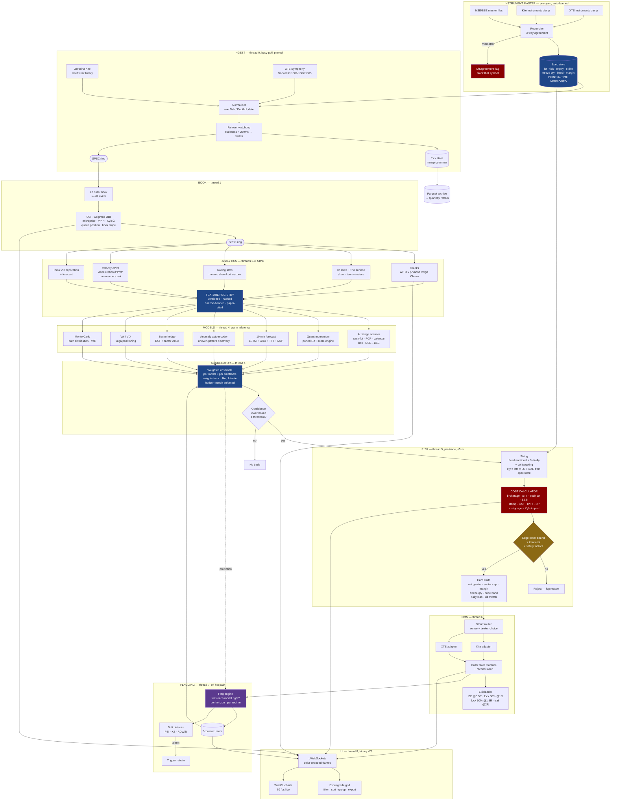

# ALTAIR — Roadmap

**A tick-to-tick, multi-strategy, self-correcting trading engine for NSE & BSE.**
C++23 core · LibTorch (C++ API) for training and inference · zero Python in the runtime.

| | |
|---|---|
| **Status** | Scaffolded. Phase 0 ready to start. |
| **Predecessor** | `RXT_trade/` (Python/Flask) — reference only, **clean-room rewrite** |
| **Implementer** | **DeepSeek V4**, one task card per prompt |
| **Architect / reviewer** | Claude — reviews every DeepSeek output before it is committed |
| **Primary feeds** | Zerodha Kite + XTS Symphony, normalised, hot-failover |
| **Markets** | NSE + BSE — cash, futures, options; MCX optional later |
| **Contract specs** | **Auto-learned daily.** No lot size, tick size, or margin is ever hardcoded. |
| **Retrain cadence** | Quarterly, plus event-driven when drift alarms fire |
| **Dev OS** | Windows (your box) · **Prod OS** Linux (io_uring, hugepages, CPU isolation) |
| **Last updated** | 2026-08-28 |

---

## Contents

0. [Audit of the predecessor](#0-what-already-exists-audit-of-rxt_trade)
1. [Language decision](#1-language-decision)
2. [Build protocol with DeepSeek V4](#2-build-protocol-with-deepseek-v4)
3. [Physics discipline](#3-physics-discipline)
4. [Repo layout](#4-repo-layout)
5. [Architecture flowcharts](#5-architecture)
6. [Instrument master — auto-learned contract specs](#6-instrument-master--auto-learned-contract-specs)
7. [Strategy modules](#7-the-strategy-modules)
8. [Entry / exit / sizing](#8-entry--exit--sizing--fixed-and-explicit)
9. [Cost calculator](#9-cost-calculator)
10. [UI specification](#10-ui-specification)
11. [Latency budget](#11-latency-budget-target-p99)
12. [Phased plan with task cards](#12-phased-plan--task-cards)
13. [Hard rules](#13-hard-rules)
14. [Open decisions](#14-open-decisions)
15. [Reality checks](#15-reality-checks)

---

## 0. What already exists (audit of `RXT_trade/`)

Two Python trees are present: `RXT_trade/` (older, partial) and `RXT_trade 2/`
(current, ~22 modules + Flask dashboard). Everything below is in **`RXT_trade 2/`**.

### Built and working

| Module | What it does | Carry-over value |
|---|---|---|
| `strategy.py` (~1.5k lines) | EMA/VWAP/RSI score engine (0–100, threshold 60), ATR, MACD, Supertrend, Bollinger, Keltner, Ichimoku, Stochastic, Heikin-Ashi, swing pivots, market structure (HH/HL), regime detection, RSI divergence, VWAP σ-bands, candle patterns, cumulative delta | **High** — a proven spec to port to SIMD C++ |
| `risk_manager.py` | Sizing, 5% capital-at-risk cap, 2% daily loss halt, cooldowns (15m after loss / 3m after win), same-side block (30m), `calc_fo_cost()`, `calc_round_trip_cost()` | **High** — seeds `risk/` and `costs/` |
| `montecarlo.py` (~700 lines) | `MonteCarloEngine`, Sharpe, Sortino, Calmar, max-DD, skew, kurtosis | **High** — port near-verbatim |
| `backtest.py` | Bar-level engine; results for NIFTY, BANKNIFTY, RELIANCE, HDFCBANK, ICICIBANK, AXISBANK, ONGC, SAIL | **Medium** — Altair needs tick-level |
| `execution_router.py` | Multi-broker fan-out: Kite / XTS / MT5 | **Medium** — shape is right, transport rewritten |
| `kite_client.py`, `xts_client.py`, `data_feed.py` | Kite Connect + KiteTicker, XTS MarketData/Interactive (Socket.IO 1501/1502/1505), yfinance/Stooq fallback, instrument master loader, hist cache | **High as a protocol reference** |
| `audit_log.py` | signal → order → broker-response → exchange → final-state trail | **High** — the event taxonomy is correct |
| `mt_executor.py`, `mt5_relay.py` | MT5 native / HTTP bridge / DEMO, multi-account fan-out | **Low** — defer |
| `cstrategy.py`, `tgl.py`, `ohl.py` | Commodity sessions, TGL engine, OHL strategy | **Medium** — re-derive |
| `app.py` (45+ endpoints), `templates/index.html` (3.5k lines) | Flask REST/SSE + terminal SPA: PIN lock, dark/light themes, 2 Hz tick flash, 8 tabs, MT account manager, Chart Studio, fundamentals | **High as a UX spec** |

### Known gaps — why Altair exists

1. **Python is the bottleneck.** GIL + per-tick interpreter dispatch + a 500 ms UI
   poll = decision latency ~10⁴–10⁵× the tick cadence. Tick-to-tick is impossible.
2. **No options analytics.** No greeks, no IV, no chain-derived signal.
3. **No arbitrage engine.** Basis, calendar, PCP, NSE↔BSE all unexploited.
4. **No ML at all.**
5. **Cost model is F&O-only and hardcoded**, with no equity/BSE/currency, no slippage, no impact.
6. **No hedging book.** Single-leg directional only.
7. **No auto-correction.** Static until a human edits `config.py`.
8. **Lot sizes and contract specs are hardcoded** — a silent, compounding source of wrong PnL.
9. **Phase 8 of its own workflow never finished; Phase 9 smoke test never ran.**

---

## 1. Language decision

**C++23 for the entire system, including model training. Go is rejected.**

Ruling out Python also rules out the usual "train in Python, serve in C++" split.
LibTorch ships a first-class **C++ API** (`torch::nn`, autograd, optimisers,
`torch::save`), so LSTM/GRU/TFT training happens natively in C++ — no Python in
dev or prod.

| Concern | C++23 | Go | Verdict |
|---|---|---|---|
| p99.9 decision latency | 5–40 µs, no runtime pauses | GC STW 50 µs–1 ms; the tail kills you | **C++** |
| Kernel bypass / busy-poll NIC | Native (`SO_BUSY_POLL`, io_uring, DPDK, ef_vi) | cgo boundary per packet | **C++** |
| Cache / NUMA control, custom allocators | Full | Effectively none | **C++** |
| Native NN training | LibTorch C++ API, cuDNN, ONNX Runtime | No mature option | **C++** |
| SIMD greeks, vectorised stats | Intrinsics, `std::simd`, Eigen, xsimd | Assembly only | **C++** |
| Dev speed, concurrency ergonomics | Harder | Much easier | Go |
| Build complexity | High (vcpkg + CMake) | Trivial | Go |

Go's advantages are all developer-experience. Every hard requirement lands on the
C++ side. Losing a sub-100 µs window to a GC pause is not a trade worth making.

### Stack

```
Language      C++23 (MSVC 19.4x on Windows dev, GCC 14 / Clang 18 on Linux prod)
Build         CMake 3.28 + Ninja + vcpkg manifest mode
Concurrency   Thread-per-core, pinned; SPSC lock-free rings between stages
Networking    Boost.Asio; io_uring on Linux; RIO on Windows
Serialisation Cap'n Proto (IPC) · simdjson (broker REST) · FlatBuffers (wire log)
Math          Eigen 3.4 · xsimd · Boost.Math · in-house TA kernels
ML            LibTorch 2.x C++ API (train) · ONNX Runtime (serve, optional CUDA EP)
Storage       mmap'd columnar tick store · DuckDB for research · Parquet archive
Logging       Binary ring-buffer logger, off-thread decode (Quill/NanoLog style)
Dashboard     uWebSockets C++ server + custom WebGL front end
Testing       Catch2 · Google Benchmark · deterministic tick-replay harness
CI            GitHub Actions: build · unit · replay-regression · latency-regression
```

---

## 2. Build protocol with DeepSeek V4

This is the operating system of the project. Read it before writing any prompt.

### 2.1 Roles

| Actor | Owns | Never does |
|---|---|---|
| **You (Smit)** | Decisions, capital, broker accounts, go/no-go at phase gates | — |
| **Claude** | Architecture, task cards, interface contracts, **review of every DeepSeek output**, phase gates, financial/physics correctness | Write bulk implementation |
| **DeepSeek V4** | Implementation of exactly one task card per prompt, plus its tests | Invent interfaces, add dependencies, touch files outside its manifest |

> Full protocol: [`prompts/PROTOCOL.md`](prompts/PROTOCOL.md).
> Status board: [`prompts/LEDGER.md`](prompts/LEDGER.md).

### 2.2 The unit of work — a Task Card

One task card = one DeepSeek prompt = one reviewable commit. Each card lives in
`prompts/` as `P<phase>-<nn>_<slug>.md` and contains, in this fixed order:

1. **Context** — where this sits in the system, 3–6 lines. No more; DeepSeek does
   not need the whole roadmap and drifts when given it.
2. **File manifest** — the exact files to create or modify. *Anything not listed is
   off-limits.*
3. **Interface contract** — the exact header signatures, verbatim. DeepSeek fills
   in bodies; it does not design the API. This is what keeps 90+ prompts coherent.
4. **Behavioural spec** — numbered, testable requirements.
5. **Constraints** — allocation, latency, threading, exception, dependency rules.
6. **Acceptance tests** — the tests that must pass, named, with the assertions
   spelled out.
7. **Forbidden** — an explicit list of what would fail review.
8. **Deliverable format** — full file contents, no elisions, no `// ... rest unchanged`.

### 2.3 The review gate — run after **every** DeepSeek response

Nothing is committed until all eight pass. A failure produces a **correction
prompt**, not a rewrite from scratch.

| # | Gate | How it is checked |
|---|---|---|
| 1 | **Compiles** | `cmake --build build --target <t>`, zero warnings at `/W4` or `-Wall -Wextra -Wpedantic` |
| 2 | **Contract honoured** | Diff the produced headers against the card's interface contract — byte-level on signatures |
| 3 | **Manifest respected** | `git status` shows only files listed in the card |
| 4 | **Tests exist and pass** | Every acceptance test present, `ctest` green |
| 5 | **No hidden allocation on the hot path** | Grep for `new`, `malloc`, `std::vector` growth, `std::string`, `shared_ptr` inside functions marked `ALTAIR_HOT` |
| 6 | **Latency budget** | Google Benchmark result vs the number in §11; regression fails the gate |
| 7 | **Numerical / financial sanity** | Claude checks: units correct, no catastrophic cancellation, boundary cases (expiry T→0, IV→0, zero depth, negative rates), sign conventions, day-count basis |
| 8 | **Physics sanity** | Dimensional consistency, conservation invariants, no look-ahead, no sampling above Nyquist (§3) |

### 2.4 Prompt hygiene rules for DeepSeek

Put these verbatim at the bottom of every card:

```
RULES — violating any of these fails review:
1. Produce complete files. No "...", no "rest unchanged", no placeholder bodies.
2. Do not create, rename, or delete any file not in the File Manifest.
3. Do not change any signature in the Interface Contract. If you believe a
   signature is wrong, implement it as specified AND add a comment block at the
   top of the file titled "CONTRACT OBJECTION" explaining why. Do not act on it.
4. Do not add any third-party dependency. Only what vcpkg.json already lists.
5. No exceptions on the hot path. Return std::expected<T, Error>.
6. No dynamic allocation inside any function marked ALTAIR_HOT.
7. No `using namespace` at file scope in a header.
8. Every public function gets a doc comment stating units and preconditions.
9. Write the acceptance tests exactly as named. Do not rename or merge them.
10. If a requirement is ambiguous, implement the most conservative reading and
    list the ambiguity under "ASSUMPTIONS" at the end of your response.
```

### 2.5 Cadence

```
Claude writes card  →  You paste into DeepSeek  →  You paste output back to Claude
        ↑                                                        │
        │                                                        ▼
   correction card  ←──── fail ──── Claude runs the 8 gates ──── pass ──→ commit
                                                                 │
                                                                 ▼
                                          card marked DONE in prompts/LEDGER.md
```

At the end of each phase Claude runs a **phase gate**: full replay regression,
latency suite, and a written go/no-go with the phase's exit criteria checked off.

### 2.6 Handling DeepSeek's known failure modes

| Failure mode | Countermeasure baked into the cards |
|---|---|
| Silently redesigning the API | Interface contract given verbatim; gate 2 diffs it |
| Truncating long files | Cards are sized so no file exceeds ~400 lines; split otherwise |
| Adding `#include <iostream>` and printf debugging | Forbidden list; gate 1 warnings |
| Hidden heap allocation in "clean" code | `ALTAIR_HOT` marker + gate 5 grep |
| Plausible-but-wrong finance (day counts, sign of Θ, STT side) | Gate 7 — Claude checks every formula against the reference in the card |
| Losing context across prompts | Each card is self-contained; the contract, not memory, carries continuity |
| Writing tests that assert whatever the code does | Assertions are specified *in the card*, with expected numeric values |

---

## 3. Physics discipline

Not decoration. Each item below becomes a compile-time or test-time check.

### 3.1 Dimensional analysis → the type system

Every quantity is a strong type, not a `double`. Mixing them is a **compile
error**. This is the single highest-leverage defence against the class of bug
that destroyed the predecessor's PnL accuracy.

```cpp
Price      p;        // ₹ per unit
Qty        q;        // units (shares / contracts × lot_size)
Lots       l;        // contracts
LotSize    ls;       // units per contract  ← auto-learned, never a literal
Notional   n;        // ₹        n = p * q          (Price × Qty → Notional)
Rate       r;        // per annum, continuously compounded
Years      t;        // ACT/365F
Vol        s;        // annualised σ
Bps        b;        // 1e-4
```

`Price * Lots` does not compile. `Price * Qty` yields `Notional`.
`Lots * LotSize` yields `Qty`. A lot-size error becomes impossible to express.

### 3.2 Measurement error propagates

An implied vol is a *measurement* with error, inherited from bid-ask width, quote
staleness, and solver tolerance. Greeks computed from it carry that error:

```
σ(Δ) = |∂Δ/∂σ| · σ(IV) = Vanna · σ(IV)
```

Position sizing consumes the *lower confidence bound* of edge, not the point
estimate. A signal whose error bar straddles zero is not a signal.

### 3.3 Sampling theory sets the architecture

Nyquist: you cannot resolve a phenomenon of period *T* by sampling slower than
*T/2*. The predecessor polled at 500 ms and therefore could not, even in
principle, see any structure faster than 1 s. Order-book imbalance decays in
10–200 ms. **This is the mathematical reason the rewrite is event-driven and not
a faster poll.**

Corollary: every feature declares its **valid horizon band**, and the aggregator
refuses to combine a feature with a model whose horizon lies outside it.

### 3.4 Non-stationarity and ergodicity

Markets are not ergodic — the time average of one path ≠ the ensemble average.
Consequences, enforced in code:

- Walk-forward validation only. Random K-fold is banned in the training harness.
- Purged K-fold with an embargo ≥ the label horizon, or the test set leaks.
- Every model reports performance **per regime**, never only in aggregate.
- Parameters fitted on one regime are assumed invalid in another until proven.

### 3.5 Signal-to-noise

Individual microstructure features typically carry SNR well under 0.1. The
architectural response is: many weak, decorrelated features; ensemble averaging
(σ falls as 1/√N only if they are genuinely decorrelated — so correlation between
model errors is measured, not assumed); and a hard cost gate that rejects any
edge that does not survive §9.

### 3.6 Conservation laws → runtime invariants

Checked every tick in debug, every second in release; a breach trips the kill switch.

```
Σ(fills) + Σ(costs) + cash_delta          == 0     exactly, in paise
Σ(position_i × price_i) + cash            == equity
Σ(leg_delta) − hedge_delta                == net_delta   (reported, bounded)
book: Σ(bid_qty at level) monotone in depth, no crossed book
```

### 3.7 Response functions and impact

Kyle's λ is a linear response coefficient (the market's susceptibility to order
flow). Treat impact as the fluctuation-dissipation counterpart of volatility:
estimate λ from your own fills, and use the square-root law
`ΔP ≈ Y·σ·√(Q/V)` as the fallback when fill history is thin. Impact is a **cost**,
entered in §9, not an afterthought.

### 3.8 Numerical hygiene

- Greeks near expiry (T → 0) and deep OTM: use asymptotically stable forms;
  never `exp(-r·T)` differences that cancel.
- IV solve: Jäckel's *Let's Be Rational* — no Newton loop that fails on wings.
- Realised variance: two-scale estimator, robust to microstructure noise.
  Naive 1-tick RV measures the bid-ask bounce, not volatility.
- All money in **integer paise** in the ledger; doubles only in analytics.
- Kahan/Neumaier summation on any accumulator running for a whole session.

---

## 4. Repo layout

```
altair/
├── CMakeLists.txt              vcpkg.json          .gitignore
├── ROADMAP.md                  README.md
├── config/
│   ├── altair.toml             engine config, hot-reloadable, hashed
│   ├── charges.toml            effective-dated charge schedule (§9)
│   └── strategies/*.toml       one per strategy
├── prompts/
│   ├── PROTOCOL.md             the rules DeepSeek must follow
│   ├── LEDGER.md               task-card status board
│   └── P<phase>-<nn>_*.md      the cards themselves
├── core/
│   ├── types/                  strong units (§3.1), Money in paise, fixed-point
│   ├── time/                   TSC clock, PTP sync, exchange-timestamp normalisation
│   ├── mem/                    arena + pool allocators, hugepage backing
│   ├── lockfree/               SPSC/MPSC rings, seqlock snapshots
│   ├── log/                    binary async logger
│   ├── config/                 hot-reloadable TOML, versioned + hashed
│   └── invariant/              the conservation checks of §3.6
├── instruments/                ← AUTO-LEARNED CONTRACT SPECS (§6)
│   ├── loader/                 NSE/BSE/Kite/XTS master downloaders
│   ├── reconcile/              cross-source agreement + disagreement flags
│   ├── store/                  point-in-time versioned spec store
│   └── margin/                 SPAN+ELM fetch and local approximation
├── feed/
│   ├── kite/                   KiteTicker binary decoder
│   ├── xts/                    XTS Socket.IO 1501/1502/1505 decoder
│   ├── normalizer/             both → one Tick / DepthUpdate struct
│   ├── failover/               staleness watchdog, seamless primary switch
│   └── replay/                 deterministic file-backed feed
├── book/                       L2 book · OBI · microprice · VPIN · Kyle λ · queue pos
├── analytics/
│   ├── greeks/                 BS + Bjerksund–Stensland, 1st–3rd order
│   ├── iv/                     Jäckel solver, SVI surface, arb-free checks
│   ├── stats/                  rolling mean/var/skew/kurt, z, EWMA, Hurst
│   ├── derivs/                 velocity, acceleration, jerk of any series
│   └── vix/                    India VIX replication + forecast
├── features/
│   ├── registry/               named feature → graph, versioned, horizon-banded
│   └── builders/               one .cpp per family, paper ids cited
├── models/
│   ├── train/                  LibTorch C++ loops: LSTM · GRU · TFT · MLP · AE
│   ├── serve/                  ONNX/TorchScript inference, warm + pinned
│   ├── montecarlo/             GBM · Heston · bootstrap · jump-diffusion
│   ├── dcf/                    fundamental valuation
│   ├── aggregator/             ensemble weighting + confidence
│   └── registry/               immutable versioned model store
├── strategies/
│   ├── arb_cash_fut/  arb_options/  quant_momentum/
│   ├── forecast_10m/  hedge_sector/ vol_vix/
├── risk/
│   ├── sizing/  limits/  portfolio/  costs/
├── oms/
│   ├── router/  kite_exec/  xts_exec/  state/  throttle/  recon/
├── flagging/
│   ├── engine/                 per-model per-horizon per-regime scorecards
│   └── drift/                  PSI · KS · ADWIN · Page-Hinkley
├── backtest/                   tick replayer · walk-forward · purged CV · cost-aware
├── ui/
│   ├── server/                 uWebSockets, binary delta frames
│   ├── grid/                   Excel-grade virtual data grid (§10.1)
│   ├── charts/                 WebGL renderers (§10.2)
│   └── app/                    SPA shell, tabs, theming, PIN lock
├── research/
│   └── papers/                 ← DROP PDFs IN inbox/  (see its README)
├── data/
│   ├── ticks/                  mmap'd columnar store, one file per symbol per day
│   ├── instruments/            dated master snapshots
│   └── fundamentals/           point-in-time quarterly financials
└── tests/
```

---

## 5. Architecture

### 5.1 Live path



### 5.2 Auto-correction and quarterly retrain loop

```mermaid
flowchart LR
    A[("Tick archive<br/>Parquet, full history")] --> B["Label builder<br/>triple-barrier"]
    B --> C["Purged K-fold + embargo<br/>walk-forward only"]
    C --> D["LibTorch C++ training<br/>LSTM · GRU · TFT · MLP · AE"]
    D --> E["Walk-forward validation<br/>cost-aware tick replay"]
    E --> F{"Beats incumbent on<br/>OOS Sharpe AND<br/>post-cost PnL?"}
    F -->|no| G["Keep incumbent<br/>log the failure"]
    F -->|yes| H["Shadow deploy<br/>10 sessions, no capital"]
    H --> I{"Shadow matches<br/>backtest?"}
    I -->|no| G
    I -->|yes| J["Canary 10% size<br/>5 sessions"]
    J --> K{"Live metrics<br/>within tolerance?"}
    K -->|no| L["AUTO-ROLLBACK<br/>pin previous version"]
    K -->|yes| M["Promote to full weight"]
    M --> NR[("Model registry<br/>immutable, versioned")]
    L --> NR
    G --> NR
    NR --> O["Serving layer<br/>hot-swap, zero downtime"]

    P["Flag engine<br/>rolling hit-rate per regime"] --> Q["Online weight update<br/>every session close"]
    Q --> O
    R["Drift detector<br/>PSI / KS / ADWIN"] -->|alarm| S["Off-cycle retrain<br/>+ de-weight to zero now"]
    S --> B
    T["Quarterly timer<br/>Mar · Jun · Sep · Dec"] --> B
    U["Lot-size / spec change<br/>detected by reconciler"] -->|invalidate| B

    style F fill:#8b6914,color:#fff
    style K fill:#8b6914,color:#fff
    style L fill:#8b0000,color:#fff
    style M fill:#1a5c1a,color:#fff
```



**Three correction layers, three clocks:**

| Layer | Clock | Changes | Reversible |
|---|---|---|---|
| Ensemble re-weighting | Session close, daily | Aggregator weights from rolling per-regime hit-rate | Instantly |
| Drift response | Event-driven (PSI/KS/ADWIN) | De-weight the drifted model to zero, trigger off-cycle retrain | Instantly |
| Full retrain | Quarterly + on drift + on spec change | Model parameters, via shadow → canary → promote | Auto-rollback |

Nothing is overwritten. The registry is append-only. Every live decision records
`{model_hash, feature_version, config_hash, spec_version, tick_seqno}`, so any
trade is bit-reproducible from the archive.

---

## 6. Instrument master — auto-learned contract specs

**No lot size, tick size, strike step, expiry, freeze quantity, price band, or
margin multiplier appears as a literal anywhere in Altair.** All of it is learned
daily from the exchanges and brokers, reconciled, and versioned point-in-time.

This is the fix for the predecessor's most dangerous silent bug class. NSE has
revised F&O lot sizes repeatedly; a stale literal scales every position and every
PnL number by a wrong constant, and nothing in the system complains.

### 6.1 Sources and reconciliation

| Source | Fetched | Authority |
|---|---|---|
| NSE F&O contract master + `fo_mktlots` | pre-open daily | **Primary** for lot size, expiry, strike step |
| BSE contract master | pre-open daily | **Primary** for BSE segment |
| Kite `instruments` CSV dump | pre-open daily | Primary for Kite tokens; cross-check |
| XTS `instruments` master | pre-open daily | Primary for XTS tokens; cross-check |
| Broker margin API (Kite `basket`, XTS margin) | pre-open + on demand | **Primary** for SPAN + exposure |

**Three-way agreement is required.** If any source disagrees on lot size, tick
size, or expiry for a symbol:

1. That symbol is **blocked from trading** for the session.
2. A high-priority flag is raised in the UI with the three conflicting values.
3. The engine keeps running on every other symbol.

Failing loud beats trading a wrong multiplier.

### 6.2 The spec record

```cpp
struct ContractSpec {
    InstrumentId   id;
    Exchange       exchange;        // NSE | BSE
    Segment        segment;         // CASH | FUT | OPT | CUR | COM
    std::string    underlying;
    LotSize        lot_size;        // ← auto-learned
    Price          tick_size;       // ← auto-learned
    Price          strike;          // options only
    OptionType     opt_type;        // CE | PE | NONE
    Date           expiry;          // ← auto-learned
    Qty            freeze_qty;      // exchange max single-order qty
    Price          band_lower, band_upper;   // daily price band
    double         span_multiplier;          // from margin API
    Date           valid_from, valid_to;     // POINT-IN-TIME
    uint64_t       source_hash;              // reproducibility
};
```

`valid_from` / `valid_to` are the point of the whole design. A backtest of
2024-06-11 uses the lot size that was live on 2024-06-11, fetched from the dated
snapshot in `data/instruments/`, not today's.

### 6.3 Change detection and automatic response

| Detected change | Automatic response |
|---|---|
| Lot size changed | Recompute all open-position risk; re-scale sizing constants; **invalidate every model trained on the old multiplier and queue an off-cycle retrain**; notify UI |
| Tick size changed | Rebuild the book's price grid; recalibrate slippage model for that symbol |
| New expiry listed | Auto-subscribe; begin building the term structure for it |
| Expiry rolled | Migrate positions per rollover policy; retire the old chain's features |
| Freeze qty changed | Update order-slicing limits |
| Price band changed | Update the pre-trade band check |
| Symbol delisted / renamed | Flatten, flag, remove from the universe |
| Corporate action (split, bonus, dividend) | Adjust historical series; re-derive returns; flag affected backtests as stale |

### 6.4 What "trained auto" means beyond specs

Every calibrated constant in Altair is learned, dated, and refreshed — never typed in:

| Constant | Learned from | Refresh |
|---|---|---|
| Lot / tick / expiry / freeze / band | Exchange + broker masters | Daily, pre-open |
| SPAN + exposure margin | Broker margin API | Daily + on position change |
| Slippage per symbol × size bucket | **Own fill history** | Rolling 60 sessions |
| Kyle λ (impact coefficient) | Own fills + public trade prints | Rolling 20 sessions |
| Realised vol, correlation, β | Tick archive | Nightly |
| Cointegration pairs + half-life | Tick archive | Weekly |
| Model weights in the aggregator | Flag-engine hit rates | Every session close |
| Model parameters | Full retrain pipeline | Quarterly + on drift |
| Charge rates | `charges.toml` + monthly CI diff vs published schedule | Monthly, human-confirmed |
| Risk-free curve | T-bill / OIS | Daily |
| Dividend yield forecast | Announced + historical | Weekly |

---

## 7. The strategy modules

### 7.1 Arbitrage finder — equity, futures, options (NSE + BSE)

| Type | Condition | Window |
|---|---|---|
| Cash–futures basis | `F − S·e^((r−q)T)` outside the cost band | seconds–minutes |
| Cross-venue | Same scrip NSE vs BSE mid divergence beyond cost | 10–500 ms |
| Put–call parity | `C − P ≠ S − K·e^(−rT)` beyond cost | ms–seconds |
| Calendar spread | Near/far futures basis mispricing | minutes |
| Box spread | 4-leg synthetic risk-free ≠ risk-free rate | seconds |
| Butterfly / vertical | Convexity violation across the strike ladder | ms–seconds |
| Dividend-adjusted basis | Around record dates | days |

Every candidate is priced **net of the full cost stack for all legs on all venues**
before it is a signal. The cost calculator sits *inside* the arbitrage decision,
not in a report afterwards. Most textbook arbitrage in Indian markets dies exactly
there, and the engine must say so honestly.

### 7.2 Quant model (re-derived from `RXT_trade 2/strategy.py`)

Port the score engine to SIMD C++, then extend: regime-conditional scoring
(trending / ranging / volatile), multi-timeframe confirmation (1 s, 5 s, 1 m, 5 m,
15 m), and a **meta-labelling** layer that decides whether to *take* the primary
signal rather than reinventing the signal.

### 7.3 Greeks — computed, not fetched

The round trip to a broker greeks endpoint is slower than the maths, and fetched
greeks carry an unknown IV convention.

- Black–Scholes closed form — European index options (NIFTY, BANKNIFTY, SENSEX)
- Bjerksund–Stensland — American-style stock options
- **1st order:** Δ, Γ, Θ, ν, ρ
- **2nd/3rd order:** Vanna, Volga, Charm, Veta, Speed, Zomma, Colour, Ultima
- IV via Jäckel *Let's Be Rational* — ~2 ns/solve, machine precision, no wing failures
- Whole chain in one AVX-512 pass over all strikes × both types
- Broker greeks, if they arrive, are used only as a **cross-check**; divergence
  beyond tolerance raises a flag and ours wins

**Target: full NIFTY chain (~200 strikes) greeks + IV in < 50 µs.**

### 7.4 Ten-minute forecast — the multidimensional model

| Feature family | Features |
|---|---|
| Price kinematics | dP/dt, d²P/dt², jerk, mean-acceleration, EWMA of each, at 5 sampling scales |
| Distribution | rolling mean, σ, skew, kurtosis, z-score of price/volume/spread, Hurst exponent |
| Order book | OBI, level-weighted OBI, depth-weighted mid, microprice−mid, queue position, book slope, cancellation rate, replenishment rate |
| Flow | signed volume, cumulative delta, trade-size distribution, VPIN, Kyle λ, aggressor ratio, large-print detector |
| Options | ATM IV, 25Δ risk-reversal, butterfly, IV term slope, net Γ exposure, dealer Δ-hedging pressure, PCR (OI and volume), max-pain drift, OI change velocity, IV−RV spread |
| Cross-asset | index vs constituents, NSE↔BSE spread, INR/USD, SGX/GIFT NIFTY, US futures overnight, India VIX level and Δ |
| Calendar | minutes since open, minutes to close, minutes to expiry, day-of-week, event-day flag, expiry-week flag |

**Model stack:**

```
LSTM  ─┐   sequence memory, 300-step lookback
GRU   ─┤   cheaper recurrent, different inductive bias
TFT   ─┼─→ AGGREGATOR ─→ direction (3-class) + magnitude + confidence interval
MLP   ─┤   static / cross-sectional features
AE    ─┤   anomaly score from the unsupervised autoencoder
MC    ─┘   Monte Carlo path distribution → quantiles and tail risk
```

The **neural net for uneven pattern discovery** is a separate head: a temporal
CNN + attention autoencoder trained unsupervised on the raw tick/book/greek
tensor. Its reconstruction error surfaces regimes the hand-built features never
encoded. The anomaly score enters the aggregator as its own input.

**Timeframe discipline:** every model is scored only at the horizon it was built
for. A 10-minute forecast never justifies a 30-second arbitrage entry. Each
aggregator input carries a horizon tag and mismatched combinations are rejected.

### 7.5 Auto-hedging book — sector-neutral value

- Fundamental screen: DCF (FCFF + FCFE, three-stage), relative multiples
  (P/E, EV/EBITDA, P/B, EV/Sales) vs sector median, quality factors
  (ROIC, accruals, leverage, earnings persistence)
- Cointegration (Engle–Granger + Johansen) within sector, rolling window
- Half-life of mean reversion sets the holding horizon
- Entry on spread z-score; exit on reversion, half-life expiry, or structural break
- β and sector neutralisation enforced at the **portfolio** layer, not per pair
- Continuous net-greek and net-β hedge via index futures/options

### 7.6 VIX prediction

India VIX replicated from the NIFTY chain (CBOE methodology on NSE data), then
forecast at 10 m / 1 d / 1 w using: realised-vs-implied spread, IV term structure
slope, variance risk premium, OU mean-reversion fit, option flow skew, event
calendar. Drives vega sizing and the tail hedge.

---

## 8. Entry / exit / sizing — fixed and explicit

**Non-negotiable.** No model may override these; they live in `risk/`, downstream
of every strategy.

### Entry
- Aggregator confidence **lower bound** ≥ threshold (per strategy, hot-reloadable)
- Expected edge > total cost × safety factor (default 2.5×)
- No conflicting open position in the same underlying
- Cooldown: 15 min after a loss, 3 min after a win, per instrument
- Same-side re-entry blocked 30 min
- Not in the first 5 min after open; no new entries after 15:00 IST
- Liquidity gate: quoted depth ≥ N × intended size at the touch
- Contract spec valid, un-flagged, and within price band and freeze qty

### Sizing
```
base_risk    = capital × risk_per_trade         (default 0.5%, hard cap 2%)
kelly_frac   = clamp(edge_lb / variance, 0, 0.25)   quarter-Kelly ceiling
vol_target   = target_daily_vol / realised_vol_20d
raw_size     = base_risk × kelly_frac × vol_target / stop_distance
lots         = floor(raw_size / lot_size)       ← lot_size from the spec store
qty          = lots × lot_size                  ← type system enforces this
qty          = min(qty, liquidity_cap, margin_cap, freeze_qty, per_strategy_cap)
```

### Exit ladder
| Trigger | Action |
|---|---|
| +0.5 R | Stop → breakeven |
| +1.0 R | Lock 30% of open profit |
| +1.5 R | Lock 60% of open profit |
| +2.0 R | Trail at 1.5 × ATR |
| Original SL | Only if no tighter stop is active — **tightened stop checked first** |
| Time stop | Originating model's horizon elapsed |
| Flag stop | Flag engine marks the originating model as failing in this regime |
| 15:15 IST | Auto square-off, all intraday |
| Daily loss 2% | Halt every strategy for the session |

---

## 9. Cost calculator

Automatic, per-trade, per-segment, applied **before** the signal becomes an order.
Config-driven with **effective-date versioning** — rates change with every budget,
so they live in `config/charges.toml`, never in code.

### Charge stack

```
Turnover        = price × qty          (premium turnover for options)
Brokerage       = per-broker slab      e.g. min(0.03% × turnover, ₹20) per order
STT / CTT       = segment + side specific, effective-dated
Exchange txn    = NSE/BSE/MCX slab on turnover
SEBI turnover   = ₹10 per crore
IPFT            = NSE investor protection fund, per segment
Stamp duty      = buy side only, state/segment slab
GST             = 18% × (brokerage + exchange txn + SEBI + IPFT)
DP charges      = equity delivery sell only, per scrip per day
──────────────────────────────────────────────────────────────
Explicit total  = Σ above
Slippage        = learned from own fill history, per symbol per size bucket
Impact          = Kyle λ × qty, or Y·σ·√(Q/V) fallback
──────────────────────────────────────────────────────────────
TOTAL COST      = explicit + slippage + impact
```

### Rate table — **verify before go-live**

STT was revised effective **1 April 2026**. Both regimes are stored, because the
backtester must apply the rate that was live on each historical date.

| Segment | STT/CTT before 2026-04-01 | STT/CTT from 2026-04-01 | Exchange txn (NSE) | Stamp duty (buy) |
|---|---|---|---|---|
| Equity delivery | 0.1% both sides | verify | ~0.00297% | 0.015% |
| Equity intraday | 0.025% sell | verify | ~0.00297% | 0.003% |
| Equity futures | 0.02% sell | **0.05% sell** | ~0.00173% (₹1.73/lakh) | 0.002% |
| Equity options | 0.10% sell (premium) | **0.15% sell (premium)** | ~0.03503% (₹35.03/lakh premium) | 0.003% |
| Currency F&O | nil | nil | slab | 0.0001% |
| Commodity (MCX) | CTT 0.01% sell (non-agri) | verify | slab | 0.002% |

> ⚠️ Confirm every number against the current NSE/BSE circular and your broker's
> published schedule on the day you wire it in. The calculator's correctness is a
> hard dependency for the arbitrage engine — a 3 bps error turns a profitable
> spread into a losing one. A CI job diffs the published schedule monthly and
> fails the build on a mismatch.

### Required outputs

1. Per-trade round-trip cost, before the order is sent
2. Breakeven move in points and % — shown on every signal
3. Daily / monthly turnover-based cost projection per strategy
4. Cost-adjusted PnL attribution: how much edge each strategy pays away
5. Broker comparison: the same trade priced across Kite and XTS slabs
6. Turnover throttle: alarm when cumulative turnover pushes a strategy below its
   post-cost breakeven

---

## 10. UI specification

The predecessor's UX was good and its backend was slow. Keep the terminal
aesthetic, PIN lock, dark/light themes, tab structure and tick flash. Replace
everything underneath.

**Transport:** binary WebSocket frames, delta-encoded, not JSON. A full NIFTY
chain as JSON at 2 Hz is ~400 KB/s; the same as packed deltas is ~8 KB/s.

### 10.1 Excel-grade data grid

One component, used by every table in the app (positions, orders, trades, option
chain, instruments, audit trail, scorecards, backtest results).

**Data scale**
- Virtual scrolling — 1 M rows at 60 fps, only visible rows in the DOM
- Server-side predicate pushdown into the columnar tick store for large sets
- Incremental updates: a tick patches one cell, it does not re-render the grid

**Search & filter**
- Global quick-search box, fuzzy, across all visible columns, debounced
- Per-column filters, type-aware:
  - text — contains / not contains / equals / starts / ends / regex / blank
  - numeric — `= ≠ < ≤ > ≥`, between, top-N, bottom-N, above/below average
  - date — on / before / after / between / relative (today, this week, expiry week)
  - set — multi-select checklist of distinct values with its own search box
- Filter chips row showing every active filter, individually removable
- Boolean combination across columns (AND default, OR opt-in per column)
- Filter state is URL-encoded and shareable

**Sort & organise**
- Multi-column sort with visible priority badges (1, 2, 3…)
- Custom comparators per type (expiry sorts chronologically, not lexically)
- Row grouping by any column, collapsible, with per-group aggregates
  (sum / avg / min / max / count / weighted-avg)
- Pivot mode: rows × columns × measure

**Columns**
- Show/hide with a searchable column picker
- Drag to reorder, drag edge to resize, double-click to autosize
- Pin left / pin right; pinned columns stay while the rest scrolls horizontally
- Column groups with collapsible headers (e.g. CALLS | STRIKE | PUTS)
- Derived columns via a small expression evaluator: `=(ltp-vwap)/atr`

**Presentation**
- Conditional formatting: colour scales, data bars, icon sets, custom rules
- Heatmap mode on numeric columns
- In-cell sparklines (last N ticks per row)
- Flash-on-change per cell, green/red, 200 ms, **never blanking the prior value**
- Density toggle: compact / normal / comfortable
- Frozen header + frozen totals row

**Interaction**
- Full keyboard nav: arrows, ctrl+arrow to edge, shift+arrow range select,
  ctrl+C copies TSV, ctrl+F focuses search, `/` opens the filter of the focused column
- Range selection with a live status bar (sum, avg, count, min, max) like Excel
- Row context menu: flatten position, copy, drill to chart, open audit trail
- Saved views: named bundles of filter + sort + columns + grouping, per user

**Export**
- CSV, TSV, JSON
- **Real XLSX** written natively in C++ (styles, number formats, frozen panes,
  autofilter) — not CSV renamed
- Copy to clipboard as TSV (pastes straight into Excel)
- PDF snapshot of the current view
- Export respects current filters, sort, grouping, and column order

### 10.2 Live charts — WebGL, 60 fps

No off-the-shelf charting library. Each re-lays-out the scene per update and dies
at tick rate. Custom renderer with a persistent GPU buffer, ring-buffered data,
and per-frame updates of only what changed.

| Chart | Purpose |
|---|---|
| Candlestick + volume | Primary price view, 1 s → 1 d, with all overlays |
| Tick / line | Raw trade prints, sub-second |
| **Depth ladder (DOM)** | Live L2 both sides, size bars, your orders marked |
| **Order-book heatmap** | Depth over time — resting liquidity as a 2-D field |
| **Footprint / volume profile** | Traded volume by price, POC, value area |
| **IV smile & surface** | 2-D smile per expiry, 3-D surface across term |
| **Greeks vs strike** | Δ/Γ/ν/Θ curves across the chain, live |
| **Net gamma exposure profile** | Dealer Γ by strike — the pin/repel map |
| Equity curve + drawdown | Per strategy and aggregate |
| Return histogram + QQ | Distribution shape, tail check |
| Correlation matrix | Cross-strategy and cross-asset, live |
| Scatter / regression | Feature vs forward return, with R² |
| **Prediction cone** | Model forecast with confidence bands, overlaid on price |
| **Flag markers** | Where the flag engine judged each model right or wrong |
| Drift charts | PSI / KS over time per feature |

**Chart features**
- Overlays: EMA, SMA, BB, Keltner, VWAP ± σ bands, Supertrend, Ichimoku, pivots,
  market-structure lines, session anchors
- Subplots, synced x-axis: RSI, MACD, CVD, OBI, VPIN, velocity, acceleration
- Crosshair synced across every pane; measure tool (Δprice, Δtime, %, R)
- Drawing tools: trendline, ray, horizontal, rectangle, Fib retracement
- Entry/exit markers with hover cards showing the full signal reasoning and cost
- **Replay scrubber** — scrub any past session and watch the engine's decisions
  re-render tick by tick against what actually happened
- LTTB downsampling when zoomed out; full resolution when zoomed in
- Multi-chart grid layout, 1/2/4/6/9 panes, per-pane symbol and timeframe
- Screenshot to PNG, and export the visible series to XLSX

### 10.3 Panels beyond grid and charts

- **Option chain** — grid + live greeks + OI change bars + ATM highlight +
  strike jump + PCR/max-pain header + one-click strategy builder (straddle,
  strangle, iron condor, calendar) with instant payoff diagram and margin
- **Cost breakdown** — every trade's charge stack itemised, with the breakeven move
- **Model scorecards** — hit rate, Sharpe, calibration curve per model per regime
- **Risk dashboard** — net Δ/Γ/ν/Θ, sector exposure, margin utilisation,
  distance to every limit
- **Audit trail** — the full signal→order→fill chain in the grid, filterable
- **Instrument master viewer** — current specs, change history, disagreement flags
- **Backtest lab** — configure, run, compare runs side by side, walk-forward view
- **Kill switch** — always visible, one click, confirmed, flattens everything

---

## 11. Latency budget (target, p99)

| Stage | Budget |
|---|---|
| NIC → user space (busy-poll) | 2 µs |
| Wire decode → normalised tick | 1 µs |
| Order book update | 0.5 µs |
| Book features (OBI, microprice, VPIN) | 1 µs |
| Rolling stats + derivatives | 2 µs |
| Greeks, single option | 0.3 µs |
| Greeks, full chain (~200 strikes) | 50 µs |
| Feature vector assembly | 3 µs |
| NN inference (quantised LSTM/GRU, batch 1) | 15–40 µs |
| Aggregator + confidence | 2 µs |
| Cost calculator | 1 µs |
| Risk checks | 3 µs |
| Order encode → NIC | 5 µs |
| **Tick → order on the wire, arbitrage path (no NN)** | **≈ 20 µs** |
| **Tick → order on the wire, NN path** | **≈ 80 µs** |

Broker API round trip (10–50 ms via Kite/XTS REST) dominates all of the above.
**Be honest:** with retail broker APIs Altair's edge is decision quality, breadth,
and cost discipline — not raw speed. The microsecond architecture buys headroom
for a future co-location / DMA / FIX line, and buys the ability to evaluate every
model on every tick instead of every 500 ms. Do not build a strategy whose thesis
requires beating a co-located HFT to a quote.

---

## 12. Phased plan — task cards

96 cards. One card = one DeepSeek prompt = one review gate.
Durations assume you run ~3–5 cards per working day.
Cards live in [`prompts/`](prompts/); status board in [`prompts/LEDGER.md`](prompts/LEDGER.md).

### Phase 0 — Foundation · 9 cards · ~1.5 weeks
| Card | Deliverable |
|---|---|
| P0-01 | `core/types` — dimensional units (§3.1), exact paise money, tick rounding |
| P0-02 | `core/time/timestamp` — affine time algebra, IST, floor semantics |
| P0-03 | `core/time/tsc_clock` — invariant-TSC detect, calibration, drift uncertainty |
| P0-04 | `core/time/exchange_ts` — per-source epoch normalisation + plausibility gate |
| P0-05 | `core/mem` — arena + pool allocators, hugepage backing |
| P0-06 | `core/lockfree` — SPSC ring, MPSC ring, seqlock snapshot |
| P0-07 | `core/log` — binary async logger + off-thread decoder |
| P0-08 | `core/config` — hot-reloadable TOML, versioned + hashed |
| P0-09 | `core/invariant` — conservation checks (§3.6) + `feed/replay` skeleton |

**Exit:** `altair --replay sample.tick` runs end to end with a null strategy;
latency harness green; all invariants armed.

### Phase 1 — Instrument master · 7 cards · ~1.5 weeks
| Card | Deliverable |
|---|---|
| P1-01 | `ContractSpec` type + point-in-time spec store |
| P1-02 | NSE contract master + `fo_mktlots` downloader/parser |
| P1-03 | BSE contract master downloader/parser |
| P1-04 | Kite instruments dump parser + token map |
| P1-05 | XTS instruments master parser + token map |
| P1-06 | Three-way reconciler + disagreement flags + symbol blocking |
| P1-07 | Margin fetch (SPAN + ELM) + change-detection → retrain trigger |

**Exit:** a full session's universe auto-loads pre-open with zero hardcoded
lot sizes; a deliberately corrupted source is caught and blocks only its symbol.

### Phase 2 — Feed & book · 9 cards · ~2 weeks
| Card | Deliverable |
|---|---|
| P2-01 | `Tick` / `DepthUpdate` normalised structs + wire schema |
| P2-02 | Kite binary decoder |
| P2-03 | XTS Socket.IO 1501/1502/1505 decoder |
| P2-04 | Normaliser + spec-store binding (token → ContractSpec) |
| P2-05 | Failover watchdog + seamless primary switch |
| P2-06 | mmap'd columnar tick store (writer) |
| P2-07 | Tick store reader + Parquet archiver |
| P2-08 | L2 order book, O(1) update, crossed-book guard |
| P2-09 | OBI, weighted OBI, microprice, VPIN, Kyle λ, queue position |

**Exit:** 6 h of live NIFTY + BANKNIFTY captured, replayed bit-identically, zero
drops, p99 decode < 3 µs.

### Phase 3 — Analytics & cost · 10 cards · ~2 weeks
| Card | Deliverable |
|---|---|
| P3-01 | Black–Scholes greeks, 1st order, SIMD |
| P3-02 | 2nd/3rd order greeks (Vanna, Volga, Charm, Veta, Speed, Zomma) |
| P3-03 | Bjerksund–Stensland American pricer |
| P3-04 | Jäckel IV solver |
| P3-05 | SVI surface fit + arbitrage-free checks |
| P3-06 | Rolling stats: mean, var, skew, kurt, z, EWMA, Hurst |
| P3-07 | Derivatives: velocity, acceleration, jerk, multi-scale |
| P3-08 | India VIX replication |
| P3-09 | **Cost calculator** — full stack, effective-dated `charges.toml` |
| P3-10 | Slippage + Kyle-λ impact models learned from fill history |

**Exit:** full-chain greeks < 50 µs; cost calculator matches your broker's
contract note to the paisa on 50 historical trades.

### Phase 4 — Risk, OMS, paper trading · 9 cards · ~2 weeks
| Card | Deliverable |
|---|---|
| P4-01 | Sizing: fixed-fractional + ¼-Kelly + vol targeting, lot-size aware |
| P4-02 | Pre-trade limit checks + kill switch |
| P4-03 | Portfolio greeks + sector exposure + margin utilisation |
| P4-04 | Order state machine |
| P4-05 | Kite execution adapter |
| P4-06 | XTS execution adapter |
| P4-07 | Smart router + per-broker throttle |
| P4-08 | Reconciliation + orphan sweeper |
| P4-09 | Exit ladder + auto square-off |

**Exit:** paper-trades a trivial strategy live 5 sessions, zero reconciliation
breaks, invariants never trip.

### Phase 5 — Feature registry & arbitrage · 8 cards · ~2 weeks
| Card | Deliverable |
|---|---|
| P5-01 | Feature registry: versioned, hashed, horizon-banded |
| P5-02 | Feature builders — kinematics + distribution families |
| P5-03 | Feature builders — book + flow families |
| P5-04 | Feature builders — options + cross-asset + calendar families |
| P5-05 | Cash–futures basis + cross-venue scanner |
| P5-06 | Put–call parity + box + butterfly scanner |
| P5-07 | Calendar spread scanner |
| P5-08 | Arbitrage opportunity log + post-cost edge report |

**Exit:** a full session logging every arbitrage opportunity with its post-cost
edge. You will learn empirically whether the edge exists.

### Phase 6 — Quant strategy + backtester · 7 cards · ~1.5 weeks
| Card | Deliverable |
|---|---|
| P6-01 | SIMD indicator kernels (EMA, RSI, ATR, MACD, BB, Keltner, Supertrend) |
| P6-02 | Ichimoku, Stochastic, Heikin-Ashi, pivots, market structure |
| P6-03 | Regime detector |
| P6-04 | Score engine, regime-conditional, multi-timeframe |
| P6-05 | Tick-level backtest replayer, cost-aware |
| P6-06 | Walk-forward harness + purged K-fold + embargo |
| P6-07 | Monte Carlo engine (GBM, Heston, bootstrap, jump-diffusion) + metrics |

**Exit:** the ported strategy reproduces the predecessor's backtest within
tolerance, then is re-run under the post-April-2026 STT rates.

### Phase 7 — Research pipeline · 4 cards · ~1 week *(parallel)*
| Card | Deliverable |
|---|---|
| P7-01 | Paper ingest → feature card → `registry.json` |
| P7-02 | Feature-card → C++ builder scaffold generator |
| P7-03 | Replication harness: one folder per paper, pass/fail on your data |
| P7-04 | Paper → live promotion gate (replicated + post-cost edge) |

**Exit:** three papers ingested, implemented, replicated or rejected with evidence.

### Phase 8 — ML stack · 12 cards · ~4 weeks
| Card | Deliverable |
|---|---|
| P8-01 | Triple-barrier label builder |
| P8-02 | Dataset builder: tensor assembly from the tick archive |
| P8-03 | LibTorch training harness (loop, checkpoint, early stop, LR schedule) |
| P8-04 | LSTM model |
| P8-05 | GRU model |
| P8-06 | TFT model |
| P8-07 | MLP cross-sectional model |
| P8-08 | Temporal CNN + attention autoencoder (uneven-pattern discovery) |
| P8-09 | Model registry: immutable, versioned, hash-addressed |
| P8-10 | ONNX / TorchScript serving, warm + pinned, hot-swap |
| P8-11 | Aggregator: per-model × per-timeframe weights, horizon-match enforcement |
| P8-12 | Confidence intervals + edge lower bound |
| P8-13 | **Markov regime chain** — discrete states over daily returns |

**Exit:** the 10-minute forecast beats a persistence baseline out-of-sample
**after costs**. If it does not, that is a valid result — stop and say so.

**Exit status, 2026-09-03: NOT MET, and it cannot be met with the data on
disk.** `dataset/` holds 8,756 daily NIFTY bars, 3,153 sixty-minute, 1,207
one-minute across four partial days, and **no tick data at all**. A 10-minute
forecast needs intraday history measured in months. LibTorch is also absent,
and that is the smaller problem — vendoring it would not create the data.

Eleven of the thirteen models are therefore validated on synthetic data only.
That was a deliberate choice made when the phase ran, not an oversight, and
the desktop Models panel reports it per model rather than in a footnote.

#### P8-13 — the Markov chain, and why it is the exception

Added at Smit's request. It earns a card because it is the ONE model here the
available data can actually train: a first-order chain over daily return
states needs a few thousand daily bars, and there are 8,755 returns.

Measured on the real series (`models/tests/test_markov.cpp`):

| | |
|---|---|
| state labels that change when boundaries come from the past only | **15.1%** (1,245 of 8,255) |
| transitions fitted | 8,254 over 25 cells, thinnest 162, none empty |
| χ² vs the unconditional distribution | **298.07**, df 16, crit 26.30 → **rejects** |
| the same on a shuffled control | **19.25** → does not reject |

The shuffled control is the load-bearing half: identical marginal
distribution, no temporal structure, so a statistic firing on both would be
measuring sample size. It does not fire. **Daily NIFTY regimes carry serial
dependence that shuffling destroys.**

That is not a trading edge. Rejecting independence says nothing about
magnitude, nothing about survival after costs, and nothing about out-of-sample
stability. Rule 5 and walk-forward decide that, and neither has been applied.

#### Model → instrument order

Smit's stated priority, and the order later cards fit against:

1. NIFTY spot · 2. NIFTY future · 3. India VIX · 4. BANKNIFTY spot ·
5. BANKNIFTY future

Only **NIFTY spot** and **India VIX** have any history on disk today. There is
no future, no BANKNIFTY, and no option chain, so cards 2, 4 and 5 are blocked
on data acquisition rather than on code.

### Phase 9 — Flagging, drift, auto-correction · 7 cards · ~2 weeks
| Card | Deliverable |
|---|---|
| P9-01 | Flag engine: per-model per-horizon per-regime scorecards |
| P9-02 | Scorecard store + session-close online weight update |
| P9-03 | Drift: PSI + KS |
| P9-04 | Drift: ADWIN + Page-Hinkley |
| P9-05 | Shadow deploy harness |
| P9-06 | Canary + auto-rollback |
| P9-07 | Quarterly scheduler + spec-change and drift triggers |

**Exit:** a deliberately poisoned model is auto-detected, de-weighted, and rolled
back with no human action.

### Phase 10 — Hedge book & VIX · 8 cards · ~2.5 weeks
| Card | Deliverable |
|---|---|
| P10-01 | Fundamentals ingest, point-in-time |
| P10-02 | DCF engine (FCFF + FCFE, three-stage) |
| P10-03 | Relative multiples + quality factor screens |
| P10-04 | Engle–Granger + Johansen cointegration |
| P10-05 | Pair selection + half-life + structural break detection |
| P10-06 | Sector and β neutralisation at portfolio level |
| P10-07 | VIX forecast model |
| P10-08 | Vega sizing + tail hedge |

**Exit:** sector-neutral book runs a month in paper with |β| < 0.1.

### Phase 11 — UI · 14 cards · ~3.5 weeks
| Card | Deliverable |
|---|---|
| P11-01 | uWebSockets server + binary delta frame protocol |
| P11-02 | SPA shell: tabs, theming, PIN lock, layout persistence |
| P11-03 | Grid core: virtual scroll, 1 M rows, incremental cell patch |
| P11-04 | Grid filters: type-aware, per column, chips, URL state |
| P11-05 | Grid sort, grouping, aggregation, pivot |
| P11-06 | Grid columns: pin, reorder, resize, groups, derived expressions |
| P11-07 | Grid formatting: conditional, heatmap, sparklines, flash-on-tick |
| P11-08 | Grid keyboard, range select, status bar, saved views |
| P11-09 | Export: CSV/TSV/JSON + native XLSX writer + clipboard + PDF |
| P11-10 | WebGL chart core: candlestick, volume, overlays, subplots, crosshair |
| P11-11 | Depth ladder + order-book heatmap + footprint |
| P11-12 | IV smile/surface + greeks-vs-strike + net gamma profile |
| P11-13 | Prediction cones, flag markers, replay scrubber |
| P11-14 | Panels: option chain + strategy builder, cost breakdown, scorecards, risk dashboard, audit trail, kill switch |

**Exit:** the full dashboard drives a live paper session at 60 fps with the grid
holding 1 M audit rows and every export byte-correct.

**Exit status, 2026-09-03: NOT MET.** There is no live session to drive — see
Phase 2's transport and Phase 1's credentials. The computational layer beneath
the dashboard is built and tested (P11-01..14, TypeScript, now retired) and the
Qt desktop client renders it (P11Q-01..06).

### Phase 11Q — the Qt desktop client · 8 cards

> Smit chose Qt over the web SPA on 2026-09-03 and chose to link the engine
> **in-process**, against the recommendation. The tradeoff is recorded in
> CLAUDE.md under "The in-process decision": blast radius was given up, and the
> property that the UI cannot trade is kept by construction — `desktop/`
> links no `oms/` or `broker/` target and CMake fails configure if it ever
> does. `client/` is retired, not deleted; `client/README.md` tabulates which
> Phase 11 findings survived the language change.

| Card | Deliverable | Status |
|---|---|---|
| P11Q-01 | Shell + live grid on an identity-addressed model | **DONE** |
| P11Q-02 | Sorting + Excel-style column filters | **DONE** |
| P11Q-03 | Full screen, nav, market clock, replay scrubber | **DONE** |
| P11Q-04 | Chart core: candles, volume, crosshair, float32 rebasing | **DONE** |
| P11Q-05 | Panels: login, watchlist, broker wiring, models, data flow | **DONE** |
| P11Q-06 | Load the real NIFTY / India VIX series from `dataset/` | **DONE** |
| P11Q-07 | Fit the models that CAN be fit on the data that exists | TODO |
| P11Q-08 | Wire the training harness with a per-model walk-forward split | TODO |

**Exit:** every panel renders a fact or names the card that would make it
render one. No panel shows a number it cannot source.

### Phase 12 — Production · 6 cards · ~1.5 weeks
| Card | Deliverable |
|---|---|
| P12-01 | Linux deployment: CPU isolation, hugepages, io_uring, NIC tuning |
| P12-02 | Process supervision, crash recovery, warm restart from state |
| P12-03 | Monitoring + alerting (latency, drops, drift, PnL, invariants) |
| P12-04 | Daily reconciliation vs broker contract notes |
| P12-05 | Disaster recovery + position-flattening runbook |
| P12-06 | Go-live checklist + staged capital ramp |

**Exit:** live with 10% of intended capital.

**Total: 96 cards, ~26 weeks sequential, ~22 with Phase 7 overlapped.**

---

## 13. Hard rules

1. **Backtest and live share the same code.** Replay feed and live feed emit the
   same struct into the same pipeline. If they diverge, the backtest is a lie.
2. **No lot size, tick size, or expiry is ever a literal.** All from the spec
   store, point-in-time. Violations fail review gate 7.
3. **Every signal is cost-aware before it exists.** No strategy sees a pre-cost number.
4. **No look-ahead, ever.** Purged CV with embargo, point-in-time fundamentals,
   and a replayer that physically cannot expose a future tick.
5. **Kill switch is hardware-simple.** One file, one flag, checked every loop,
   flattens everything.
6. **Every live decision is reproducible** from `{model_hash, feature_version,
   config_hash, spec_version, tick_seqno}`.
7. **A paper is a hypothesis.** Nothing from `research/papers/` trades until it
   replicates on your own data, post-cost.
8. **The tighter stop is checked first.** (Inherited RXT lesson — that single
   ordering bug cost ~₹41K in one replay.)
9. **Paper → shadow → canary → live.** No model reaches full size otherwise.
10. **Units are types.** A `double` never crosses a module boundary carrying money,
    quantity, or time.
11. **Failing loud beats trading wrong.** Every ambiguity blocks the affected
    symbol and raises a flag; it never falls back to a guess.

---

## 14. Open decisions

| # | Question | Why it matters | Status |
|---|---|---|---|
| 1 | Linux or Windows in production? | io_uring, hugepages, CPU isolation are Linux-only; MT5 native SDK is Windows-only | **Assumed: dev Windows, prod Linux.** Confirm |
| 2 | Kite/XTS rate limits and OPS caps on your accounts | Caps achievable trade rate; may kill the arbitrage thesis outright | **Blocking Phase 4.** Ask your brokers |
| 3 | Co-location / DMA budget | Decides whether sub-ms strategies are reachable at all | Open |
| 4 | Capital and per-strategy allocation | Sets sizing constants and strategy viability | **Blocking Phase 4** |
| 5 | GPU for training? | LibTorch CPU training of a TFT on years of ticks is slow | **Blocking Phase 8** |
| 6 | Historical tick data source and depth | Order-book models need L2 history; brokers don't provide it retrospectively | **Blocking Phase 8** |
| 7 | MCX / commodity in scope for v1? | Adds MT5 path, separate sessions, CTT | Open |

---

## 15. Reality checks

Written down deliberately, so they are not discovered at capital risk.

- **Retail API latency is the ceiling.** 10–50 ms round trips mean pure
  latency-arbitrage is unavailable. Altair competes on model quality, instrument
  breadth, and cost discipline.
- **Most textbook arbitrage in NSE/BSE is already gone** after STT, exchange
  charges, GST, stamp duty, and impact. Phase 5's most valuable output may be
  proving that — worth knowing before deploying capital, and cheap to learn.
- **The April 2026 STT rise materially raised the bar.** Options STT at 0.15% on
  sell-side premium is a large fixed haircut on short-premium and high-turnover
  options strategies. Re-run every historical strategy under the new rates before
  believing its backtest.
- **Deep learning on 10-minute direction has a low ceiling.** Realistic: 52–55%
  directional accuracy. Tradeable only with strict sizing and low costs. Anything
  claiming 70% is overfit.
- **Quarterly retraining on non-stationary markets degrades as easily as it
  improves.** Shadow → canary → auto-rollback is not ceremony; it is what keeps
  retraining from becoming a slow-motion self-inflicted loss.
- **DeepSeek will produce plausible, subtly wrong finance.** Sign of Θ, day-count
  basis, which side STT applies to, premium vs notional turnover for options.
  Review gate 7 exists for exactly this and must not be skipped when you are in a
  hurry.
- **This is a large build.** ~22–26 weeks is honest. Phases 0–6 alone — a working,
  cost-aware, arbitrage-scanning C++ engine with no ML — already do things the
  Python version cannot, and are a legitimate stopping point if the ML tier proves
  unrewarding.

---

**Sources for the charge rates in §9:**
[Zerodha — charges](https://zerodha.com/charges/) ·
[Angel One — exchange transaction charges](https://www.angelone.in/exchange-transaction-charges) ·
[F&O Trading Cost Calculator 2026](https://onetradejournal.com/tools/fo-trading-cost-calculator)
