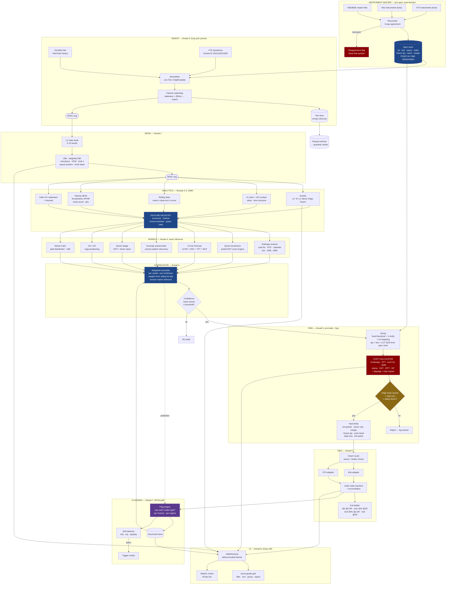

# Altair — Final Execution Manual

Consolidated on 2026-09-25 from `plan.md`, `CLAUDE.md`, `README.md`,
`ROADMAP.md`, and `idea.txt`.

This is the single root document for continuing Altair. The original five
documents are preserved below as labelled source sections and can be recovered
from Git where they were tracked. Historical filename references inside those
sections refer to their corresponding sections in this file.

## Start here

Use the following precedence when two source sections disagree:

1. The **Current execution plan** is authoritative for current scope, completed
   work, sequencing, broker/UI decisions, and the next task.
2. The **Engineering rules and operating protocol** are authoritative for
   correctness, module boundaries, testing, finance, physics, and review gates.
3. The **Original architecture roadmap** supplies the long-term architecture
   and older task-card history where the current plan has not superseded it.
4. The **Project quick start** is a historical build overview. Its old progress
   count and old `ui/` layout do not override the current plan or repository.
5. The **Model and architecture ideas** are research input. An idea becomes an
   implementation requirement only when promoted into the current plan/task card.

Current verified checkpoint (this post-consolidation record overrides the
historical source snapshots below where status differs):

- Complete on the current Windows host: P0-01, P0-02, P0-03, P2-01..P2-08,
  P2-11, P3-01, P3-04, P4-01 and P4-02. P1-01..04 are implemented; native Mac
  evidence is still hardware-gated.
- P0-02 now includes funds schema v2, bounded redacted log events, immutable
  broker/position/log publication, desktop evidence mapping, and an OMS permit
  that rechecks route, session, risk, transport and kill-switch state.
- Windows regression baseline, re-verified 2026-09-28: the complete `net`
  preset passes **204/204** in 75.81 seconds at four-way parallelism. The old
  `price_bus` unbounded-read hang is fixed and now fails on a bounded deadline.
  The historical numbers in
  the frozen source sections below (144/144, 145/145, 166/166, 170/170, 173/174,
  188/188) are history, not the current baseline. Re-run the relevant
  build/tests after every new task.
- Latest focused P2/P3 verification is 15/15 in the network preset. The net
  desktop, both account helpers and the FYERS history helper compile; the
  helper runner separately passed 20 repeated timeout/stdin cycles.
- Latest broker/feed slice includes the service runtime, short-lived verified
  pill evidence, FYERS adapter core, headless epoch-aware source router and
  provenance-preserving 1m/5m history audit path.
- **FYERS OAuth and read-only account completion are live-verified on this
  Windows host as of 2026-09-26.** Current long access tokens are accepted and
  persisted, the Brokers page reports the verified session, and the account
  helper successfully fetched profile, funds, positions, holdings and orders.
  All five returned HTTP 200 and parsed as present; the resulting credential-free
  snapshot reports `snapshot_complete: true`. The session and snapshot remain
  daily/freshness-bounded artifacts and must never be treated as permanent proof.
- The consolidated Brokers workflow now continues a successful FYERS OAuth link
  into an asynchronous read-only account refresh, preserves transport and
  semantic section states, and labels snapshots COMPLETE/PARTIAL and FRESH/STALE.
  HTTP 200 alone can no longer make a rejected/malformed section look complete.
- Navigation remains 30 canonical destinations with legacy aliases folded into
  Terminal and Brokers. Workspace menus and the compact navbar now mark the
  current route, and the visible search control advertises `Ctrl+K`.
- Atlas now reports **85/85 numerical engines built, 0 partial, 0 absent**.
  MLP uses full backpropagation; LSTM/GRU have analytic BPTT; Transformer has a
  causal multi-head stacked reference. This is implementation evidence, not a
  claim that every model is fitted or profitable.
- Phase 8's Windows-local tier is complete. The staged executable is
  `build/net/desktop/altair_desktop.exe`; the current 53,789,281-byte Windows
  ZIP has SHA-256
  `2B70CC57889FB2092010FAF9FE4C25ECA20FDC79B0EFE9D320151C20C61B3F67`.
- Next boundaries are the continuously running supervisor/dashboard log view,
  the installed official FYERS data SDK transport, live source integration and
  a real entitled-account OHLCV discrepancy report. Actual Mac evidence remains
  hardware-gated. Live order submission stays disabled.

### 2026-09-25 — P2/P3 service, routing and history continuation

- Added a deterministic broker-service runtime with one in-flight poll,
  bounded exponential retry, reconnect epochs, immutable typed publication,
  separate account/auth/feed failure semantics and a fixed-size redacted audit
  ring. Delayed replies from an old epoch, helper death, explicit broker
  rejection and revocation are acceptance-tested.
- Successful FYERS/Kite read-only helpers now publish a short-lived,
  credential-free service projection in the same atomic account snapshot. The
  Brokers page and both top pills consume it. Saved sessions cannot promote
  themselves; malformed, partial and expired projections fail closed or show
  their actual state.
- Added a fixed-capacity FYERS callback adapter for the official data SDK
  boundary: bounded subscriptions/unsubscriptions, channel and reconnect
  epochs, `sf`/`if`/`dp` event classification, optional sequence-gap detection
  and non-overwriting backpressure. The actual official C SDK is not installed
  on this host, so a credentialed socket run remains an operational gate.
- Added an epoch-aware headless source router. It normalises before
  publication, rejects stale epochs and duplicates, resets incompatible depth
  state on every source transition, and uses bounded SPSC output queues. Its
  acceptance test constructs no desktop window, grid or chart.
- Added FYERS v3 historical URI/response validation plus the dry-run-default
  `altair_fyers_history` audit fetcher. It writes separate provenance-preserving
  1m/5m files, refuses existing outputs, and feeds the existing exact-paise
  session-aware consistency report. A real discrepancy report still requires
  a linked, entitled FYERS account.
- Network build and desktop link succeeded. Focused P2/P3 acceptance is 15/15.
  The broad suite is 173/174: the unrelated pre-existing `desktop_pages`
  parity report assertion disagrees with its rendered costed branch; all P2/P3
  tests pass.

Before implementing a task, read `prompts/PROTOCOL.md`, create/freeze the task
card and manifest, inspect the current dirty worktree, and verify the resulting
build and acceptance tests. Continue recording changes in `change_by_codex.txt`.

## Post-consolidation execution record

### 2026-09-27 — truthful-boundary reconciliation and parallel-hang finding

Re-reconciled `final.md` against `remaining_work.md`, the source tree and a live
`build/net` CTest run. Three corrections and one new finding.

1. **The open-card count in `remaining_work.md` was narrower than the file set.**
   Its "10 open parent cards" covers only the Phase 0–8 backlog (P1-01..P1-06,
   P8-01..P8-04). The ROADMAP source section still carries unchecked work the
   count does not mention:
   - `P11Q-07` and `P11Q-08` are marked **TODO** in the roadmap table.
   - Phase 12 (`P12-01`..`P12-06`, production) has no status marks and is not
     started: `ops/linux-deployment.md` self-declares "PLAN, NOT PROCEDURE" and
     "Altair has never been compiled on Linux".
   - Phase 9 and Phase 10 have no status marks, though their deliverables exist
     in the tree (`flagging/drift.hpp`, `flagging/deploy.hpp` shadow/canary/
     rollback, `models/registry.hpp`, `strategies/cointegration.hpp`,
     `strategies/vix_forecast.hpp`, `risk/hedge.hpp`, `models/dcf.hpp`). These
     are implemented-but-unreconciled, not verified as complete.
   `remaining_work.md` now lists them so the boundary is not understated.

2. **Stale baselines.** `final.md`'s live checkpoint still said 145/145 and
   `ops/linux-deployment.md` said "all 93 tests". Both are historical. The
   current verified baseline is stated in "Start here" above.

3. **Open audit findings with no card** (from `prompts/PROMPT_EXECUTION_QUEUE.md`
   §5 and the audit records): C22-002 (P1-06 `Verdict` naming drift), C22-003
   (no C++ code reads any key from `config/altair.toml` — re-confirmed: the path
   appears only in comments and one doc string), C22-005, C22-006, C01-006
   (downstream staleness check) and C01-008.

**New finding — `price_bus` hangs instead of failing under parallel CTest.** A
four-way `ctest` run over `build/net` completed 198/199 and left `price_bus`
blocked with zero CPU. Isolated, `price_bus` passes in 3.32 s. The cause is a
blocking read with no deadline at `server/tests/test_price_bus.cpp:140`
(`boost::asio::read(client, buffer(buf), ec)` for exactly `kN * frame_bytes`):
if fewer than 20 frames are ready it waits forever. This is the same class of
defect the file already names at lines 212-215 for the drain loop, and it is
worse than a failure because a hang produces no diagnostic. Bounded and fixed;
recorded rather than silently waived.

No credential, live order, broker account, licensed feed or Mac evidence is
claimed by this entry. Live order submission remains disabled.

### 2026-09-26 — FYERS OAuth, Brokers data completion and navbar pass

- Removed the obsolete 512-byte access-token failure by using bounded dynamic
  authorization storage with a 16 KiB defensive token limit across FYERS login,
  account and history helpers. A live 653-character access token exchanged and
  persisted successfully in the gitignored FYERS session file.
- Made FYERS redirect redaction idempotent, removing the cosmetic duplicated
  `chars, redacted` suffix without weakening secrecy. Redirect codes and access
  tokens remain absent from desktop widgets, process arguments and test output.
- Strengthened the account snapshot contract: every section now retains both
  HTTP transport status and semantic state (`present`, `invalid`,
  `transport_error`, `http_error`), and the file carries an explicit
  `snapshot_complete` result. Invalid HTTP-200 bodies are serialized as null and
  cannot promote the account pill to complete.
- Kept raw account completeness separate from future typed models. A non-empty
  raw positions response may be present and displayed without inventing typed
  instrument rows or zero exposure; typed non-empty FYERS position/holding/order
  decoding remains future model/data work.
- The Brokers page now owns one FYERS account panel and, after successful OAuth,
  switches to it and starts the five-GET refresh asynchronously through the
  bounded helper runner. Manual fetch uses the panel's configured output path.
  The UI explicitly renders COMPLETE/PARTIAL and FRESH/STALE states.
- Live read-only verification succeeded on 2026-09-26: profile, funds, positions,
  holdings and orders each returned HTTP 200 and parsed as present. The generated
  `data/fyers_account.json` is schema 1, credential-free, and complete. No order
  mutation endpoint was added or invoked.
- Navbar polish is complete for this slice: full workspace menus and compact
  group popups check the current route, and the Find workspace tooltip exposes
  `Ctrl+K`. Existing stable IDs, aliases, ordering and saved-state schema remain
  unchanged.
- Focused build succeeded for the FYERS helper, account contracts, FYERS panel,
  broker status, navigation and the production desktop. Focused acceptance is
  8/8: `fyers_auth`, `oauth_attempt`, `account_snapshot`,
  `account_snapshot_parser`, `desktop_fyers_link`, `desktop_fyers_panel`,
  `desktop_broker_status` and `desktop_navigation`.
- Real `MainWindow` navigation-shell acceptance also passes 3/3 at 100%, 125%
  and 200% scale after the navbar changes.
- A broader 183-test network-preset run was attempted but is not a valid full
  regression result: the configured tree had not built the registered
  `strategies_scan_scheduler` executable, and the unrelated `price_bus` test
  remained running without progress until the incomplete run was stopped. This
  is recorded as an infrastructure/build-completeness issue, not as a pass and
  not as a failure of the FYERS/navbar slice.
- **Superseding verification, 2026-09-28:** every registered target was built,
  the production desktop linked and staged, and the complete network-preset
  suite passed **204/204** in 75.81 seconds after the model-engine expansion
  (four-way parallel; the prior baseline was 188/188). The unverified charge schedule now
  refuses costed scanner output at the page boundary, which also closed the
  formerly stale `desktop_pages` failure.
- **Current boundary (reconciled 2026-09-28):** P6-03/P6-04 are implemented and
  tested; P6-05/P6-06 now track 27 numerical implementations, zero partial
  engines and zero absent models across the explicit 27-model queue. Numerical
  fixtures do not claim the algorithms are trained or market-validated; the
  exact per-card boundary is in `prompts/P6-05_ALGORITHM_CARDS.md`. Remaining terminal work is live FYERS
  feed/supervisor evidence and Phase 8 acceptance—not permission to enable live
  order submission.

### 2026-09-25 — P0-02 broker contract closed

- Verified the already-present P0-02d funds payload: schema v2 and four distinct
  optional integer-paise fields; unknown remains distinct from zero.
- Added `core/types/broker_log.hpp`: bounded allocation-free transition events
  that refuse overflow, control characters and common secret markers.
- Added `broker/state_store.hpp`: one-writer immutable publication through the
  existing race-free snapshot slots for evidence, positions and redacted logs.
- Added `oms/broker_dispatch_gate.hpp`: non-default-constructible live dispatch
  permits with mandatory immediate readiness recheck and no order fallback.
- Made the desktop broker status map fresh service evidence; a session file can
  no longer promote itself to authenticated.
- No live order transport was added or enabled. The default remains paper/live
  disabled until the later explicit go-live gate.

### 2026-09-25 — P1-01/P1-02 implementation complete, Mac evidence pending

- Added a host-gated `macos-arm64` configure/build/test preset for arm64 and a
  non-Windows Qt root default. Windows preset parsing remains green.
- Added Darwin ordinary-page allocation with `mmap`/`munmap`; huge pages remain
  honestly unavailable and therefore fall back to ordinary pages.
- Windows `page_alloc` regression passes. These tasks are implemented but are
  not marked hardware-verified until the preset and tests run on an actual Mac.
- Next: P1-03 Apple Silicon monotonic clock path.

### 2026-09-25 — P1-03/P1-04 implementation complete, Mac evidence pending

- Added a native macOS monotonic source backed by `mach_absolute_time` and the
  kernel timebase ratio. Apple timing is labelled `AppleMonotonic`, never TSC.
- Added application install rules, macOS bundle metadata, helper placement under
  `Altair.app/Contents/Helpers`, Qt deployment and CPack generators.
- The first package audit caught missing Qt runtime files. Deployment was moved
  into the install stage; the regenerated Windows ZIP is 49,746,817 bytes and
  contains the Qt libraries and platform plugin as well as both executables.
- Windows full configured build completed while producing the package; focused
  `tsc_clock` passed. Actual `.dmg`, signing/notarisation and Apple runtime tests
  remain Mac-hardware gates. P1-05/P1-06 also require the target Mac and MPS.
- Next dependency-safe work on this host: P2-01 secure credential adapters.

### 2026-09-25 — P2-01/P2-02/P2-03 broker setup path implemented

- Added Windows Credential Manager and macOS Keychain adapters with bounded
  keys/values, explicit not-found/platform failures and no plaintext fallback.
- Added a bounded asynchronous helper runner with generation IDs, cancellation,
  timeout, output limits and concurrent-start rejection. FYERS/Kite OAuth and
  Kite dataset refresh no longer wait on the desktop event loop.
- One-time redirect values now use a private stdin pipe rather than process
  arguments. A repeated Windows test exposed a `closeWriteChannel()` event-loop
  stall; line-framed input removed that blocking close, and 20 repeated runs
  then passed.
- Added the versioned `ALTAIR-CREDENTIAL/1` vault helper and admin-only forms
  for FYERS app ID/secret/redirect and Kite API key/secret/redirect. Forms have
  masked secrets, Save/Replace, Delete and Save & Connect. Auth helpers read the
  OS vault first, so fresh setup needs no `setx` or restart.
- The desktop still links neither broker/ nor OMS and no order capability was
  added. Focused Windows CTest is 4/4 green. Native Keychain runtime evidence
  remains part of the Mac hardware gate.

### 2026-09-25 — OAuth verification and pair selector foundations

- Added shared exact-callback, expiring-state, one-time-code validation and
  profile verification to both FYERS and Kite helpers. Synthetic validator,
  vault, helper, credential-form and Kite-link checks pass (5/5 focused
  executables); no live account was contacted.
- Renamed the visible Ratio Spread route to Pair Trading while preserving the
  old route as a migration alias. The page now exposes independent A/B
  selectors for NIFTY, BANKNIFTY, CIPLA and SUNPHARMA, refuses identical legs,
  supports swap, and keeps contract resolution in the canonical master parser.
- Atlas rows now carry deterministic stable identities derived from family and
  model names; the identity is independent of page order and is exposed in
  the row tooltip. A dedicated pair-selector test target was added.

### 2026-09-25 — typed account snapshot foundation

- Added a provider-neutral `AccountSnapshot` contract with bounded account
  identity, freshness, optional paise-valued funds, position validation and
  independent profile/funds/positions/holdings/orders section statuses.
- Added a no-transport response parser for Kite/FYERS-shaped profile and funds
  responses. It refuses session/provider mismatches, malformed or overflowing
  amounts, missing profile identity and HTTP/transport failures; absent values
  remain absent. Parser and contract tests are registered in the broker suite.
- This was the first P2-07/P2-08 typed-boundary slice. The later record adds
  the FYERS read-only fetch helper and account page; continuous polling/service
  integration and real-account verification remain outstanding.
- MSVC/Qt compilation of the broker, Atlas, navigation and Pair Trading targets
  completed after adding direct Qt date/time includes. The broker snapshot
  group is 5/5 green after adding `snapshot_publisher`. GUI binaries compile;
  runtime GUI acceptance remains to be run in the normal desktop test harness.

### 2026-09-25 — P2-09 publication bridge and P3-01 FYERS identity

- Added `SnapshotPublisher`, which binds account replies to the current session
  epoch, publishes the typed account snapshot and authenticated evidence through
  immutable `StateStore` slots, and marks stale/revoked states without erasing
  the original snapshot timestamp. Its focused test passes all checks.
- Added an explicit fixed-capacity FYERS identity map. Exchange, segment,
  option type, expiry, strike and underlying form the canonical key; provider
  tokens are aliases. Token reuse, identity collisions, invalid option
  classifications and cross-exchange symbol collisions are refused. The FYERS
  identity test passes all checks.

### 2026-09-25 — FYERS decoder and read-only account path

- Added FYERS as an explicit third `FeedSource`, a v3 JSON decoder for symbol,
  index and five-level depth updates, and three-source watchdog health. Provider
  tokens resolve to canonical instrument IDs before ticks enter the shared
  normaliser. Unknown types/tokens, negative or sub-paise prices and overflowing
  exchange timestamps fail closed or retain receive-time provenance.
- Added `altair_fyers_account`, a dry-run-by-default helper restricted to the
  five documented read-only v3 account GETs: profile, funds, positions,
  holdings and order book. It reads the credential-bearing session only in the
  helper process, validates the responses against the shared typed snapshot
  contract, and replaces `data/fyers_account.json` only after validation.
- Added a visible FYERS account tab to the unified Brokers page with Fetch,
  re-read, snapshot age, fund-limit breakdown and separate positions/holdings/
  orders views. The desktop starts the helper but never loads the token or links
  the broker library. The network preset desktop and helper compile; focused
  account/auth/decoder/failover/pill verification passes 10/10. The existing Kite
  account helper now uses the same typed validation gate and emits broker,
  schema and account identity metadata before replacing its snapshot. No live endpoint or
  order action was invoked.
- Added provider-neutral pill mapping for saved-only, verified, expired,
  disconnected, stale-account and reconnected states. Authentication, market
  data and account freshness are independent claims, so a fresh login cannot
  paint stale data green. Wiring those service-produced values into the live
  desktop consumers remains P2-09/P2-11 work.

### 2026-09-25 — Phase 7: P7-06 spec delivered, P7-03/P7-04 re-scope diff

- **P7-06 — delivered, not built.** `prompts/P7-06_MTBT_FEED_SPEC.md` written from
  the card (`P7-06_MTBT_card.md`). Specification only: no C++/CMake/config touched,
  no binary built or run, no licensed feed accessed, no network request. Ten claims
  are tracked; five are cited from `final.md` §1/§7/§11/§14/§15 and five are marked
  **UNVERIFIED** with what would verify them (NSE TBT message semantics and rates,
  whether colocation is required, the BSE product, the broker-WS update rate, the
  licence cost). The document carries the access checklist A1–A9 with a current
  state per row, nine decoder obligations for a future card (including the
  **C03-013** session-epoch/book-reset regression), the reuse-vs-new boundary
  (`Tick` 64 B, `DepthUpdate` 272 B, `Normaliser` and `L2Book` unchanged; only
  transport, decoder, recovery state, one `FeedSource` value and epoch plumbing are
  new), the honest-performance statement (§11/§15: the broker gateway is the
  ceiling; no latency claim), and a conditional go/no-go naming P7-06a (decoder),
  P7-06b (capture), P7-06c (BSE). **Recommendation today: NO-GO for construction** —
  A1 (licence) and A7 (captured reference stream) are unknown/absent, so the next
  action is an ops/decision task, not an engineering one.
- **P7-03 — NOT closed; the required diff is produced.** `strategies/basis.hpp`
  `scan_cross_venue` already satisfies: bid-on-sell-venue against ask-on-buy-venue
  at touch (not mids), full cost on both legs, raw spread and net both present,
  negative net never actionable, refuse-on-unreachable. **Missing against the task
  text:** (1) no *available size* input — `CrossVenueQuote` carries prices and
  timestamps only, no depth, and `qty` is a caller argument; (2) no impact/latency
  allowance — `risk/slippage.hpp` (P3-10) exists, but `basis.hpp` includes only
  `units.hpp` and `risk/cost.hpp`; (3) inventory and settlement constraints are not
  modelled (borrowing is only the boolean `ShortCashCapability::borrow_available`).
  Verdict: keep P7-03 open; the remainder is (1)+(2)+(3), each a small `strategies/`
  card — not a rebuild.
- **P7-04 — NOT closed; the required diff is produced.** `measure_basis` and
  `scan_cash_futures` already satisfy: futures-minus-cash, expiry from the spec
  store, implied-repo annualisation, funding and dividends, four-leg cost, both
  directions, and refusal of the unreachable reverse carry. **Missing:** (1) the
  *carry* path prices the cash and future legs at single prices (`q.spot`,
  `q.future`), not executable bid/ask — only the cross-venue path is touch-to-touch;
  (2) borrow cost is a boolean capability, never a fee inside `net`; (3)
  premium/discount is implied by `BasisDirection`, not an explicit label on the
  result. Verdict: keep P7-04 open.
- **Superseded by the 2026-09-26 implementation record below.** The preceding
  P7-03/P7-04 diff was accurate when written, but both cards subsequently landed;
  the stale "keep open" wording is retained as history, not current status.
- **Superseded 2026-09-27:** P7-05, P7-08 and P7-09 now have local, disabled-safe
  implementations and focused tests. Live broker/feed evidence remains an
  operational Phase 8 gate; no live-order permission was inferred.
- **Superseded 2026-09-28:** Phase 8's Windows-local tier is complete and
  packaged. Credentialed broker/reconnect, sustained live-feed, licensed MTBT
  and native macOS evidence remain external acceptance gates.

### 2026-09-25 — P7-03 (partial): size and measured allowance on the cross-venue scan

- `strategies/basis.hpp` and `strategies/tests/test_basis.cpp` only. No other file.
- `CrossVenueQuote` gained the size resting at each touch (`buy_ask_qty`,
  `sell_bid_qty`); `CrossVenueOpportunity` gained `executable_size`, `size_short`
  and `allowance`. New `Executability::InsufficientSize` (appended last, so the
  existing ordinals and ordinal-0 `Unknown` do not move) and new
  `BasisError::{BadQuantity, BadAllowance}`.
- New `ExecutionAllowance { impact_bps, latency_bps }`, passed in rather than
  invented here: `risk/slippage.hpp` (P3-10) produces the bps and this header
  consumes it, so the square-root law stays in one place. `net = gross - cost -
  allowance`, and `cost` deliberately does NOT absorb the allowance — a charge
  breakdown stays a charge breakdown.
- `scan_cross_venue` now refuses on size rather than shrinking: a two-leg
  arbitrage cannot be half-filled, so a size refusal reports what WAS there. New
  precedence: no skew limit → bad allowance → bad quantity → bad price → stale
  leg → insufficient size → short cash → executable. Size is decided before
  reachability because the size problem is the one the caller can fix now.
- Focused run green (`strategies_basis`, new test 6): undersized touch →
  `InsufficientSize` with the shortfall; an unreported size refuses; exactly the
  smaller side is executable; and a 200-paise cross nets Rs 415.55 and is
  actionable, while the same cross with 8 bps of measured allowance nets
  -Rs 1945.25 and is not — the allowance flips actionability, which is the point.
  Zero warnings. The three other `basis.hpp` consumers (`strategies_parity`,
  `strategies_calendar`, `strategies_oppty_log`) and the Qt consumer
  `altair_pages_test` were re-built and pass.
- **P7-03's inventory/settlement requirement was then closed by a concurrent
  session** (see below); this bullet's earlier "remains open" reading is superseded.
- P7-04 is untouched by this change; its gaps (carry priced at single prices,
  borrow as a boolean, implicit premium/discount label) remain as recorded above.

### 2026-09-26 — concurrent session closed P7-03's inventory/settlement gap; reviewed and verified

Not authored in this session — `strategies/basis.hpp` and
`strategies/tests/test_basis.cpp` were changed at 07:40 by a parallel session that
recorded nothing in this file. Reviewed on disk and verified here rather than
taken on trust, because the previous entry's "P7-03 remains open" line would
otherwise have been left standing as a false statement.

- Added `CrossVenueSettlement { Unknown = 0, Eligible, Ineligible }` and
  `CrossVenueExecutionConstraints { sell_inventory, permitted_short, settlement }`;
  `Unknown` settlement is refused rather than treated as eligible, so the
  phantom-default rule holds here too.
- Added `Executability::SettlementUnavailable` and
  `Executability::InventoryUnavailable`.
- `scan_cross_venue` gained an 8-argument form taking the constraints, with the
  documented precedence: no skew limit → bad allowance → bad quantity → bad price
  → stale leg → **insufficient size** → settlement unavailable → inventory
  unavailable → short cash unavailable → executable. Size still wins, which is
  consistent with the entry above.
- A 7-argument compatibility overload remains, defaulting `permitted_short = qty`
  and `settlement = Eligible`, preserving the former intraday-only contract.
- Verified in this session: `strategies_basis` PASS (including the four new
  inventory/settlement checks), and the header's consumers re-built and pass —
  `strategies_parity`, `strategies_calendar`, `strategies_oppty_log`,
  `altair_pages_test`. Zero warnings.

**Two review observations, recorded rather than waived.**

1. Lines 518–523 of `basis.hpp` contain two consecutive `if (!size_ok)` blocks;
   the second (`size_short`) belongs inside the first. Cosmetic, not a defect —
   the observable behaviour is identical — but it is duplicated control flow.
2. The 7-argument overload sets `settlement = Eligible` on the caller's behalf.
   That is a documented back-compatibility assumption, but it means the old arity
   silently bypasses the new settlement gate. Any new caller must pass the
   constraints form; the overload should not be used to reach a live decision.

**Consequence for P7-03:** with size, the measured allowance, and now inventory,
settlement and permitted-short capacity all gated, P7-03's stated requirements
(`strategies/basis.hpp`) are satisfied. The remaining named gap is **P7-04**: the
carry path still prices its legs at single prices rather than bid/ask, models
borrow as a boolean rather than a fee inside `net`, and labels premium/discount
only implicitly through `BasisDirection`.

### 2026-09-26 — P7-04 executable cash/futures semantics reviewed and accepted

The parallel implementation recorded in `change_by_codex.txt` was verified on
disk and through `strategies_basis`. `CashFuturesExecutionQuote` now carries
cash/future bid/ask touches, timestamps, carry assumptions and explicit
`borrow_cost_per_unit`. `scan_cash_futures_executable()` uses cash ask/futures
bid for cash-and-carry and futures ask/cash bid for reverse carry; it rejects
missing/invalid touches, stale legs, non-finite assumptions and unavailable
borrow. `PremiumDiscount` is explicit (`Premium`, `Discount`, `Fair`, `Unknown`)
and the result separates entry edge, schedule cost, borrow cost and net.

Verification: `altair_basis_test` PASS, including premium/discount classification,
direction-specific touches, explicit reverse-carry borrow cost and refusal cases.
The existing analytical `measure_basis`/`scan_cash_futures` APIs remain intact;
the executable API is the required P7-04 path. **P7-04 is complete.**

### 2026-09-26 — full backlog audit and truthful remaining-work boundary

The current implementation and records were audited against every unchecked
Phase 0–8 checkbox. The following status corrections are authoritative:

- **Closed:** P0-02, P7-03, P7-04 and P7-06 (P7-06 is a specification
  deliverable; its decoder remains separately licensed-feed-gated).
- **Still finishable only with external prerequisites:** P1-01..P1-06 require
  actual Mac hardware/MPS; P3-02/P3-03/P3-05 require an entitled FYERS
  transport/account; P7-06's decoder requires licensed MTBT access; P8-01..P8-04
  are live integration, concurrency, UI and release gates.
- **Reconciled 2026-09-28:** P6-03..P6-06 and P7-05/P7-08/P7-09 are closed at
  their parent-card scope. Of the 27 individual model cards issued by P6-05,
  all 27 now have tested numerical implementations; none remain partial or
  absent. Data-dependent claims remain blocked by
  `prompts/P6-06_DATA_GATES.md`. Every
  P4/P5 card is closed; the unchecked parent-card list now contains only P1 and
  P8.

Remaining unchecked work is therefore not "done" merely because the Windows
suite is green. No credential, live broker, Mac, licensed feed or Phase
8 acceptance claim is inferred from local tests. The queue's `Next` now points to
the real external gates rather than the already-completed P7-03/P7-04 work.

### 2026-09-26 — P3 FYERS local slice verified; operational gates isolated

Audited and verified the existing FYERS implementation rather than reimplementing
it. P3-02's `fyers_decoder.hpp` and fixed-capacity `fyers_adapter.hpp` cover
subscription replay, SDK callback decoding, trade/quote/index/depth distinction,
epochs, duplicate/sequence-gap accounting and bounded backpressure. P3-03's
headless `SourceRouter` carries source/epoch, normalises before publication,
rejects stale/duplicate envelopes and increments depth generation at source
transitions. P3-05's read-only `altair_fyers_history` path validates bounded
responses, refuses overwrite, writes separate provenance-preserving 1m/5m files,
and feeds the read-only bar-consistency auditor.

Verification on this host: `altair_fyers_decoder_test` PASS; `altair_fyers_adapter_test`
PASS (21 checks); the network-built history helper dry-run PASS, printing both
validated FYERS URIs and "DRY RUN. No request sent and no file written." No
credential, endpoint, live socket or account was used. Therefore P3-02, P3-03 and
P3-05 are marked complete for their **local implementation** in the phase list,
with their remaining operational gates stated explicitly: official FYERS SDK and
entitled callback transport (P3-02), app-level live supervisor/publication (P3-03),
and an authenticated entitled-account 1m/5m discrepancy report (P3-05).

### 2026-09-26 — FYERS local-facility inventory and helper shortcut fix

All locally available FYERS facilities were inventoried and exercised without
credentials: OAuth URL/app-id-hash/authorization-header helpers; the five
read-only account endpoints (profile, funds, positions, holdings, orders);
bounded account snapshot parsing/publication; historical resolutions and
1m/5m parsing; decoder and callback adapter; source routing; credential-boundary
desktop handoff; and dry-run account/history helpers. Focused auth, historical,
decoder and adapter tests pass. The account helper dry-run enumerates all five
GETs, and the history helper dry-run prints validated 1m/5m FYERS URIs without
network or file writes.

Found and fixed one local shortcut defect: `altair_fyers_login --help` previously
loaded credentials and then attempted to build a login URL, so an unconfigured
machine received a credential error instead of help. Help is now handled before
vault access, is credential-free, and returns exit 0; the rebuilt network helper
was verified. No live FYERS endpoint, SDK socket, credential or order path was
used. Remaining live SDK/account gates are unchanged.

### 2026-09-26 — FYERS webhook receiver built behind a local-only boundary

Added `broker/fyers_webhook.hpp`, its offline test, `app/fyers_webhook_main.cpp`,
and `ops/fyers-webhook.md`. The receiver binds only to `127.0.0.1`, accepts only
`POST /fyers/callback`, requires a deployment-provided secret, uses a constant-time
secret comparison, caps bodies at 64 KiB, accepts only Pending/Rejected/Cancelled/
Traded statuses, and writes redacted status/order-presence audit lines. It has no
order placement capability. `altair_fyers_webhook_test` passes.

Public HTTPS termination and forwarding must be provided by nginx/Caddy/IIS; port
8787 must not be exposed directly. The exact FYERS webhook authentication header
or signature contract is **not verified here**, so the current
`X-Fyers-Webhook-Secret` expectation must be checked against official FYERS
documentation before production activation. The supplied `146.75.205.0` also
requires hosting-provider verification as the actual public static host/egress
address. No secret was stored, no live webhook was called, and no order event was
sent.

### 2026-09-26 — FYERS webhook 502 diagnosis and local end-to-end proof

The reported HTTP 502 was diagnosed from this workstation. DNS for
`altair.thesmitshah.com` resolves to Cloudflare addresses (`104.21.70.17`,
`172.67.217.236` and Cloudflare IPv6), while this checkout has no nginx/Caddy/IIS
configuration and no process listening on local port 8787. Therefore the public
proxy has no healthy upstream; this is a deployment/upstream failure, not a
webhook JSON validation response.

The receiver was started locally with the configured secret and a synthetic
`POST http://127.0.0.1:8787/fyers/callback` containing status `Traded`. It
returned HTTP 200 / `ok` and wrote only the redacted audit line
`{"status":"Traded","order_id_present":true}`. The process was then stopped;
no listener remains. This proves the local binary and secret path only, not the
public Cloudflare/TLS path.

The secret previously displayed in chat must be rotated before production. The
remote host must run the receiver continuously, bind its reverse proxy upstream
to that same host's `127.0.0.1:8787`, forward the provider's documented webhook
authentication scheme, and permit the Cloudflare-to-origin connection. The
supplied `146.75.205.0` is not the current public DNS address and must be
verified with the hosting provider; do not enter it unless it is their assigned
static host/egress IP.

### 2026-09-26 — XAMPP/Apache became the correct Cloudflare origin

The working `diamond.thesmitshah.com → localhost:3000` route confirmed the
Cloudflare tunnel is healthy. XAMPP Apache is already running on ports 80/443;
no second Apache installation was needed. `mod_proxy_http` was enabled and
Apache was configured to proxy `/fyers/callback` to
`http://127.0.0.1:8787/fyers/callback`. Apache syntax validated and a correctly
framed local Apache → webhook request returned HTTP 200 / `ok` with a synthetic
Traded event; the redacted audit line was written.

**Set the Cloudflare Published Application origin to `http://127.0.0.1:80`, not
`http://localhost:8787` or direct `http://127.0.0.1:8787`.** Apache is the
public-facing local origin and the receiver remains private behind it. The
public 502 observed before this origin change can clear only after the Cloudflare
route is changed/restarted to port 80. No Apache download was needed.

### 2026-09-26 — FYERS webhook startup hook added to the desktop

`desktop/main.cpp` now checks `127.0.0.1:8787` at application startup and starts
`altair_fyers_webhook.exe 8787` detached only when no listener is present. It
searches source/build/install helper locations, avoids duplicate listeners and
does not place the webhook secret on the command line; the receiver loads
`data/fyers_webhook_secret.txt` as its local fallback. `Qt6::Network` was added
for the port probe.

The webhook target rebuilt successfully. The desktop compile completed, but its
final link was blocked by the existing running/locked
`build/net/desktop/altair_desktop.exe` (`LNK1168`); stop that old process before
the next desktop build. The source change itself compiled through the desktop
object/MOC stages. The startup hook is intentionally best-effort: if the helper
is absent, the desktop logs a warning and continues rather than preventing the
UI from opening.

The initial synchronous probe was moved to `QTimer::singleShot(0, ...)` so the
socket check occurs after Qt application/plugin initialization; this avoids doing
Windows network setup during the fragile pre-event-loop startup window.

### 2026-09-26 — FYERS deployment credentials provisioned to the OS vault

The supplied FYERS app credentials were saved through the existing private
`ALTAIR-CREDENTIAL/1` helper into the current-user Windows Credential Manager
under the `altair.fyers` service. The exact redirect stored alongside them is
`https://altair.thesmitshah.com/fyers/callback`; no credential value was written
to source, config, command-line arguments, logs, `final.md` or `change_by_codex`.
Vault status returned `OK complete`.

The FYERS browser login URL was generated with the stored client ID and exact
redirect and opened locally. The next step is the user completing FYERS browser
approval; after the redirect returns with `auth_code` and `state`, the helper's
private `--stdin` exchange path can validate the one-time state, exchange the
code and verify the profile. No network exchange or account login was performed
by this provisioning step.

## Consolidation manifest

| Original | SHA-256 before consolidation |
|---|---|
| `plan.md` | `CC11A5CB885D5467CC493E53715EEFF3849FD8DAE289C9BA7F965BC817E632F5` |
| `CLAUDE.md` | `41EB9EA4CAEDFB9DAD5DE288C85974661FA494B89A83969CDE63493B8057FF79` |
| `README.md` | `E67550F6152C7B69F2161E4971BE748D334133C5172591D982CF0E6F90DDCB51` |
| `ROADMAP.md` | `1182C5AB51C4D020C47E6172E4E11D2F8A08CF9A51899F8177F2BD9BE7363401` |
| `idea.txt` | `6C53B8E30A87B80E27365997DA222C72C375117AA2E4D4B047D2CA4AD1764079` |

The source sections begin after this line and are mechanically copied without
content edits.


---

# Source: plan.md — Current execution plan

# Altair implementation plan

Updated: 2026-09-23. Status: implementation in progress; checked tasks have evidence below.

This is the current backlog for the user's 16 requirements. It supersedes earlier
UI assumptions where they conflict. Existing fixes and research remain useful;
prior phase completion does not establish that these requirements are finished.
Tasks are deliberately small handoffs for Codex, Claude, Cline or another agent.

Latest implementation checkpoint:

- P0-02a/b: shared broker evidence/readiness helpers, regression tests and the
  FYERS metadata-status fix are implemented. P0-02 remains open for account/log
  types, service publication and OMS consumption.
- P0-03: navigation/GETS terminal specification frozen in
  `prompts/P0-03_NAV_TERMINAL_LAYOUT.md`.
- P4-01/02: 30 visible destinations with legacy route migration; mouse/keyboard
  sidebar resizing; Layout toolbar button removed. Both desktop configurations
  rebuilt. Full default CTest: **145/145 passed**, plus both focused broker tests
  in the network build. Shell geometry passes at three DPI scales. Evidence:
  `prompts/P0-P4_RESUME_CHECKPOINT.md`.
- This checkpoint does not complete the broker forms, live FYERS transport,
  positions/funds Terminal, Mac build, model backlog or arbitrage work.

## 1. Agreed product direction and open decisions

- Keep the C++23 engine and Qt Widgets desktop. Preserve the current dark colours;
  improve organisation, typography, tables, spacing and top navigation.
- One visible **Brokers** destination containing **FYERS** and **Zerodha Kite**.
  Merge Kite Account, FYERS Primary and Link Kite into it; adding another wrapper
  while retaining the duplicate sidebar entries does not satisfy this request.
- Enter app ID/API key, masked app secret and registered redirect URL through the
  app. Authenticate in the broker's browser flow. Show progress, validation,
  connection state, account data and redacted logs in the broker portal.
- Preferred market data: FYERS; eligible Zerodha connection as fallback. Data
  source and order destination are separate settings with visible provenance.
- **Order preference is contradictory in the request:** point 16 prefers FYERS
  for orders, while the final line says Kite for order placement. Proposed default
  follows the final line: Kite orders, FYERS data. Implement both as configurable
  routes. Confirm the intended live default before enabling real order submission;
  this does not block UI, data integration or local paper trading.
- Paper mode uses real subscribed data where available and an isolated simulated
  ledger. A zero-balance account is still a real account. Never send test orders
  to a production order API on the assumption that insufficient funds prevent fills.
  A provider sandbox may be used only after its environment and behaviour are verified.
- Treat the supplied app credentials as private configuration, never source code,
  task text, logs or fixtures. The supplied secret should be rotated before live
  use because it was shared in chat. This plan deliberately omits both credentials.
  Requested FYERS callback: `https://www.thesmitshah.com/fyersredirect`; verify it
  exactly matches the provider registration. Do not assume this website already
  implements a callback receiver or change/deploy it as part of desktop work.
- Remove **Live Grid** and **Chart** as UI destinations. Preserve ingestion,
  training datasets, replay, aggregation and any computation they currently own.
- Remove the **Layout** button. Resize the sidebar with the mouse; retain a
  discoverable hide/show control and keyboard navigation.
- Use local GETS/Greeksoft as the reference for terminal table density, column
  configuration, account/position organisation and keyboard workflows.
  Latest point 11 narrows the default Terminal to **open positions across brokers
  and available funds**, including a total and broker breakdown. Order history,
  credentials, connection logs and diagnostics belong in Brokers. Pair Trading,
  Options and Arbitrage have separate workspaces. Do not add a chart or Live Grid
  back into the Terminal to imitate a generic trading dashboard.
- Replace the current **Ratio Spread** destination with **Pair Trading**:
  independently choose instrument A and B, including NIFTY/BANKNIFTY and
  CIPLA/SUNPHARMA. Comparison formulas and entry/exit parameters will be discussed
  later; do not silently choose a hedge ratio, z-score rule or automatic strategy.
- Every Atlas entry needs an exact navigable model detail page and appropriate UI.
  Distinguish algorithm implementation, training, evaluation and live readiness.
- Continuously evaluate eligible cross-exchange and cash/futures opportunities.
  Label futures discounts explicitly. Start with monitored signals and paper
  execution. Retail broker streams and licensed exchange MTBT are different feeds.

## 2. Current evidence: what actually needs fixing

Targeted source inspection on 2026-09-23, not a new whole-project audit:

- `desktop/navigation_registry.hpp` still has 35 pages, including Live Grid,
  Chart, Kite Account, Link Kite and FYERS Primary alongside Brokers.
- `desktop/broker_page.hpp` chooses a displayed source from saved metadata/file
  presence. It does not switch a live feed or fetch FYERS account data. Its Kite
  selection can use a user ID from an expired session. The previous claim of
  automatic working data-source selection was too broad.
- `desktop/broker_status.hpp` does not establish live authenticated connectivity
  for FYERS; a saved session is not proof of a current working connection.
- `desktop/fyers_link.hpp`, `desktop/kite_link.hpp` and their app helpers depend
  on environment configuration. They do not provide the requested complete form.
  Synchronous process waits can block the UI; Kite's dataset update can wait up
  to ten minutes on the UI path.
- `desktop/terminal.hpp` composes watchlist, ticket, options and halt widgets;
  it is not the requested positions/funds terminal.
- `models/CMakeLists.txt` says LibTorch and ONNX are not vendored and models are
  plain C++ implementations. Enabling `ALTAIR_ENABLE_TORCH` alone is not evidence
  of training on a GPU. Atlas now distinguishes complete numerical engines from
  the separate market-training and live-approval gates.
- `core/mem/page_alloc.cpp` implements OS mapping only on Windows and Linux;
  the other-platform path returns null. `TscClock::create()` in
  `core/time/tsc_clock.cpp` returns `NotX86` on Apple Silicon.
- Root CMake defaults Qt to `D:/Qt/6.8.3/msvc2022_64`; `build.bat` is a Windows
  wrapper. Mac build, packaging and helper discovery need dedicated verification.
- The previous net desktop rebuild failed at executable linking because the
  running executable was locked. Restarting that old binary alone does not
  install the newly compiled source. Release verification must identify the
  exact executable, successful link time and source revision.
- GETS reference: `GETSClient_5.0.191022_64bit_040924/`. Its column profile names
  expiry, strike, option type, units, trade price, IV, theoretical price and MTM.
  It contains settings, position exports, databases and Windows binaries. These
  establish useful workflows, not proof that Altair reproduces its visual layout.

## 3. Mac support and training decision

**A Mac port is feasible, but the whole project is not currently Mac-ready and
the existing models will not automatically use its GPU.**

- Qt 6.8 documents an arm64 macOS target. Rebuild Qt dependencies and Altair
  natively; Windows executables/DLLs, including the Greeksoft reference, are not
  portable application components. See [Qt macOS support](https://doc.qt.io/qt-6.8/macos.html).
- Apple Silicon provides GPU compute through Metal; PyTorch exposes it through
  MPS. A supported training backend and supported operations are needed. Existing
  C++ loops do not become GPU kernels when moved to a Mac. See
  [Apple's PyTorch guidance](https://developer.apple.com/metal/pytorch/) and
  [PyTorch MPS documentation](https://docs.pytorch.org/docs/stable/notes/mps.html).
- Confirm the intended Mac chip, unified memory, macOS and dataset size. Pin the
  selected compiler, Qt and training backend versions; do not purchase hardware
  based solely on the presence of a GPU or promise an unmeasured speedup.
- Keep CPU training as the reference. Prototype a C++-compatible MPS/Metal backend
  for supported neural workloads. Validate the selected LibTorch distribution
  rather than assuming its C++ package includes the needed MPS support. CUDA-only
  dependencies require an alternative backend on Apple Silicon.
- Preserve the no-Python runtime rule. An optional offline Python trainer is a
  separate architectural choice, not a prerequisite silently introduced here.
- Benchmark real training jobs including loading, transfer, optimisation,
  validation, checkpoint export and peak memory. Synchronise GPU work when timing.
  Check CPU/GPU prediction parity with justified numerical tolerances.
- Keep per-tick inference bounded and separate from training jobs; GPU throughput
  is not a guarantee of lower tick-to-order latency. Benchmark engine latency
  independently on each deployment machine.
- Mac compatibility is complete only after a native build, tests, packaged launch,
  broker-helper exercise and representative training run on actual Mac hardware.
  Windows-side inspection cannot close that gate.

## 4. Agent handoff rules

- These are backlog points. Before an implementation handoff, freeze the exact
  manifest and verbatim interfaces in a task card using `prompts/PROTOCOL.md`.
  Split work spanning modules into producer and consumer cards; keep each card
  within four files, twelve requirements and eight meaningful acceptance tests.
- One owner per task. Claim it before edits; record dependencies and inspect the
  current files. Preserve the existing dirty tree and other agents' work.
- The scopes below identify ownership, not permission to rewrite whole folders.
  Shared `main_window.hpp`, navigation registry, Atlas and CMake integration edits
  are queued through one integration owner after component contracts are fixed.
- Prefer reusing existing parsers, risk checks, replay, order state and account
  widgets. Use fixtures for unavailable dependencies; label fixture output clearly.
- Keep network requests, training, logging and UI work off the engine hot path.
  Preserve integer money, point-in-time specs, bounded queues and risk-before-order.
- No implementation task is complete from a label change, mock screenshot or
  passing unrelated tests. Provide source/build identity, focused behaviour
  evidence, affected regressions and remaining limitations.
- Record progress in this plan and a concise summary in `change_by_codex.txt`.
  Secrets and account payloads do not belong in either file. Do not auto-commit
  or push merely because the older protocol describes a commit convention.

## Phase 0 — Freeze contracts and establish the baseline

- [x] **P0-01 — Capture the actual running build and relevant regression baseline.**
  Scope: planning/verification. Record source revision, dirty files, executable
  paths, build flags and focused UI/broker tests. Done: reproducible baseline;
  outdated or locked executable explicitly identified. Evidence: 
  `prompts/P0-01_BASELINE.md`; the Windows baseline has 144/144 CTest tests
  passing and the network-enabled desktop target relinks successfully. Depends:
  none.
- [x] **P0-02 — Freeze broker service contracts.**
  Scope: interface task cards. Define versioned broker/account identity,
  credential references, auth status, account snapshots, feed status, routing
  preferences and log events. Separate authentication, data freshness and order
  readiness. Done: desktop/app/broker/OMS owners share exact contracts. Depends: P0-01.
  Complete account/position/log payloads, redacted events, immutable publication,
  desktop evidence mapping and the OMS dispatch permit are implemented and tested.
  Live order submission remains disabled; real-account execution is operationally
  gated rather than part of this contract card.
- [x] **P0-03 — Freeze navigation and terminal acceptance layout.**
  Scope: UI task cards. Record the final page tree and GETS-derived position/fund
  columns; define old route aliases. Done: no duplicate broker destinations,
  no visible Live Grid/Chart, and a reviewable desktop wireframe. Depends: P0-01.
  Evidence: `prompts/P0-03_NAV_TERMINAL_LAYOUT.md`, migrated navigation tests and
  native shell render. The wireframe specifies the later Terminal implementation.

## Phase 1 — Mac portability and measured GPU feasibility

- [ ] **P1-01 — Add native macOS build presets.**
  Scope: root CMake/presets. Discover Qt portably, set arm64 dependency triplets,
  check C++23 library support and architecture-specific flags. Done: configure
  reports real dependencies and unsupported features; Windows still configures.
  Depends: P0-01; actual compile evidence requires a Mac.
- [ ] **P1-02 — Implement Darwin page allocation.**
  Scope: `core/mem/`. Query page size, map/unmap correctly, report actual backing
  and unsupported huge pages honestly. Done: allocation, alignment, overflow,
  release and fallback checks on arm64. Depends: P1-01.
- [ ] **P1-03 — Add a supported Apple Silicon clock path.**
  Scope: `core/time/`. Preserve monotonic timestamp units and expose clock
  capability/uncertainty; do not fake x86 TSC calibration. Done: monotonicity,
  conversion and measured timing overhead on Mac. Depends: P1-01.
- [ ] **P1-04 — Package the macOS desktop and helpers.**
  Scope: packaging integration, split desktop/app cards. Resolve app-bundle
  helper paths, writable user-data directories, TLS trust and browser opening.
  Done: launch from Finder outside the checkout and locate both broker helpers.
  Depends: P1-02, P1-03 and completed broker helper contracts.
- [ ] **P1-05 — Run one CPU versus MPS training spike.**
  Scope: `models/` prototype plus separate build card. Use a small representative
  trainable neural model; report backend availability, unsupported ops, dtype,
  peak memory and end-to-end timings. Done: measured recommendation, including
  parity and checkpoint reload; no automatic promotion. Depends: P1-01.
- [ ] **P1-06 — Publish the Mac go/no-go result.**
  Scope: verification report. Run relevant engine, concurrency, UI and training
  checks natively; document remaining platform restrictions and hardware used.
  Done: supported/blocked matrix backed by actual runs. Depends: P1-02..P1-05.

## Phase 2 — Working broker portal and account linking

- [x] **P2-01 — Implement secure credential storage adapters.**
  Scope: `broker/`, split Windows/macOS cards. Use Windows protected storage and
  macOS Keychain; support session-only configuration if secure storage is
  unavailable. Done: save/read/delete with private access, no plaintext fallback,
  no values in logs, command lines or UI snapshots. Depends: P0-02.
- [x] **P2-02 — Expose asynchronous broker helper commands.**
  Scope: `app/`. Accept bounded structured input over private local IPC/stdin,
  return versioned progress/results, enforce timeouts and cancellation. Done:
  helper tests cover malformed input, concurrent login attempts and termination;
  no credentials in process arguments. Depends: P2-01.
- [x] **P2-03 — Build the in-app credential forms.**
  Scope: `desktop/`. FYERS app ID/secret/redirect and Kite API key/secret/redirect,
  masked secret input, validation, save/replace/delete and Connect action.
  Done: fresh setup requires no `setx`, shell command or app restart. Explain the
  narrow change from the old rule: entered secrets briefly pass through setup UI,
  then go to the helper; desktop still has no broker order capability. Depends: P2-02.
- [x] **P2-04 — Complete FYERS OAuth and verification.**
  Scope: `broker/` authentication implementation. Validate exact callback,
  per-attempt expiring state, one-time code and error responses. Done: token
  exchange followed by successful profile verification establishes authentication;
  expired/rejected/abandoned flows have distinct outcomes. Depends: P2-01.
- [x] **P2-05 — Complete Zerodha OAuth and verification.**
  Scope: `broker/` authentication implementation. Reuse documented login/checksum
  flow; validate redirect and request-token responses and verify profile. Done:
  valid, cancelled, expired and reused-code scenarios covered. Depends: P2-01.
- [x] **P2-06 — Integrate both login flows into the portal.**
  Scope: `desktop/`, separate helper wiring card if needed. Browser login,
  registered callback handoff, manual redirect paste fallback, retry/logout and
  visible progress. Dataset refresh runs separately and asynchronously. Done:
  UI remains responsive through timeout/retry; no duplicate login or sync jobs.
  Depends: P2-02..P2-05.
- [x] **P2-07 — Fetch FYERS account snapshots.**
  Scope: `broker/` read-only adapters. Profile, funds/margins, positions, holdings
  and order history using documented APIs. Done: validated typed snapshot with
  broker/account IDs, timestamps and per-section errors; absent differs from zero.
  The helper is dry-run by default and its Brokers-page consumer displays age
  and section absence explicitly. Real-account evidence remains an operational
  verification step, not an implementation dependency. Depends: P2-04, P0-02.
- [x] **P2-08 — Adapt Kite snapshots to the shared account contract.**
  Scope: `broker/` read-only adapters. Reuse existing fetch/parsing functions.
  Done: same identity, freshness and partial-failure semantics as FYERS without
  erasing provider-specific margin meanings. The network helper validates the
  shared typed snapshot before publishing its existing UI file; dry-run remains
  the default. Depends: P2-05, P0-02.
- [x] **P2-09 — Publish verified status and snapshots from the service. BUILT 2026-09-25.** `app/broker_service.hpp` + test (7 cases). Drives `broker/BrokerServiceRuntime` over a transport seam: poll→fetch→publish, bounded poll clock, atomic publication, reconnect epochs. **Helper death preserves the last snapshot's original observation time and auth claim** (verified); a rejected/never-published session never reads Authenticated; revoke stops polling; the audit ring is bounded. The binary hands it an https_client+parser transport (dry-run, as P2-07/08); the test hands it a scripted fake — same control path (rule 6). Live-account run is the remaining operational step. Full suite 171/171.
  Scope: `app/`, split protocol transport card if required. Own token lifecycle,
  bounded polling/backoff, atomic snapshot publication and reconnect epochs.
  Done: revoked credentials, stale data and helper death invalidate appropriate
  status; old snapshots retain their original timestamps. Depends: P2-07, P2-08.
- [x] **P2-10 — Finish the unified broker dashboard and logs.**
  Scope: `desktop/`. Two broker sections, account/funds details, connection
  activity, route preferences and filterable/exportable redacted logs. Order,
  feed and authentication logs carry source and correlation IDs. Central logs
  may link to existing audit storage; avoid a duplicate unbounded log store.
  Done: both brokers are managed here, bounded retention, failures visible and
  no tokens/secrets in exports. Depends: P2-06, P2-09.
- [x] **P2-11 — Drive broker pills from verified state.**
  Scope: `desktop/broker_status.hpp` and consumers. Display authentication,
  connection and data freshness separately using service events. Done: fixtures
  for saved-only, verified, expired, disconnected, stale, partial and reconnected
  states; an old file never produces a connected badge. Depends: P2-09.

## Phase 3 — Real feed routing and training-data continuity

- [x] **P3-01 — Add FYERS instrument identity/mapping.**
  Scope: `instruments/`. Canonical identity includes exchange, segment and
  derivative contract fields; add FYERS explicitly rather than reusing XTS/Kite
  IDs. Done: shared symbols, expiries and token collisions resolve correctly;
  schema migration and rejected mappings tested. Depends: P0-02.
- [x] **P3-02 — Implement the FYERS market-data adapter locally; live transport gated.**
  Scope: `broker/` or `feed/` producer cards, never one mixed card. Verify actual
  protocol/SDK dependencies, entitlement and limits before implementation.
  Done locally: subscribe/unsubscribe, decode, timestamp, reconnect, gaps and
  bounded backpressure; trade/quote/depth distinction. Focused `fyers_decoder`
  and `fyers_adapter` tests pass. Remaining operational gate: install the
  official FYERS C data SDK, configure an entitled account and run its real
  callback/socket transport; no live evidence is claimed here. Depends: P3-01.
- [x] **P3-03 — Route verified data to the shared pipeline locally; app live wiring gated.**
  Scope: `app/` integration. Select FYERS when healthy, Kite only when eligible;
  carry source/epoch, normalise before book/features/models, then publish display
  Done locally: `SourceRouter` carries source/epoch, normalises before its
  bounded headless output, resets depth generation on source transition,
  rejects duplicates/stale epochs and never combines stale cross-source depth;
  these behaviours pass in `fyers_adapter`. Remaining gate: connect the router
  to the app-level live supervisor/publication path. Depends: P3-02, P2-09.
- [x] **P3-04 — Keep ingestion independent of removed UI pages.**
  Scope: `app/` data ownership. Extract any replay/training dependencies from
  desktop grid/chart construction. Done: headless collection, replay and training
  run without constructing a grid, chart or desktop window. Depends: P3-03.
- [x] **P3-05 — Implement the FYERS one-minute OHLCV audit path; live evidence gated.**
  Scope: existing history/consistency helpers, split by module. Preserve raw
  provider provenance; match session boundaries, timezone, closed-bar rules,
  instrument identity and adjustment policy before comparing. Done: report
  Done locally: dry-run-by-default history helper, bounded response parser,
  provenance-preserving separate 1m/5m outputs, refuse-overwrite behavior and
  read-only consistency auditor. Dry-run passes; no real discrepancy report
  can be claimed until an authenticated entitled FYERS account fetch is run.
  Depends: P3-01, authenticated historical-data access and existing tooling.

## Phase 4 — Navigation cleanup and GETS-style Terminal

- [x] **P4-01 — Consolidate visible routes and migrate saved navigation.**
  Scope: `desktop/` navigation. One Brokers entry; remove Live Grid/Chart.
  Old broker links resolve to Brokers; removed market links resolve to Terminal
  with a migration notice. Update Atlas integer targets or replace them with
  stable IDs before changing page order. Done: search, favourites, recent pages,
  CLI routes and keyboard navigation never select the wrong page. Depends:
  P0-03. Landed before P2-10/P3-04 by preserving internal page construction and
  all data/model initialisation. Only UI routes changed; full headless separation
  remains P3-04. Evidence: canonical route, search alias, saved preferences,
  recent/favourite deduplication and real-shell tests.
- [x] **P4-02 — Replace Layout with mouse sidebar resizing.**
  Scope: `desktop/` shell/layout. Use a visible splitter handle, min/max width,
  saved width and restore/hide control. Keep layout reset accessible outside a
  Layout toolbar button. Done: mouse drag, persistence, high-DPI and narrow-window
  checks; hide/show and Halt access remain reachable. Depends: P0-03.
  Evidence: actual mouse/key events, width roundtrip, min/max refusal, reset,
  hidden/compact states, 100/125/200% shell geometry and native render. Appearance
  and reset actions remain under Workspaces > Navigation appearance.
- [x] **P4-03 — Polish the top navigation.**
  Scope: `desktop/` chrome. Keep palette; concise breadcrumb, workspace search,
  paper/live mode and compact verified connection indicators. Done: readable at
  laptop widths, no duplicate actions, adequate contrast and keyboard focus.
  Depends: P4-01, P4-02, P2-11.
- [x] **P4-04 — Specify the Greeksoft table layout from local evidence.**
  Scope: design/task documentation. Inspect column profiles/order-width settings,
  portfolio and position schema. Record a reference-to-Altair mapping and render
  the intended layout. Do not execute unknown reference binaries to inspect them.
  Done: explicit table/column/density comparison, not merely a claim of
  inspiration or a copied logo. Depends: P0-03. Reference directory stays read-only.
- [x] **P4-05 — Build the open-position table.**
  Scope: `desktop/` terminal components. Columns: broker/account, exchange,
  instrument, expiry/strike/type where relevant, product, net quantity, average,
  last mark, unrealised P&L and freshness. Show only open positions; retain
  real/paper source distinctions. Done: no cross-broker netting that hides risk,
  sorting/filtering/resizing work and stale/unknown values are explicit.
  Depends: P4-04, P2-09.
- [x] **P4-06 — Build the available-funds summary.**
  Scope: `desktop/` account summary. Show FYERS and Kite amounts and a comparable
  INR total; separate cash, available trading balance, collateral and used margin.
  Done: no duplicated balances across segments, no claim that cross-broker funds
  are fungible, partial totals marked incomplete, all-zero values render correctly.
  Depends: P2-07..P2-09.
- [x] **P4-07 — Integrate and visually verify the Terminal.**
  Scope: `desktop/` composition. Position table plus compact funds strip is the
  default Terminal; remove old embedded charts/watchlist/ticket clutter from that
  view, relocate necessary workflows to their proper workspaces. Done: render
  empty, funded, positions-present, disconnected and paper fixtures; compare
  against P4-04 and test 100/125/200% scale and Mac when available. Depends:
  P4-05, P4-06, P4-01. Visible change is required for completion.

## Phase 5 — Pair Trading instrument comparison

- [x] **P5-01 — Add two independent instrument selectors.**
  Scope: `desktop/`. Search A/B from the canonical master, include exchange and
  segment, swap selections and reject accidental identical selections. Rename
  Ratio Spread to Pair Trading and migrate its route. Done: NIFTY/BANKNIFTY and
  CIPLA/SUNPHARMA can be selected without hard-coded token assumptions.
  Depends: P3-01, P0-03; shared registry edits go through P4-01 owner.
- [x] **P5-02 — Add aligned pair data and persistence.**
  Scope: read-side data component, then separate UI card. Show each instrument's
  price, source and timestamp; save A/B identities. Done: fixture/read-side
  ingress reports missing, stale, mixed-source and incompatible timestamps;
  no forward-filled future information. Live feed wiring remains P3-03-gated.
  Depends: P5-01, P3-03.
- [x] **P5-03 — Reserve the comparison-parameter contract.**
  Scope: specification. List pending ratio/spread/returns, hedge sizing, sampling,
  threshold, entry/exit and execution-leg choices. Done: UI clearly says comparison
  rules await definition; no automated pair orders. Indices are comparison data;
  tradeable futures/ETF legs require an explicit mapping. Depends: P5-02 and the
  user's later parameter discussion for actual strategy implementation.

## Phase 6 — Model links, real model workspaces and missing implementations

- [x] **P6-01 — Reconcile the Atlas against actual code and call paths.**
  Scope: model inventory/task cards. Record each entry's algorithm, training,
  evaluation, data requirements, live caller and UI target separately. Done:
  every Atlas row has a stable model ID and evidence; labels alone are not proof.
  Depends: P0-01.
- [x] **P6-02 — Make every model link open its exact detail page.**
  Scope: `desktop/`. Include purpose, required data, implementation status,
  parameters, units and the corresponding output/job view. Done: all entries,
  including presently missing models, resolve to the correct detail state;
  no generic text page is described as a finished model. Stable Atlas identities
  now route to the canonical Models host; absent/partial identities remain
  explicit. Depends: P6-01.
- [x] **P6-03 — Add cancellable background model jobs.**
  Scope: `desktop/` controller; separate model runner card where needed.
  Queue training/evaluation with progress, cancellation, errors and provenance.
  Done: rapid instrument/page changes cannot publish another job's results;
  training never freezes the UI or the trading loop. Depends: P6-01, P3-04.
- [x] **P6-04 — Replace report dumps with model-family result views.**
  Scope: `desktop/`, one family per child card. Typed parameter controls,
  output tables, uncertainty, sample windows and cost-adjusted validation.
  Graphs only where essential inside a model result, not a restored Chart page.
  Done: units/inputs and missing data are explicit and each Run invokes the real
  implementation. Depends: P6-02, P6-03.
- [x] **P6-05 — Issue separate algorithm cards for each current gap.**
  Scope: owning algorithm module only per card. Use the inventory to generate
  independent implementation + numerical-test cards, then separate UI cards.
  Current queue includes SVM, KNN, autoencoder; ARMA, ARIMA, SARIMA; EGARCH;
  full OU estimation/simulation; Heston pricer; trinomial lattice; PDE pricer;
  trainable MLP, LSTM, GRU, multi-head Transformer and a defined causal CNN;
  statistical-arbitrage portfolio; factor risk/named factors; queue position,
  fill probability, Hawkes; event/news models; agent-based simulation; DQN, PPO
  and actor-critic. Split bundled Atlas labels into individual specifications.
  Done per child: stated equations/inputs/limits, reference numerical results,
  checkpoint/gradient tests where relevant, causal out-of-sample evaluation and
  UI wiring. Reuse built components rather than reimplementing them. Depends:
  P6-01 and individual data/backend prerequisites; neural acceleration uses P1-05.
  Issued as 27 independently owned open child cards in
  `prompts/P6-05_ALGORITHM_CARDS.md`; this parent completion is card issuance,
  not an implementation claim for those children.
- [x] **P6-06 — Track data-dependent model gates explicitly.**
  Scope: data/evaluation task cards. Queue/fill models need suitable order/depth
  data; factors need point-in-time inputs; news/events need timestamped licensed
  corpora; RL needs a specified simulation environment and baseline. Done:
  blocked prerequisites assigned with exact next tasks, no fabricated training
  data presented as market validation, and no blanket 'all models finished'
  while any required model remains incomplete. Depends: P6-05.
  Exact gates, evidence and next owners are recorded in
  `prompts/P6-06_DATA_GATES.md`; blocked models remain Absent/Partial in Atlas.

## Phase 7 — Continuous arbitrage scanner and paper automation

> **Status, reviewed 2026-09-25 (read the disk).**
> - **P7-03 / P7-04 are already built** — `strategies/basis.hpp` (P5-05) computes
>   executable NSE↔BSE spreads and cash-futures basis net of full cost, with
>   `Executability` and refuse-on-unreachable; `strategies/oppty_log.hpp` (P5-08)
>   is the post-cost opportunity log. The §18 tasks are a re-scope of existing
>   code, not a rebuild. Do not re-dispatch them without a diff of what is missing.
> - **P7-06 — carded** ([`P7-06_MTBT_card.md`](prompts/P7-06_MTBT_card.md)):
>   spec/doc only, `Depends: P0-01` (satisfied), buildable now. Deliverable is
>   `prompts/P7-06_MTBT_FEED_SPEC.md`.
> - **P7-07 — BUILT and passing 2026-09-25.** `oms/paper_venue.hpp` + test, 8 tests,
>   full suite 166/166. Reuses the state machine and `ConservationLedger`. This is
>   the keystone that unblocks P7-08 and P8-03 once a feed exists.
> - **P3-01 (parser half) — BUILT 2026-09-25.** `instruments/fyers_master.hpp`
>   parses the FYERS public symbol master. Column layout was **autofetched and
>   verified against live data** (public.fyers.in CSV cross-checked field-by-field
>   against the self-describing JSON, across cash/option/future rows, 2026-09-24);
>   fixtures in the test are real rows. Prices to integer paise, rule-11 refusals,
>   segment split (10=Cash, 11+XX=Fut, 11+CE/PE=Opt) verified. Full suite green.
>   This is the reader `instruments/fyers_identity.hpp` (P3-01 map) always lacked.
> - **Historical blocker note, superseded 2026-09-27:** P7-01/P7-02/P7-05/P7-08/
>   P7-09 now have local implementations. Live operation still requires the
>   entitled feed/account, licensed data where applicable and the disabled
>   dispatch permit; that evidence is tracked under Phase 8.

- [x] **P7-01 — Eligible cross-venue universe. BUILT 2026-09-25.** `instruments/cross_venue.hpp` + test (4 cases). NSE↔BSE matched on ISIN (not symbol); one-sided, same-exchange collision, no-ISIN and non-cash legs all refused and counted. Full suite 170/170.
  Scope: `instruments/`. Match the same security across NSE/BSE using verified
  identity and series; map cash to actual future expiries, lot/tick/settlement
  rules. Done: symbol collisions, corporate actions and unmatched contracts
  excluded visibly. Depends: P3-01.
- [x] **P7-02 — Event-driven scan scheduler. BUILT 2026-09-25.** `strategies/scan_scheduler.hpp` + test (6 cases). Marks pairs dirty on a leg update, drains only fresh/in-skew pairs under a bounded work cap, and counts every suppression (incomplete/stale/skew) and unsubscribed update. Full suite 170/170.
  Scope: `strategies/`. Re-evaluate affected pairs on admitted updates with
  freshness/skew limits and bounded work. Done: missing/stale legs suppress
  actionable signals; subscriptions and scan coverage are counted. 'Everything'
  means the supported, subscribed eligible universe with explicit coverage.
  Depends: P7-01, P3-03.
- [x] **P7-03 — Compute executable NSE/BSE spreads.**
  Scope: `strategies/`. Compare bid on the sell venue with ask on the buy venue,
  available size and full costs/impact/latency allowance. Check inventory,
  borrowing and settlement constraints before declaring an executable trade.
  Done: raw difference and net edge both shown; LTP-only or negative-net-cost
  examples never generate actionable arbitrage. Inventory, permitted short
  capacity and explicit settlement eligibility are caller-supplied gates;
  unknown/ineligible settlement and uncovered sell quantity refuse without
  shrinking the pair. Depends: P7-02.
- [x] **P7-04 — Compute cash/futures premium and discount.**
  Scope: `strategies/`. Show futures-minus-cash, expiry, annualisation and
  fair-carry assumptions including funding/dividends/borrow/costs. Done: discount
  explicitly labelled, but not equated with profit; both trade directions checked
  with executable quotes and tradable legs; direction-specific bid/ask touches
  and explicit borrow cost are included in the net. Depends: P7-02.
- [x] **P7-05 — Build the Arbitrage workspace.**
  Scope: `desktop/`. Live opportunity table with instruments, venues, source,
  quotes, sizes, quote ages, discount/premium, gross/net edge and refusal reason.
  Done: event-driven engine runs independently of throttled UI refresh; logs and
  alerts link to broker diagnostics. Depends: P7-03, P7-04, P2-10.
- [x] **P7-06 — Qualify the optional MTBT feed path.** *(specification delivered 2026-09-25: [`P7-06_MTBT_FEED_SPEC.md`](prompts/P7-06_MTBT_FEED_SPEC.md); decoder remains gated)*
  Scope: feed specification, then separate decoder/recovery cards. Verify current
  licensed NSE/BSE access, network and protocol requirements. Specify per-stream
  sequencing, snapshot/recovery, duplicate suppression and book integrity.
  Done: protocol obligations and access prerequisites are recorded; broker
  WebSocket data is never labelled direct exchange MTBT and no HFT performance
  is promised without measurement. Depends: P0-01; actual decoder deployment
  depends on licensed access and a captured reference stream.
- [x] **P7-07 — Isolated paper execution venue. BUILT 2026-09-25.** `oms/paper_venue.hpp` + `oms/tests/test_paper_venue.cpp` (8 tests). Deterministic fill simulator: reuses `oms/order_state.hpp`'s state machine and `core/invariant/conservation.hpp`'s `ConservationLedger` (not reinvented), prices every fill through `risk/cost.hpp`, refuses stale quotes / no depth / unfundable buys / unverified schedules, no live route. **Full suite 166/166, zero warnings, `paper_venue` green.**
  Scope: `oms/`. Use existing order/risk machinery with a paper venue, configurable
  virtual cash, costs, partial fills, latency, cancels and multi-leg exposure
  handling. Done: no live submit route reachable in paper mode; stale data,
  missing depth and uncertain fills refuse or use an explicitly named conservative
  simulation policy. Depends: P7-03, P7-04, existing risk/OMS correction gates.
- [x] **P7-08 — Assemble paper runs and reconcile their results.**
  Scope: `app/` integration followed by separate UI consumer card. Connect feed,
  normalisation, models/strategies, risk, paper OMS and ledger. Done: deterministic
  replay, conservation checks, restart/recovery, leg-failure scenarios and visible
  paper positions/funds. Real balances never inherit virtual cash. Depends:
  P7-07, P3-03, P4-07.
- [x] **P7-09 — Prepare broker order adapters behind a disabled live gate.**
  Scope: `oms/`, one broker per card. Document selected FYERS/Kite API contracts,
  order events, idempotency and reconciliation; exercise against transport fakes.
  Done: no blind retry or automatic cross-broker order failover after uncertainty.
  Actual live enablement remains separate from paper testing and requires resolved
  broker preference plus account/operational readiness. Depends: P0-02, P2-09,
  P7-07 and the user's live-route decision.
  Kite and FYERS request/status translators are fixture-tested; the shared
  `BrokerDispatchPermit` remains the mandatory, disabled-by-default live gate.
  Uncertain submissions require reconciliation and never retry or fail over.

## Phase 8 — End-to-end acceptance and handoff

> **Status, reconciled 2026-09-28.** The Windows-local Phase 8 tier is complete:
> UI structure/rendering, local concurrency and recovery, the full test suite,
> staged desktop, hashed package and live-order safety are recorded in
> `ops/phase8-acceptance.md`. The external tier remains open because P8-01 runs
> broker integration scenarios (no brokers — credentials, §14 #2), P8-02 is a UI
> acceptance pass on the rebuilt app against Phases 2/4/5/P7-05 (live-feed
> evidence still required), P8-03 verifies concurrency and a live-fed paper
> session, and P8-04 is the
> release + truthful completion record (the Windows package is complete, but it
> cannot certify a feed/broker or Mac tier that is
> credential-gated). These open when Phases 2, 3 and 7 are live — not before.
> Marking any of them done now would be the fiction the review gates exist to
> stop (§13 rule 11; §2 gate 7).

> **FYERS symbol-master debt, resolved 2026-09-27.** `fy_token` is now carried as
> `uint64_t` in `instruments/fyers_identity.hpp`. Cross-venue identity is joined
> on ISIN by `instruments/cross_venue.hpp`, with master parsers supplying that
> key; symbol/underlying guesses remain forbidden.

- [ ] **P8-01 — Run broker integration scenarios.**
  Scope: integration verification. Both disconnected, FYERS only, Kite only,
  both linked, zero funds, partial endpoint failure, expiry, revoked credentials,
  reconnect, stale source, helper crash and fallback. Done: displayed status,
  actual route, snapshot attribution and logs agree. Depends: Phases 2 and 3.
- [ ] **P8-02 — Run the complete UI acceptance checklist.**
  Scope: desktop verification. Single Brokers route, complete forms, no Layout,
  mouse resizing, no Live Grid/Chart pages, GETS-derived positions/funds Terminal,
  pair selectors, exact model hyperlinks and compact top bar. Done: recorded
  renders and meaningful interaction checks on the actual rebuilt application.
  Depends: Phases 4, 5, model UI cards and P7-05.
- [ ] **P8-03 — Verify concurrency, latency and paper session behaviour.**
  Scope: engine/integration verification. Relevant sanitizers on supported hosts,
  forced source/model-swap interleavings, sustained feed replay and bounded-load
  benchmarks. Done: measured engine p50/p95/p99 separately from network, training
  and UI timing; all omissions recorded. Depends: P7-08 and affected model cards.
- [ ] **P8-04 — Produce installable builds and a truthful completion record.**
  Scope: release/handoff. Build and link successfully, identify exact binary and
  helpers, ensure running-file locks are resolved before replacement, package
  supported platforms and update project memory/change log. Done: each user
  requirement maps to evidence or an explicit unresolved dependency. Mac and
  missing-model gates remain open until their own acceptance passes.

## 5. Execution order and parallel lanes

- First: P0-01..P0-03. Then start secure broker setup and real account/status work.
- Parallel lane A: P1 portability/GPU research; can run independently of broker UI.
- Parallel lane B: P2 broker service/auth/account adapters, then P3 feed integration.
- Parallel lane C: P4 layout/components and P5 selectors using agreed fixtures;
  final wiring waits for P2/P3. One owner controls shared navigation/shell files.
- Parallel lane D: P6 inventory and separate model cards. Do not dispatch all
  models as a single task or let multiple agents edit Atlas/CMake simultaneously.
- Next: P7 scanner and paper automation, then P8 integrated verification.
- No agents were launched and no trading/account calls were made by creation of
  this plan. Implementation can use these task IDs in any agent's handoff.

## 6. Requirement coverage

| User point | Completion tasks |
| --- | --- |
| 1. Mac and GPU training | P1-01..P1-06 |
| 2. Perform properly | P0, handoff rules, P8 |
| 3. FYERS complete setup in UI | P2-01..P2-07 |
| 4. Broker navbar and improved Kite login | P2-03, P2-05, P2-06, P4-01 |
| 5. Remove Layout; mouse resize | P4-02 |
| 6. GETS/Greeksoft terminal | P4-04..P4-07 |
| 7. Two instruments for pair comparison | P5-01..P5-03 |
| 8. Remove grid UI; keep training data | P3-04, P4-01 |
| 9. Remove Chart destination | P4-01 |
| 10. Merge broker pages and centralise logs | P2-10, P4-01 |
| 11. Open positions and attributed funds | P4-05..P4-07 |
| 12. Correct connection pills | P2-09, P2-11, P8-01 |
| 13. Model hyperlinks, implementations and UI | P6-01..P6-06 plus child cards |
| 14. Cross-exchange/cash-futures automation | P7-01..P7-09 |
| 15. Retain colours; improve top bar | P4-03 |
| 16. FYERS data preference and paper trading | P3-03, P7-07..P7-09; route decision in section 1 |

## 7. Official references checked for this plan

- [FYERS v3 documentation](https://myapi.fyers.in/docsv3): direct automated fetch
  failed during planning; endpoint-level work must re-read the accessible official
  docs/SDK. Do not infer protocol details from the failure.
- [FYERS user-app authentication](https://support.fyers.in/portal/en/kb/articles/how-does-the-authentication-and-login-flow-work-for-user-apps-on-fyers): browser approval and code exchange.
- [Kite user/session/margins API](https://www.kite.trade/docs/connect/v3/user/):
  registered redirect, request-token flow and account balances.
- [NSE real-time data products](https://www.nseindia.com/static/market-data/real-time-data-subscription)
  and [NSE trading protocols](https://www.nseindia.com/static/trade/platform-services-neat-trading-system-protocols):
  distinct data levels and exchange multicast TBT. BSE specifics still require
  their own official protocol/access verification in P7-06.
- Mac sources are linked in section 3. Recheck release-specific requirements when
  pinning dependencies; these sources establish platform capability, not an
  Altair Mac build or measured acceleration.

---

# Source: CLAUDE.md — Engineering rules and operating protocol

# CLAUDE.md — Altair

Tick-to-tick, multi-strategy, self-correcting trading engine for NSE & BSE.
C++23 · LibTorch C++ API · **no Python in the runtime**.

---

## Your role in this repo

**You are the architect and reviewer. DeepSeek V4 is the implementer.**

You do not write bulk implementation. You write **task cards**, and you **review
every DeepSeek output against eight gates** before it is committed. 194 cards will
pass through this loop; the interface contract in each card — not anyone's
memory — is what keeps card 90 compiling against card 3.

| Actor | Owns | Never does |
|---|---|---|
| Smit | Decisions, capital, broker accounts, phase go/no-go | — |
| **You (Claude)** | Architecture, task cards, interface contracts, review, phase gates, financial + physics correctness | Write bulk implementation |
| DeepSeek V4 | One task card per prompt, plus its tests | Invent interfaces, add dependencies, touch files outside its manifest |

**Read [`prompts/PROTOCOL.md`](prompts/PROTOCOL.md) before writing or reviewing
anything.** Status board: [`prompts/LEDGER.md`](prompts/LEDGER.md).
Full design: [`ROADMAP.md`](ROADMAP.md).

---

## The loop

```
You write card P<phase>-<nn>  →  Smit pastes to DeepSeek  →  output comes back
        ↑                                                          │
   correction card ←──── fail ──── you run the 8 gates ──── pass ──→ commit + LEDGER
```

### The eight review gates

| # | Gate | Check |
|---|---|---|
| 1 | Compiles clean | zero warnings at `/W4` or `-Wall -Wextra -Wpedantic -Wconversion` |
| 2 | Contract honoured | diff produced headers against the card's contract, byte-level on signatures |
| 3 | Manifest respected | only files listed in the card exist/changed |
| 4 | Tests pass | every named acceptance test present, `ctest` green |
| 5 | No hot-path allocation | no `new`/`malloc`/`vector` growth/`string`/`shared_ptr`/`std::function` in `ALTAIR_HOT` |
| 5b | **Bounds refuse** | every fixed buffer, table and loop cap either refuses, proves it cannot be reached, or counts what it dropped — rule 11 |
| 6 | Latency budget | benchmark vs ROADMAP §11; regression fails |
| 7 | **Numerical / financial** | units · cancellation · boundaries (T→0, IV→0, zero depth, expiry day) · sign conventions · day-count · **which side STT applies to** · premium-vs-notional turnover |
| 8 | **Physics** | dimensional consistency · conservation invariants · no look-ahead · no sampling above Nyquist · error propagation |

**Gate 7 is the one that matters most and is easiest to skip when rushed.**
DeepSeek produces confident, plausible, wrong finance. Never wave it through.

### Reviewing — read the disk, not the summary

DeepSeek reports state relative to *when it started looking*, not when you last
looked. It may claim "already correct" about work an earlier turn did. **Always
`Read` the actual files** and re-derive the numbers yourself before passing a
gate. Verify claims about compiler behaviour; ask for version and error code.

A failed gate produces a **correction card** naming only the defect, never a
from-scratch rewrite. Format is in PROTOCOL.md §7.

---

## Hard rules — these fail review, every time

1. **No lot size, tick size, strike step, or expiry as a literal.** All from the
   point-in-time spec store (`instruments/`). This is the bug that silently
   scaled the predecessor's every P&L number.
2. **No `double` crossing a module boundary carrying money, quantity, or time.**
   Use `core/types` strong units. `Price * Lots` must not compile.
3. **All money is integer paise.** Doubles only in analytics, never the ledger.
4. **No heap allocation inside `ALTAIR_HOT`.** No exceptions on the hot path —
   return `std::expected<T, Error>`.
5. **Every signal is priced net of full cost before it exists.** No strategy sees
   a pre-cost number.
6. **Backtest and live share the same code path.** Replay feed and live feed emit
   the same struct into the same pipeline. If they diverge, the backtest is a lie.
7. **No look-ahead, ever.** Purged CV with embargo, point-in-time fundamentals,
   a replayer that physically cannot expose a future tick. **Strategies read time
   off the tick, never from a wall clock.**
8. **The tighter stop is checked before the original stop.** That ordering bug
   cost ~₹41K in one replay of the predecessor.
9. **Failing loud beats trading wrong.** Ambiguity blocks the affected symbol and
   raises a flag. It never falls back to a guess.
10. **Every live decision is reproducible** from
    `{model_hash, feature_version, config_hash, spec_version, tick_seqno}`.
11. **A fixed bound must refuse what exceeds it.** Every fixed-size buffer,
    lookup table, loop cap and capacity constant has exactly three permitted
    behaviours when the input could exceed it:

    - **Refuse** — return `std::unexpected`, and say which bound was hit.
    - **Prove it cannot be reached**, and state the proof next to the bound.
      `kMaxJumpsPerStep = 64` against a refused `lambda > 12` is a proof:
      P(N > 64) < 1e-25.
    - **Truncate VISIBLY** — count it, carry the count in the result, and put
      it on screen. Only for data loading, where refusing a real row is worse
      than accepting a marked one.

    Silently clamping is banned. **This has been found five times** and every
    one of them returned a plausible number that nothing downstream could
    question:

    | Where | Bound | What it did |
    |---|---|---|
    | `backtest/montecarlo.hpp` | 16 jump arrivals | at λ=20, 78% of steps forced to exactly 16 |
    | `models/markov.hpp` | χ² table ended at df 63 | a 9-state chain — `kMaxStates` — could never reject |
    | `models/recurrent.hpp` | 4,096 rows | GRU trained on 1.9% of 211,000 bars |
    | `models/mlp.hpp` | 8,192 rows | MLP trained on 3.9% of the same |
    | `instruments/kite_dump.hpp` | 23-char underlying | 137 prefixes collide two companies each |

    Three of those are the *same bug written twice with different constants*,
    which is what makes it a rule rather than five fixes.

    **And where a clamp is genuinely unavoidable, it clamps toward the SAFE
    side.** `QLearner::aggression` mapped an out-of-range action to
    `kActions - 1` — the MOST aggressive of the five. A bug that produced a
    bad index traded 3x size.

    The tell is always the same: a returned metric computed over the *same*
    truncated slice, so the one number that would have exposed the truncation
    agreed with it.

---

## Physics discipline

These are enforced, not decorative (ROADMAP §3):

- **Dimensional analysis → the type system.** Timestamps are an affine space;
  durations are the associated vector space. `Timestamp + Timestamp` is as
  meaningless as adding two positions and must not compile.
- **Measurements carry error.** IV, TSC frequency, Kyle's λ are all measured.
  Propagate the error; size on the *lower confidence bound* of edge, never the
  point estimate. A signal whose error bar straddles zero is not a signal.
- **Nyquist sets the architecture.** Order-book imbalance decays in 10–200 ms.
  The predecessor polled at 500 ms and could not, even in principle, see it.
  This is why the engine is event-driven and not a faster poll.
- **Markets are not ergodic.** Walk-forward only; random K-fold is banned in the
  training harness. Report per regime, never only in aggregate.
- **Conservation → runtime invariants.** `Σ(fills) + Σ(costs) + cash_delta == 0`
  exactly, in paise, checked every tick. A breach trips the kill switch.
- **Numerical hygiene.** Stable forms near expiry; two-scale realised variance
  (naive 1-tick RV measures the bid-ask bounce, not volatility); Kahan summation
  on session-long accumulators.

---

## Layout

```
core/          strong types, clock, allocators, lock-free rings, logging, config
instruments/   AUTO-LEARNED contract specs — lot size, tick, expiry, margin
feed/          Kite + XTS decoders, normaliser, failover, replay
book/          L2 book, imbalance, microprice, VPIN, Kyle lambda
analytics/     greeks, IV/SVI, rolling stats, derivatives, India VIX
features/      versioned, horizon-banded feature registry
models/        LibTorch training, ONNX serving, Monte Carlo, DCF, aggregator
strategies/    arbitrage, quant momentum, 10-min forecast, sector hedge, vol
risk/          sizing, limits, portfolio greeks, COST CALCULATOR
oms/           THE TRADE HANDLER — router, broker adapters, state machine,
               reconciliation. Nothing else places or amends an order.
flagging/      per-model scorecards, drift detection, auto-correction
backtest/      tick replayer, walk-forward, purged CV
server/        BACKEND ONLY — the binary delta-frame protocol, auth, session.
               Renders nothing and knows no pixels. Serves a REMOTE client;
               the desktop UI does not go through it.
desktop/       THE UI — Qt 6 Widgets, C++23, IN THE SAME PROCESS as the
               engine. Grid, charts, depth ladder, panels. Links read-side
               engine headers only; holds no oms/ handle and has no
               order-placing vocabulary. See "The in-process decision".
client/        RETIRED — the TypeScript SPA from Phase 11. Kept as a record
               of its findings and their tests; not built, not shipped.
               See client/README.md.
app/           main() — the `altair` binary
dataset/       TRAINING AND RESEARCH DATA, partitioned by segment then symbol
research/      papers/inbox/ — PDFs get dropped here
config/        altair.toml, charges.toml (effective-dated), strategies/*.toml
prompts/       PROTOCOL.md, LEDGER.md, task cards
ops/           RUNBOOKS — Linux deployment, disaster recovery, go-live.
               Documents only; nothing here is built, linked or tested, and
               no card manifest may list a file in it. Every claim states
               whether it has been verified and on what.
RXT_trade*/    predecessor Python tree — REFERENCE ONLY, not part of the build
Quants/        REFERENCE ONLY — the QUANTLAB Python tree. Its MODELS were
               reimplemented here in Phases 13–19 (Smit, 2026-09-06); its
               FINDINGS are the valuable import and are recorded in
               prompts/PHASE13_PLAN.md §2. Not built, not linked, and no
               card manifest may list a file in it. Kept because four of its
               results are negative ones this project would otherwise pay to
               rediscover.
```

### One component, one directory — this is a hard rule

A directory is a **deployment and blast-radius boundary**, not a filing
convenience.

- **`oms/` is the only thing that can place an order.** If order-placing code
  appears anywhere else, that is a review failure, not a refactor opportunity.
  This rule is unconditional and survives everything below.
- **`server/` and a remote client never share a header.** They share a wire
  protocol and nothing more, kept honest by conformance vectors both sides
  test against (`server/tests/vectors/`). Shared test vectors, not shared
  code — if the implementations drift, the vectors fail rather than the
  dashboard quietly showing a wrong number.
- A card's manifest **never spans two of these directories.** If a change
  needs both, it is two cards with an explicit interface between them.

### The in-process decision — Smit, 2026-09-03

`desktop/` links the engine and runs in the same process. **This was decided
against the recommendation above, deliberately, and the tradeoff is recorded
here rather than left to be rediscovered.**

What was given up: **blast radius.** A paint bug, a bad cast in a chart, an
out-of-range index in the grid — any of them now takes down the process that
is holding live positions. Out of process, the engine would have survived and
the window would have died alone. There is no way to mitigate this from inside
one address space, and it is the reason the rule was written the other way.

What was gained: no serialisation, no IPC, no second copy of every view
struct, and one language and one build for the whole program. For a
single-operator desktop tool that is a real and defensible saving.

**What is preserved anyway, and is not optional:**

1. `desktop/` includes **read-side headers only** — `core/types`, `book/`,
   `analytics/`, `risk/` (for reading exposure), `flagging/`. It does not
   include `oms/` or `broker/`, and CMake does not link them into the UI
   target.
2. The UI holds **no handle that can place an order**. Its only mutating
   channel is a kill-switch request, which still goes through the same
   confirmation as P11-14 and is still executed by `oms/`, never by the UI.
3. Because the compiler will not stop a determined `#include`, **gate 3
   (manifest) explicitly checks the UI target's link libraries.** A UI target
   that links `altair_oms` fails review.

The safety property that matters — *the UI cannot trade* — is therefore kept
by construction. The one that was traded away — *the UI cannot crash the
engine* — is gone, and this paragraph exists so nobody later reads the code
and assumes it was an oversight.

### `dataset/` layout

Training data is **directory-partitioned**, `dataset/<segment>/<symbol>/`:

```
dataset/
  spot/          # cash / underlying
    nifty/       # e.g. dataset/spot/nifty/
    banknifty/
    reliance/
  fut/
    nifty/
  opt/
    nifty/
```

The partition is the point: a model trained on NIFTY spot reads exactly one
directory, so its training set is defined by a path rather than by a filter
someone has to get right. It also makes walk-forward folds and per-symbol
retraining trivially separable, and makes it impossible to leak another
symbol's data into a fold by accident.

Segment names on disk are `spot` (`Segment::Cash`), `fut`, `opt`, `cur`, `com`.
Symbols are lower-case. `dataset/` is gitignored — it is large and regenerable.

## Build

```powershell
.\build.bat                     # configure + build + test, preset `default`
.\build.bat debug               # any other preset by name
```

`build.bat` is a thin wrapper, not a second build system. It exists because on
this box neither `cmake` nor `ninja` is on `PATH` — both ship inside VS Build
Tools — and because `vcvars64.bat` cannot export into PowerShell: it runs in a
child process and its environment dies with it. The wrapper calls `vcvars` in
the *same* cmd process, prepends the bundled `cmake`/`ninja`, then runs:

```powershell
cmake --preset default          # no vcpkg needed until P0-05
cmake --build --preset default
ctest --preset default
```

Those three are still the real commands, and work directly from a Developer
Command Prompt with cmake and ninja on `PATH`.

Presets: `default` · `vcpkg` · `debug` · `asan` · `tsan` · `prod`.

### Building `desktop/` (the Qt UI)

Qt 6.8.3 LTS, MSVC 2022 x64, installed at `D:\Qt` — off C: deliberately, which
had 7.8 GB free against a 230 GB disk. Fetched with `aqtinstall`, not the Qt
online installer, so the version is reproducible from a command line:

```powershell
python -m aqt install-qt windows desktop 6.8.3 win64_msvc2022_64 -O D:\Qt
```

CMake finds it through `ALTAIR_QT_ROOT` (see `CMakePresets.json`). The UI is
part of the normal build; there is no separate frontend toolchain and no
`npm`.

Qt is **LGPLv3** here. Dynamic linking only — do not static-link Qt into a
distributed binary without reading the licence.

### `client/` is retired

The TypeScript SPA is kept as a record and is **not built**. Do not add it to
a build, a CI step, or a card manifest. `client/README.md` says what survived
into `desktop/` and what was language-specific and died with it.

### Seeing it run

```powershell
.\build\default\app\altair.exe --instruments    # Phase 1, end to end
.\build\default\app\altair.exe --selftest       # Phase 0 wiring
.\build\default\app\altair.exe --help
```

`--instruments` walks the whole instrument-master pipeline: the
download-failure policy, the Kite parser, three-way reconciliation, and the
spec store — with a built-in sample so it runs against no files. Pass a real
Kite `instruments.csv` as an argument to run it at full scale.

---

## Card sizing

Split the card if: any file would exceed ~400 lines · more than 4 files in the
manifest · more than 12 numbered requirements · more than 8 acceptance tests.

**If a card would require DeepSeek to make a design decision — stop.** You make
the decision and put it in the interface contract.

---

## Carried debt

Tracked at the top of [`prompts/LEDGER.md`](prompts/LEDGER.md). Currently:
`apply_bps` uses `long double` (64-bit on MSVC) — exact for single-trade
magnitudes, must be revisited with scaled-integer arithmetic in P3-09 where
session-accumulated turnover is involved.

---

## Reality checks — do not let these get lost

- **Retail broker APIs cap you at 10–50 ms round trips.** Pure latency-arbitrage
  is unavailable. Altair competes on model quality, breadth, and cost discipline.
  The µs architecture buys headroom for a future DMA/FIX line and the ability to
  evaluate every model on every tick.
- **Most textbook arbitrage in NSE/BSE is already gone** after STT, exchange
  charges, GST, stamp duty, and impact. Phase 5's most valuable output may be
  proving that.
- **STT rose on 2026-04-01** (futures 0.02→0.05%, options 0.10→0.15% sell-side
  premium). Every pre-April backtest is optimistic until re-run.
- **10-minute directional accuracy tops out around 52–55%.** Anything claiming
  70% is overfit.
- **Quarterly retraining degrades as easily as it improves.** Shadow → canary →
  auto-rollback is what stops it becoming a slow-motion self-inflicted loss.

---

# Source: README.md — Project quick start

# Altair

Tick-to-tick, multi-strategy, self-correcting trading engine for NSE & BSE.
C++23 · LibTorch C++ API · no Python in the runtime.

**Read [`ROADMAP.md`](ROADMAP.md) first.** It is the single source of truth for
architecture, phases, and the rules everything is built under.

---

## Who does what

| Actor | Role |
|---|---|
| **Smit** | Decisions, capital, broker accounts, phase go/no-go |
| **Claude** | Architecture, task cards, interface contracts, review of every output |
| **DeepSeek V4** | Implements exactly one task card per prompt, plus its tests |

The workflow is defined in [`prompts/PROTOCOL.md`](prompts/PROTOCOL.md).
Progress is tracked in [`prompts/LEDGER.md`](prompts/LEDGER.md).

---

## Build

### Prerequisites

| Tool | Version | Needed from |
|---|---|---|
| CMake | ≥ 3.28 | now |
| Ninja | any | now |
| Compiler | MSVC 19.4x / GCC 14 / Clang 18 | now (C++23) |
| vcpkg | current, `VCPKG_ROOT` set | card P0-03 |

**Cards P0-01 and P0-02 need nothing but the standard library**, so the tree
builds before vcpkg is set up at all.

```powershell
cmake --preset default
cmake --build --preset default
ctest --preset default
```

From P0-03, switch to the vcpkg preset — first pin the baseline:

```powershell
cd $env:VCPKG_ROOT; git rev-parse HEAD   # paste into vcpkg.json "builtin-baseline"
cd C:\PycharmProjects\altair
cmake --preset vcpkg
cmake --build --preset vcpkg
```

Presets: `default` · `vcpkg` · `debug` · `asan` · `tsan` · `prod`.

### Useful options

```
-DALTAIR_BUILD_TESTS=ON/OFF        unit tests           (default ON)
-DALTAIR_BUILD_BENCH=ON/OFF        latency benchmarks   (default ON)
-DALTAIR_ENABLE_ASAN=ON            address + UB sanitizer
-DALTAIR_ENABLE_TSAN=ON            thread sanitizer
-DALTAIR_ENABLE_TORCH=ON           build the ML tier    (Phase 8+)
-DALTAIR_STRICT_INVARIANTS=ON/OFF  conservation checks every tick (default ON)
```

---

## Layout

```
core/          strong types, clock, allocators, lock-free rings, logging, config
instruments/   AUTO-LEARNED contract specs — lot size, tick, expiry, margin
feed/          Kite + XTS decoders, normaliser, failover, replay
book/          L2 book, imbalance, microprice, VPIN, Kyle lambda
analytics/     greeks, IV/SVI, rolling stats, derivatives, India VIX
features/      versioned, horizon-banded feature registry
models/        LibTorch training, ONNX serving, Monte Carlo, DCF, aggregator
strategies/    arbitrage, quant momentum, 10-min forecast, sector hedge, vol
risk/          sizing, limits, portfolio greeks, COST CALCULATOR
oms/           router, broker adapters, state machine, reconciliation
flagging/      per-model scorecards, drift detection, auto-correction
backtest/      tick replayer, walk-forward, purged CV
ui/            uWebSockets server, Excel-grade grid, WebGL charts
research/      papers/inbox/ — drop PDFs here
config/        altair.toml, charges.toml, strategies/*.toml
prompts/       PROTOCOL.md, LEDGER.md, and the task cards
data/          tick store, dated instrument snapshots, fundamentals (gitignored)
```

---

## Non-negotiables

These fail code review, every time:

1. No lot size, tick size, strike step, or expiry as a literal — all from the
   point-in-time spec store.
2. No `double` crossing a module boundary carrying money, quantity, or time —
   use the strong types in `core/types`.
3. No heap allocation inside a function marked `ALTAIR_HOT`.
4. No exceptions on the hot path — return `std::expected<T, Error>`.
5. Every signal is priced net of full cost before it exists.
6. Backtest and live share the same code path.
7. No look-ahead. Ever.
8. Ambiguity blocks the affected symbol and raises a flag; it never guesses.

Full list: [`ROADMAP.md` §13](ROADMAP.md#13-hard-rules).

---

## Status

Phase 0 — Foundation. **1 / 96** task cards complete.
Next card: [`prompts/P0-02_core_time_timestamp.md`](prompts/P0-02_core_time_timestamp.md).
See [`prompts/LEDGER.md`](prompts/LEDGER.md).

---

# Source: ROADMAP.md — Original architecture roadmap

# ALTAIR — Roadmap

**A tick-to-tick, multi-strategy, self-correcting trading engine for NSE & BSE.**
C++23 core · LibTorch (C++ API) for training and inference · zero Python in the runtime.

| | |
|---|---|
| **Status** | Scaffolded. Phase 0 ready to start. |
| **Predecessor** | `RXT_trade/` (Python/Flask) — reference only, **clean-room rewrite** |
| **Implementer** | **DeepSeek V4**, one task card per prompt |
| **Architect / reviewer** | Claude — reviews every DeepSeek output before it is committed |
| **Primary feeds** | Zerodha Kite + XTS Symphony, normalised, hot-failover |
| **Markets** | NSE + BSE — cash, futures, options; MCX optional later |
| **Contract specs** | **Auto-learned daily.** No lot size, tick size, or margin is ever hardcoded. |
| **Retrain cadence** | Quarterly, plus event-driven when drift alarms fire |
| **Dev OS** | Windows (your box) · **Prod OS** Linux (io_uring, hugepages, CPU isolation) |
| **Last updated** | 2026-08-28 |

---

## Contents

0. [Audit of the predecessor](#0-what-already-exists-audit-of-rxt_trade)
1. [Language decision](#1-language-decision)
2. [Build protocol with DeepSeek V4](#2-build-protocol-with-deepseek-v4)
3. [Physics discipline](#3-physics-discipline)
4. [Repo layout](#4-repo-layout)
5. [Architecture flowcharts](#5-architecture)
6. [Instrument master — auto-learned contract specs](#6-instrument-master--auto-learned-contract-specs)
7. [Strategy modules](#7-the-strategy-modules)
8. [Entry / exit / sizing](#8-entry--exit--sizing--fixed-and-explicit)
9. [Cost calculator](#9-cost-calculator)
10. [UI specification](#10-ui-specification)
11. [Latency budget](#11-latency-budget-target-p99)
12. [Phased plan with task cards](#12-phased-plan--task-cards)
13. [Hard rules](#13-hard-rules)
14. [Open decisions](#14-open-decisions)
15. [Reality checks](#15-reality-checks)

---

## 0. What already exists (audit of `RXT_trade/`)

Two Python trees are present: `RXT_trade/` (older, partial) and `RXT_trade 2/`
(current, ~22 modules + Flask dashboard). Everything below is in **`RXT_trade 2/`**.

### Built and working

| Module | What it does | Carry-over value |
|---|---|---|
| `strategy.py` (~1.5k lines) | EMA/VWAP/RSI score engine (0–100, threshold 60), ATR, MACD, Supertrend, Bollinger, Keltner, Ichimoku, Stochastic, Heikin-Ashi, swing pivots, market structure (HH/HL), regime detection, RSI divergence, VWAP σ-bands, candle patterns, cumulative delta | **High** — a proven spec to port to SIMD C++ |
| `risk_manager.py` | Sizing, 5% capital-at-risk cap, 2% daily loss halt, cooldowns (15m after loss / 3m after win), same-side block (30m), `calc_fo_cost()`, `calc_round_trip_cost()` | **High** — seeds `risk/` and `costs/` |
| `montecarlo.py` (~700 lines) | `MonteCarloEngine`, Sharpe, Sortino, Calmar, max-DD, skew, kurtosis | **High** — port near-verbatim |
| `backtest.py` | Bar-level engine; results for NIFTY, BANKNIFTY, RELIANCE, HDFCBANK, ICICIBANK, AXISBANK, ONGC, SAIL | **Medium** — Altair needs tick-level |
| `execution_router.py` | Multi-broker fan-out: Kite / XTS / MT5 | **Medium** — shape is right, transport rewritten |
| `kite_client.py`, `xts_client.py`, `data_feed.py` | Kite Connect + KiteTicker, XTS MarketData/Interactive (Socket.IO 1501/1502/1505), yfinance/Stooq fallback, instrument master loader, hist cache | **High as a protocol reference** |
| `audit_log.py` | signal → order → broker-response → exchange → final-state trail | **High** — the event taxonomy is correct |
| `mt_executor.py`, `mt5_relay.py` | MT5 native / HTTP bridge / DEMO, multi-account fan-out | **Low** — defer |
| `cstrategy.py`, `tgl.py`, `ohl.py` | Commodity sessions, TGL engine, OHL strategy | **Medium** — re-derive |
| `app.py` (45+ endpoints), `templates/index.html` (3.5k lines) | Flask REST/SSE + terminal SPA: PIN lock, dark/light themes, 2 Hz tick flash, 8 tabs, MT account manager, Chart Studio, fundamentals | **High as a UX spec** |

### Known gaps — why Altair exists

1. **Python is the bottleneck.** GIL + per-tick interpreter dispatch + a 500 ms UI
   poll = decision latency ~10⁴–10⁵× the tick cadence. Tick-to-tick is impossible.
2. **No options analytics.** No greeks, no IV, no chain-derived signal.
3. **No arbitrage engine.** Basis, calendar, PCP, NSE↔BSE all unexploited.
4. **No ML at all.**
5. **Cost model is F&O-only and hardcoded**, with no equity/BSE/currency, no slippage, no impact.
6. **No hedging book.** Single-leg directional only.
7. **No auto-correction.** Static until a human edits `config.py`.
8. **Lot sizes and contract specs are hardcoded** — a silent, compounding source of wrong PnL.
9. **Phase 8 of its own workflow never finished; Phase 9 smoke test never ran.**

---

## 1. Language decision

**C++23 for the entire system, including model training. Go is rejected.**

Ruling out Python also rules out the usual "train in Python, serve in C++" split.
LibTorch ships a first-class **C++ API** (`torch::nn`, autograd, optimisers,
`torch::save`), so LSTM/GRU/TFT training happens natively in C++ — no Python in
dev or prod.

| Concern | C++23 | Go | Verdict |
|---|---|---|---|
| p99.9 decision latency | 5–40 µs, no runtime pauses | GC STW 50 µs–1 ms; the tail kills you | **C++** |
| Kernel bypass / busy-poll NIC | Native (`SO_BUSY_POLL`, io_uring, DPDK, ef_vi) | cgo boundary per packet | **C++** |
| Cache / NUMA control, custom allocators | Full | Effectively none | **C++** |
| Native NN training | LibTorch C++ API, cuDNN, ONNX Runtime | No mature option | **C++** |
| SIMD greeks, vectorised stats | Intrinsics, `std::simd`, Eigen, xsimd | Assembly only | **C++** |
| Dev speed, concurrency ergonomics | Harder | Much easier | Go |
| Build complexity | High (vcpkg + CMake) | Trivial | Go |

Go's advantages are all developer-experience. Every hard requirement lands on the
C++ side. Losing a sub-100 µs window to a GC pause is not a trade worth making.

### Stack

```
Language      C++23 (MSVC 19.4x on Windows dev, GCC 14 / Clang 18 on Linux prod)
Build         CMake 3.28 + Ninja + vcpkg manifest mode
Concurrency   Thread-per-core, pinned; SPSC lock-free rings between stages
Networking    Boost.Asio; io_uring on Linux; RIO on Windows
Serialisation Cap'n Proto (IPC) · simdjson (broker REST) · FlatBuffers (wire log)
Math          Eigen 3.4 · xsimd · Boost.Math · in-house TA kernels
ML            LibTorch 2.x C++ API (train) · ONNX Runtime (serve, optional CUDA EP)
Storage       mmap'd columnar tick store · DuckDB for research · Parquet archive
Logging       Binary ring-buffer logger, off-thread decode (Quill/NanoLog style)
Dashboard     uWebSockets C++ server + custom WebGL front end
Testing       Catch2 · Google Benchmark · deterministic tick-replay harness
CI            GitHub Actions: build · unit · replay-regression · latency-regression
```

---

## 2. Build protocol with DeepSeek V4

This is the operating system of the project. Read it before writing any prompt.

### 2.1 Roles

| Actor | Owns | Never does |
|---|---|---|
| **You (Smit)** | Decisions, capital, broker accounts, go/no-go at phase gates | — |
| **Claude** | Architecture, task cards, interface contracts, **review of every DeepSeek output**, phase gates, financial/physics correctness | Write bulk implementation |
| **DeepSeek V4** | Implementation of exactly one task card per prompt, plus its tests | Invent interfaces, add dependencies, touch files outside its manifest |

> Full protocol: [`prompts/PROTOCOL.md`](prompts/PROTOCOL.md).
> Status board: [`prompts/LEDGER.md`](prompts/LEDGER.md).

### 2.2 The unit of work — a Task Card

One task card = one DeepSeek prompt = one reviewable commit. Each card lives in
`prompts/` as `P<phase>-<nn>_<slug>.md` and contains, in this fixed order:

1. **Context** — where this sits in the system, 3–6 lines. No more; DeepSeek does
   not need the whole roadmap and drifts when given it.
2. **File manifest** — the exact files to create or modify. *Anything not listed is
   off-limits.*
3. **Interface contract** — the exact header signatures, verbatim. DeepSeek fills
   in bodies; it does not design the API. This is what keeps 90+ prompts coherent.
4. **Behavioural spec** — numbered, testable requirements.
5. **Constraints** — allocation, latency, threading, exception, dependency rules.
6. **Acceptance tests** — the tests that must pass, named, with the assertions
   spelled out.
7. **Forbidden** — an explicit list of what would fail review.
8. **Deliverable format** — full file contents, no elisions, no `// ... rest unchanged`.

### 2.3 The review gate — run after **every** DeepSeek response

Nothing is committed until all eight pass. A failure produces a **correction
prompt**, not a rewrite from scratch.

| # | Gate | How it is checked |
|---|---|---|
| 1 | **Compiles** | `cmake --build build --target <t>`, zero warnings at `/W4` or `-Wall -Wextra -Wpedantic` |
| 2 | **Contract honoured** | Diff the produced headers against the card's interface contract — byte-level on signatures |
| 3 | **Manifest respected** | `git status` shows only files listed in the card |
| 4 | **Tests exist and pass** | Every acceptance test present, `ctest` green |
| 5 | **No hidden allocation on the hot path** | Grep for `new`, `malloc`, `std::vector` growth, `std::string`, `shared_ptr` inside functions marked `ALTAIR_HOT` |
| 6 | **Latency budget** | Google Benchmark result vs the number in §11; regression fails the gate |
| 7 | **Numerical / financial sanity** | Claude checks: units correct, no catastrophic cancellation, boundary cases (expiry T→0, IV→0, zero depth, negative rates), sign conventions, day-count basis |
| 8 | **Physics sanity** | Dimensional consistency, conservation invariants, no look-ahead, no sampling above Nyquist (§3) |

### 2.4 Prompt hygiene rules for DeepSeek

Put these verbatim at the bottom of every card:

```
RULES — violating any of these fails review:
1. Produce complete files. No "...", no "rest unchanged", no placeholder bodies.
2. Do not create, rename, or delete any file not in the File Manifest.
3. Do not change any signature in the Interface Contract. If you believe a
   signature is wrong, implement it as specified AND add a comment block at the
   top of the file titled "CONTRACT OBJECTION" explaining why. Do not act on it.
4. Do not add any third-party dependency. Only what vcpkg.json already lists.
5. No exceptions on the hot path. Return std::expected<T, Error>.
6. No dynamic allocation inside any function marked ALTAIR_HOT.
7. No `using namespace` at file scope in a header.
8. Every public function gets a doc comment stating units and preconditions.
9. Write the acceptance tests exactly as named. Do not rename or merge them.
10. If a requirement is ambiguous, implement the most conservative reading and
    list the ambiguity under "ASSUMPTIONS" at the end of your response.
```

### 2.5 Cadence

```
Claude writes card  →  You paste into DeepSeek  →  You paste output back to Claude
        ↑                                                        │
        │                                                        ▼
   correction card  ←──── fail ──── Claude runs the 8 gates ──── pass ──→ commit
                                                                 │
                                                                 ▼
                                          card marked DONE in prompts/LEDGER.md
```

At the end of each phase Claude runs a **phase gate**: full replay regression,
latency suite, and a written go/no-go with the phase's exit criteria checked off.

### 2.6 Handling DeepSeek's known failure modes

| Failure mode | Countermeasure baked into the cards |
|---|---|
| Silently redesigning the API | Interface contract given verbatim; gate 2 diffs it |
| Truncating long files | Cards are sized so no file exceeds ~400 lines; split otherwise |
| Adding `#include <iostream>` and printf debugging | Forbidden list; gate 1 warnings |
| Hidden heap allocation in "clean" code | `ALTAIR_HOT` marker + gate 5 grep |
| Plausible-but-wrong finance (day counts, sign of Θ, STT side) | Gate 7 — Claude checks every formula against the reference in the card |
| Losing context across prompts | Each card is self-contained; the contract, not memory, carries continuity |
| Writing tests that assert whatever the code does | Assertions are specified *in the card*, with expected numeric values |

---

## 3. Physics discipline

Not decoration. Each item below becomes a compile-time or test-time check.

### 3.1 Dimensional analysis → the type system

Every quantity is a strong type, not a `double`. Mixing them is a **compile
error**. This is the single highest-leverage defence against the class of bug
that destroyed the predecessor's PnL accuracy.

```cpp
Price      p;        // ₹ per unit
Qty        q;        // units (shares / contracts × lot_size)
Lots       l;        // contracts
LotSize    ls;       // units per contract  ← auto-learned, never a literal
Notional   n;        // ₹        n = p * q          (Price × Qty → Notional)
Rate       r;        // per annum, continuously compounded
Years      t;        // ACT/365F
Vol        s;        // annualised σ
Bps        b;        // 1e-4
```

`Price * Lots` does not compile. `Price * Qty` yields `Notional`.
`Lots * LotSize` yields `Qty`. A lot-size error becomes impossible to express.

### 3.2 Measurement error propagates

An implied vol is a *measurement* with error, inherited from bid-ask width, quote
staleness, and solver tolerance. Greeks computed from it carry that error:

```
σ(Δ) = |∂Δ/∂σ| · σ(IV) = Vanna · σ(IV)
```

Position sizing consumes the *lower confidence bound* of edge, not the point
estimate. A signal whose error bar straddles zero is not a signal.

### 3.3 Sampling theory sets the architecture

Nyquist: you cannot resolve a phenomenon of period *T* by sampling slower than
*T/2*. The predecessor polled at 500 ms and therefore could not, even in
principle, see any structure faster than 1 s. Order-book imbalance decays in
10–200 ms. **This is the mathematical reason the rewrite is event-driven and not
a faster poll.**

Corollary: every feature declares its **valid horizon band**, and the aggregator
refuses to combine a feature with a model whose horizon lies outside it.

### 3.4 Non-stationarity and ergodicity

Markets are not ergodic — the time average of one path ≠ the ensemble average.
Consequences, enforced in code:

- Walk-forward validation only. Random K-fold is banned in the training harness.
- Purged K-fold with an embargo ≥ the label horizon, or the test set leaks.
- Every model reports performance **per regime**, never only in aggregate.
- Parameters fitted on one regime are assumed invalid in another until proven.

### 3.5 Signal-to-noise

Individual microstructure features typically carry SNR well under 0.1. The
architectural response is: many weak, decorrelated features; ensemble averaging
(σ falls as 1/√N only if they are genuinely decorrelated — so correlation between
model errors is measured, not assumed); and a hard cost gate that rejects any
edge that does not survive §9.

### 3.6 Conservation laws → runtime invariants

Checked every tick in debug, every second in release; a breach trips the kill switch.

```
Σ(fills) + Σ(costs) + cash_delta          == 0     exactly, in paise
Σ(position_i × price_i) + cash            == equity
Σ(leg_delta) − hedge_delta                == net_delta   (reported, bounded)
book: Σ(bid_qty at level) monotone in depth, no crossed book
```

### 3.7 Response functions and impact

Kyle's λ is a linear response coefficient (the market's susceptibility to order
flow). Treat impact as the fluctuation-dissipation counterpart of volatility:
estimate λ from your own fills, and use the square-root law
`ΔP ≈ Y·σ·√(Q/V)` as the fallback when fill history is thin. Impact is a **cost**,
entered in §9, not an afterthought.

### 3.8 Numerical hygiene

- Greeks near expiry (T → 0) and deep OTM: use asymptotically stable forms;
  never `exp(-r·T)` differences that cancel.
- IV solve: Jäckel's *Let's Be Rational* — no Newton loop that fails on wings.
- Realised variance: two-scale estimator, robust to microstructure noise.
  Naive 1-tick RV measures the bid-ask bounce, not volatility.
- All money in **integer paise** in the ledger; doubles only in analytics.
- Kahan/Neumaier summation on any accumulator running for a whole session.

---

## 4. Repo layout

```
altair/
├── CMakeLists.txt              vcpkg.json          .gitignore
├── ROADMAP.md                  README.md
├── config/
│   ├── altair.toml             engine config, hot-reloadable, hashed
│   ├── charges.toml            effective-dated charge schedule (§9)
│   └── strategies/*.toml       one per strategy
├── prompts/
│   ├── PROTOCOL.md             the rules DeepSeek must follow
│   ├── LEDGER.md               task-card status board
│   └── P<phase>-<nn>_*.md      the cards themselves
├── core/
│   ├── types/                  strong units (§3.1), Money in paise, fixed-point
│   ├── time/                   TSC clock, PTP sync, exchange-timestamp normalisation
│   ├── mem/                    arena + pool allocators, hugepage backing
│   ├── lockfree/               SPSC/MPSC rings, seqlock snapshots
│   ├── log/                    binary async logger
│   ├── config/                 hot-reloadable TOML, versioned + hashed
│   └── invariant/              the conservation checks of §3.6
├── instruments/                ← AUTO-LEARNED CONTRACT SPECS (§6)
│   ├── loader/                 NSE/BSE/Kite/XTS master downloaders
│   ├── reconcile/              cross-source agreement + disagreement flags
│   ├── store/                  point-in-time versioned spec store
│   └── margin/                 SPAN+ELM fetch and local approximation
├── feed/
│   ├── kite/                   KiteTicker binary decoder
│   ├── xts/                    XTS Socket.IO 1501/1502/1505 decoder
│   ├── normalizer/             both → one Tick / DepthUpdate struct
│   ├── failover/               staleness watchdog, seamless primary switch
│   └── replay/                 deterministic file-backed feed
├── book/                       L2 book · OBI · microprice · VPIN · Kyle λ · queue pos
├── analytics/
│   ├── greeks/                 BS + Bjerksund–Stensland, 1st–3rd order
│   ├── iv/                     Jäckel solver, SVI surface, arb-free checks
│   ├── stats/                  rolling mean/var/skew/kurt, z, EWMA, Hurst
│   ├── derivs/                 velocity, acceleration, jerk of any series
│   └── vix/                    India VIX replication + forecast
├── features/
│   ├── registry/               named feature → graph, versioned, horizon-banded
│   └── builders/               one .cpp per family, paper ids cited
├── models/
│   ├── train/                  LibTorch C++ loops: LSTM · GRU · TFT · MLP · AE
│   ├── serve/                  ONNX/TorchScript inference, warm + pinned
│   ├── montecarlo/             GBM · Heston · bootstrap · jump-diffusion
│   ├── dcf/                    fundamental valuation
│   ├── aggregator/             ensemble weighting + confidence
│   └── registry/               immutable versioned model store
├── strategies/
│   ├── arb_cash_fut/  arb_options/  quant_momentum/
│   ├── forecast_10m/  hedge_sector/ vol_vix/
├── risk/
│   ├── sizing/  limits/  portfolio/  costs/
├── oms/
│   ├── router/  kite_exec/  xts_exec/  state/  throttle/  recon/
├── flagging/
│   ├── engine/                 per-model per-horizon per-regime scorecards
│   └── drift/                  PSI · KS · ADWIN · Page-Hinkley
├── backtest/                   tick replayer · walk-forward · purged CV · cost-aware
├── ui/
│   ├── server/                 uWebSockets, binary delta frames
│   ├── grid/                   Excel-grade virtual data grid (§10.1)
│   ├── charts/                 WebGL renderers (§10.2)
│   └── app/                    SPA shell, tabs, theming, PIN lock
├── research/
│   └── papers/                 ← DROP PDFs IN inbox/  (see its README)
├── data/
│   ├── ticks/                  mmap'd columnar store, one file per symbol per day
│   ├── instruments/            dated master snapshots
│   └── fundamentals/           point-in-time quarterly financials
└── tests/
```

---

## 5. Architecture

### 5.1 Live path



### 5.2 Auto-correction and quarterly retrain loop

```mermaid
flowchart LR
    A[("Tick archive<br/>Parquet, full history")] --> B["Label builder<br/>triple-barrier"]
    B --> C["Purged K-fold + embargo<br/>walk-forward only"]
    C --> D["LibTorch C++ training<br/>LSTM · GRU · TFT · MLP · AE"]
    D --> E["Walk-forward validation<br/>cost-aware tick replay"]
    E --> F{"Beats incumbent on<br/>OOS Sharpe AND<br/>post-cost PnL?"}
    F -->|no| G["Keep incumbent<br/>log the failure"]
    F -->|yes| H["Shadow deploy<br/>10 sessions, no capital"]
    H --> I{"Shadow matches<br/>backtest?"}
    I -->|no| G
    I -->|yes| J["Canary 10% size<br/>5 sessions"]
    J --> K{"Live metrics<br/>within tolerance?"}
    K -->|no| L["AUTO-ROLLBACK<br/>pin previous version"]
    K -->|yes| M["Promote to full weight"]
    M --> NR[("Model registry<br/>immutable, versioned")]
    L --> NR
    G --> NR
    NR --> O["Serving layer<br/>hot-swap, zero downtime"]

    P["Flag engine<br/>rolling hit-rate per regime"] --> Q["Online weight update<br/>every session close"]
    Q --> O
    R["Drift detector<br/>PSI / KS / ADWIN"] -->|alarm| S["Off-cycle retrain<br/>+ de-weight to zero now"]
    S --> B
    T["Quarterly timer<br/>Mar · Jun · Sep · Dec"] --> B
    U["Lot-size / spec change<br/>detected by reconciler"] -->|invalidate| B

    style F fill:#8b6914,color:#fff
    style K fill:#8b6914,color:#fff
    style L fill:#8b0000,color:#fff
    style M fill:#1a5c1a,color:#fff
```



**Three correction layers, three clocks:**

| Layer | Clock | Changes | Reversible |
|---|---|---|---|
| Ensemble re-weighting | Session close, daily | Aggregator weights from rolling per-regime hit-rate | Instantly |
| Drift response | Event-driven (PSI/KS/ADWIN) | De-weight the drifted model to zero, trigger off-cycle retrain | Instantly |
| Full retrain | Quarterly + on drift + on spec change | Model parameters, via shadow → canary → promote | Auto-rollback |

Nothing is overwritten. The registry is append-only. Every live decision records
`{model_hash, feature_version, config_hash, spec_version, tick_seqno}`, so any
trade is bit-reproducible from the archive.

---

## 6. Instrument master — auto-learned contract specs

**No lot size, tick size, strike step, expiry, freeze quantity, price band, or
margin multiplier appears as a literal anywhere in Altair.** All of it is learned
daily from the exchanges and brokers, reconciled, and versioned point-in-time.

This is the fix for the predecessor's most dangerous silent bug class. NSE has
revised F&O lot sizes repeatedly; a stale literal scales every position and every
PnL number by a wrong constant, and nothing in the system complains.

### 6.1 Sources and reconciliation

| Source | Fetched | Authority |
|---|---|---|
| NSE F&O contract master + `fo_mktlots` | pre-open daily | **Primary** for lot size, expiry, strike step |
| BSE contract master | pre-open daily | **Primary** for BSE segment |
| Kite `instruments` CSV dump | pre-open daily | Primary for Kite tokens; cross-check |
| XTS `instruments` master | pre-open daily | Primary for XTS tokens; cross-check |
| Broker margin API (Kite `basket`, XTS margin) | pre-open + on demand | **Primary** for SPAN + exposure |

**Three-way agreement is required.** If any source disagrees on lot size, tick
size, or expiry for a symbol:

1. That symbol is **blocked from trading** for the session.
2. A high-priority flag is raised in the UI with the three conflicting values.
3. The engine keeps running on every other symbol.

Failing loud beats trading a wrong multiplier.

### 6.2 The spec record

```cpp
struct ContractSpec {
    InstrumentId   id;
    Exchange       exchange;        // NSE | BSE
    Segment        segment;         // CASH | FUT | OPT | CUR | COM
    std::string    underlying;
    LotSize        lot_size;        // ← auto-learned
    Price          tick_size;       // ← auto-learned
    Price          strike;          // options only
    OptionType     opt_type;        // CE | PE | NONE
    Date           expiry;          // ← auto-learned
    Qty            freeze_qty;      // exchange max single-order qty
    Price          band_lower, band_upper;   // daily price band
    double         span_multiplier;          // from margin API
    Date           valid_from, valid_to;     // POINT-IN-TIME
    uint64_t       source_hash;              // reproducibility
};
```

`valid_from` / `valid_to` are the point of the whole design. A backtest of
2024-06-11 uses the lot size that was live on 2024-06-11, fetched from the dated
snapshot in `data/instruments/`, not today's.

### 6.3 Change detection and automatic response

| Detected change | Automatic response |
|---|---|
| Lot size changed | Recompute all open-position risk; re-scale sizing constants; **invalidate every model trained on the old multiplier and queue an off-cycle retrain**; notify UI |
| Tick size changed | Rebuild the book's price grid; recalibrate slippage model for that symbol |
| New expiry listed | Auto-subscribe; begin building the term structure for it |
| Expiry rolled | Migrate positions per rollover policy; retire the old chain's features |
| Freeze qty changed | Update order-slicing limits |
| Price band changed | Update the pre-trade band check |
| Symbol delisted / renamed | Flatten, flag, remove from the universe |
| Corporate action (split, bonus, dividend) | Adjust historical series; re-derive returns; flag affected backtests as stale |

### 6.4 What "trained auto" means beyond specs

Every calibrated constant in Altair is learned, dated, and refreshed — never typed in:

| Constant | Learned from | Refresh |
|---|---|---|
| Lot / tick / expiry / freeze / band | Exchange + broker masters | Daily, pre-open |
| SPAN + exposure margin | Broker margin API | Daily + on position change |
| Slippage per symbol × size bucket | **Own fill history** | Rolling 60 sessions |
| Kyle λ (impact coefficient) | Own fills + public trade prints | Rolling 20 sessions |
| Realised vol, correlation, β | Tick archive | Nightly |
| Cointegration pairs + half-life | Tick archive | Weekly |
| Model weights in the aggregator | Flag-engine hit rates | Every session close |
| Model parameters | Full retrain pipeline | Quarterly + on drift |
| Charge rates | `charges.toml` + monthly CI diff vs published schedule | Monthly, human-confirmed |
| Risk-free curve | T-bill / OIS | Daily |
| Dividend yield forecast | Announced + historical | Weekly |

---

## 7. The strategy modules

### 7.1 Arbitrage finder — equity, futures, options (NSE + BSE)

| Type | Condition | Window |
|---|---|---|
| Cash–futures basis | `F − S·e^((r−q)T)` outside the cost band | seconds–minutes |
| Cross-venue | Same scrip NSE vs BSE mid divergence beyond cost | 10–500 ms |
| Put–call parity | `C − P ≠ S − K·e^(−rT)` beyond cost | ms–seconds |
| Calendar spread | Near/far futures basis mispricing | minutes |
| Box spread | 4-leg synthetic risk-free ≠ risk-free rate | seconds |
| Butterfly / vertical | Convexity violation across the strike ladder | ms–seconds |
| Dividend-adjusted basis | Around record dates | days |

Every candidate is priced **net of the full cost stack for all legs on all venues**
before it is a signal. The cost calculator sits *inside* the arbitrage decision,
not in a report afterwards. Most textbook arbitrage in Indian markets dies exactly
there, and the engine must say so honestly.

### 7.2 Quant model (re-derived from `RXT_trade 2/strategy.py`)

Port the score engine to SIMD C++, then extend: regime-conditional scoring
(trending / ranging / volatile), multi-timeframe confirmation (1 s, 5 s, 1 m, 5 m,
15 m), and a **meta-labelling** layer that decides whether to *take* the primary
signal rather than reinventing the signal.

### 7.3 Greeks — computed, not fetched

The round trip to a broker greeks endpoint is slower than the maths, and fetched
greeks carry an unknown IV convention.

- Black–Scholes closed form — European index options (NIFTY, BANKNIFTY, SENSEX)
- Bjerksund–Stensland — American-style stock options
- **1st order:** Δ, Γ, Θ, ν, ρ
- **2nd/3rd order:** Vanna, Volga, Charm, Veta, Speed, Zomma, Colour, Ultima
- IV via Jäckel *Let's Be Rational* — ~2 ns/solve, machine precision, no wing failures
- Whole chain in one AVX-512 pass over all strikes × both types
- Broker greeks, if they arrive, are used only as a **cross-check**; divergence
  beyond tolerance raises a flag and ours wins

**Target: full NIFTY chain (~200 strikes) greeks + IV in < 50 µs.**

### 7.4 Ten-minute forecast — the multidimensional model

| Feature family | Features |
|---|---|
| Price kinematics | dP/dt, d²P/dt², jerk, mean-acceleration, EWMA of each, at 5 sampling scales |
| Distribution | rolling mean, σ, skew, kurtosis, z-score of price/volume/spread, Hurst exponent |
| Order book | OBI, level-weighted OBI, depth-weighted mid, microprice−mid, queue position, book slope, cancellation rate, replenishment rate |
| Flow | signed volume, cumulative delta, trade-size distribution, VPIN, Kyle λ, aggressor ratio, large-print detector |
| Options | ATM IV, 25Δ risk-reversal, butterfly, IV term slope, net Γ exposure, dealer Δ-hedging pressure, PCR (OI and volume), max-pain drift, OI change velocity, IV−RV spread |
| Cross-asset | index vs constituents, NSE↔BSE spread, INR/USD, SGX/GIFT NIFTY, US futures overnight, India VIX level and Δ |
| Calendar | minutes since open, minutes to close, minutes to expiry, day-of-week, event-day flag, expiry-week flag |

**Model stack:**

```
LSTM  ─┐   sequence memory, 300-step lookback
GRU   ─┤   cheaper recurrent, different inductive bias
TFT   ─┼─→ AGGREGATOR ─→ direction (3-class) + magnitude + confidence interval
MLP   ─┤   static / cross-sectional features
AE    ─┤   anomaly score from the unsupervised autoencoder
MC    ─┘   Monte Carlo path distribution → quantiles and tail risk
```

The **neural net for uneven pattern discovery** is a separate head: a temporal
CNN + attention autoencoder trained unsupervised on the raw tick/book/greek
tensor. Its reconstruction error surfaces regimes the hand-built features never
encoded. The anomaly score enters the aggregator as its own input.

**Timeframe discipline:** every model is scored only at the horizon it was built
for. A 10-minute forecast never justifies a 30-second arbitrage entry. Each
aggregator input carries a horizon tag and mismatched combinations are rejected.

### 7.5 Auto-hedging book — sector-neutral value

- Fundamental screen: DCF (FCFF + FCFE, three-stage), relative multiples
  (P/E, EV/EBITDA, P/B, EV/Sales) vs sector median, quality factors
  (ROIC, accruals, leverage, earnings persistence)
- Cointegration (Engle–Granger + Johansen) within sector, rolling window
- Half-life of mean reversion sets the holding horizon
- Entry on spread z-score; exit on reversion, half-life expiry, or structural break
- β and sector neutralisation enforced at the **portfolio** layer, not per pair
- Continuous net-greek and net-β hedge via index futures/options

### 7.6 VIX prediction

India VIX replicated from the NIFTY chain (CBOE methodology on NSE data), then
forecast at 10 m / 1 d / 1 w using: realised-vs-implied spread, IV term structure
slope, variance risk premium, OU mean-reversion fit, option flow skew, event
calendar. Drives vega sizing and the tail hedge.

---

## 8. Entry / exit / sizing — fixed and explicit

**Non-negotiable.** No model may override these; they live in `risk/`, downstream
of every strategy.

### Entry
- Aggregator confidence **lower bound** ≥ threshold (per strategy, hot-reloadable)
- Expected edge > total cost × safety factor (default 2.5×)
- No conflicting open position in the same underlying
- Cooldown: 15 min after a loss, 3 min after a win, per instrument
- Same-side re-entry blocked 30 min
- Not in the first 5 min after open; no new entries after 15:00 IST
- Liquidity gate: quoted depth ≥ N × intended size at the touch
- Contract spec valid, un-flagged, and within price band and freeze qty

### Sizing
```
base_risk    = capital × risk_per_trade         (default 0.5%, hard cap 2%)
kelly_frac   = clamp(edge_lb / variance, 0, 0.25)   quarter-Kelly ceiling
vol_target   = target_daily_vol / realised_vol_20d
raw_size     = base_risk × kelly_frac × vol_target / stop_distance
lots         = floor(raw_size / lot_size)       ← lot_size from the spec store
qty          = lots × lot_size                  ← type system enforces this
qty          = min(qty, liquidity_cap, margin_cap, freeze_qty, per_strategy_cap)
```

### Exit ladder
| Trigger | Action |
|---|---|
| +0.5 R | Stop → breakeven |
| +1.0 R | Lock 30% of open profit |
| +1.5 R | Lock 60% of open profit |
| +2.0 R | Trail at 1.5 × ATR |
| Original SL | Only if no tighter stop is active — **tightened stop checked first** |
| Time stop | Originating model's horizon elapsed |
| Flag stop | Flag engine marks the originating model as failing in this regime |
| 15:15 IST | Auto square-off, all intraday |
| Daily loss 2% | Halt every strategy for the session |

---

## 9. Cost calculator

Automatic, per-trade, per-segment, applied **before** the signal becomes an order.
Config-driven with **effective-date versioning** — rates change with every budget,
so they live in `config/charges.toml`, never in code.

### Charge stack

```
Turnover        = price × qty          (premium turnover for options)
Brokerage       = per-broker slab      e.g. min(0.03% × turnover, ₹20) per order
STT / CTT       = segment + side specific, effective-dated
Exchange txn    = NSE/BSE/MCX slab on turnover
SEBI turnover   = ₹10 per crore
IPFT            = NSE investor protection fund, per segment
Stamp duty      = buy side only, state/segment slab
GST             = 18% × (brokerage + exchange txn + SEBI + IPFT)
DP charges      = equity delivery sell only, per scrip per day
──────────────────────────────────────────────────────────────
Explicit total  = Σ above
Slippage        = learned from own fill history, per symbol per size bucket
Impact          = Kyle λ × qty, or Y·σ·√(Q/V) fallback
──────────────────────────────────────────────────────────────
TOTAL COST      = explicit + slippage + impact
```

### Rate table — **verify before go-live**

STT was revised effective **1 April 2026**. Both regimes are stored, because the
backtester must apply the rate that was live on each historical date.

| Segment | STT/CTT before 2026-04-01 | STT/CTT from 2026-04-01 | Exchange txn (NSE) | Stamp duty (buy) |
|---|---|---|---|---|
| Equity delivery | 0.1% both sides | verify | ~0.00297% | 0.015% |
| Equity intraday | 0.025% sell | verify | ~0.00297% | 0.003% |
| Equity futures | 0.02% sell | **0.05% sell** | ~0.00173% (₹1.73/lakh) | 0.002% |
| Equity options | 0.10% sell (premium) | **0.15% sell (premium)** | ~0.03503% (₹35.03/lakh premium) | 0.003% |
| Currency F&O | nil | nil | slab | 0.0001% |
| Commodity (MCX) | CTT 0.01% sell (non-agri) | verify | slab | 0.002% |

> ⚠️ Confirm every number against the current NSE/BSE circular and your broker's
> published schedule on the day you wire it in. The calculator's correctness is a
> hard dependency for the arbitrage engine — a 3 bps error turns a profitable
> spread into a losing one. A CI job diffs the published schedule monthly and
> fails the build on a mismatch.

### Required outputs

1. Per-trade round-trip cost, before the order is sent
2. Breakeven move in points and % — shown on every signal
3. Daily / monthly turnover-based cost projection per strategy
4. Cost-adjusted PnL attribution: how much edge each strategy pays away
5. Broker comparison: the same trade priced across Kite and XTS slabs
6. Turnover throttle: alarm when cumulative turnover pushes a strategy below its
   post-cost breakeven

---

## 10. UI specification

The predecessor's UX was good and its backend was slow. Keep the terminal
aesthetic, PIN lock, dark/light themes, tab structure and tick flash. Replace
everything underneath.

**Transport:** binary WebSocket frames, delta-encoded, not JSON. A full NIFTY
chain as JSON at 2 Hz is ~400 KB/s; the same as packed deltas is ~8 KB/s.

### 10.1 Excel-grade data grid

One component, used by every table in the app (positions, orders, trades, option
chain, instruments, audit trail, scorecards, backtest results).

**Data scale**
- Virtual scrolling — 1 M rows at 60 fps, only visible rows in the DOM
- Server-side predicate pushdown into the columnar tick store for large sets
- Incremental updates: a tick patches one cell, it does not re-render the grid

**Search & filter**
- Global quick-search box, fuzzy, across all visible columns, debounced
- Per-column filters, type-aware:
  - text — contains / not contains / equals / starts / ends / regex / blank
  - numeric — `= ≠ < ≤ > ≥`, between, top-N, bottom-N, above/below average
  - date — on / before / after / between / relative (today, this week, expiry week)
  - set — multi-select checklist of distinct values with its own search box
- Filter chips row showing every active filter, individually removable
- Boolean combination across columns (AND default, OR opt-in per column)
- Filter state is URL-encoded and shareable

**Sort & organise**
- Multi-column sort with visible priority badges (1, 2, 3…)
- Custom comparators per type (expiry sorts chronologically, not lexically)
- Row grouping by any column, collapsible, with per-group aggregates
  (sum / avg / min / max / count / weighted-avg)
- Pivot mode: rows × columns × measure

**Columns**
- Show/hide with a searchable column picker
- Drag to reorder, drag edge to resize, double-click to autosize
- Pin left / pin right; pinned columns stay while the rest scrolls horizontally
- Column groups with collapsible headers (e.g. CALLS | STRIKE | PUTS)
- Derived columns via a small expression evaluator: `=(ltp-vwap)/atr`

**Presentation**
- Conditional formatting: colour scales, data bars, icon sets, custom rules
- Heatmap mode on numeric columns
- In-cell sparklines (last N ticks per row)
- Flash-on-change per cell, green/red, 200 ms, **never blanking the prior value**
- Density toggle: compact / normal / comfortable
- Frozen header + frozen totals row

**Interaction**
- Full keyboard nav: arrows, ctrl+arrow to edge, shift+arrow range select,
  ctrl+C copies TSV, ctrl+F focuses search, `/` opens the filter of the focused column
- Range selection with a live status bar (sum, avg, count, min, max) like Excel
- Row context menu: flatten position, copy, drill to chart, open audit trail
- Saved views: named bundles of filter + sort + columns + grouping, per user

**Export**
- CSV, TSV, JSON
- **Real XLSX** written natively in C++ (styles, number formats, frozen panes,
  autofilter) — not CSV renamed
- Copy to clipboard as TSV (pastes straight into Excel)
- PDF snapshot of the current view
- Export respects current filters, sort, grouping, and column order

### 10.2 Live charts — WebGL, 60 fps

No off-the-shelf charting library. Each re-lays-out the scene per update and dies
at tick rate. Custom renderer with a persistent GPU buffer, ring-buffered data,
and per-frame updates of only what changed.

| Chart | Purpose |
|---|---|
| Candlestick + volume | Primary price view, 1 s → 1 d, with all overlays |
| Tick / line | Raw trade prints, sub-second |
| **Depth ladder (DOM)** | Live L2 both sides, size bars, your orders marked |
| **Order-book heatmap** | Depth over time — resting liquidity as a 2-D field |
| **Footprint / volume profile** | Traded volume by price, POC, value area |
| **IV smile & surface** | 2-D smile per expiry, 3-D surface across term |
| **Greeks vs strike** | Δ/Γ/ν/Θ curves across the chain, live |
| **Net gamma exposure profile** | Dealer Γ by strike — the pin/repel map |
| Equity curve + drawdown | Per strategy and aggregate |
| Return histogram + QQ | Distribution shape, tail check |
| Correlation matrix | Cross-strategy and cross-asset, live |
| Scatter / regression | Feature vs forward return, with R² |
| **Prediction cone** | Model forecast with confidence bands, overlaid on price |
| **Flag markers** | Where the flag engine judged each model right or wrong |
| Drift charts | PSI / KS over time per feature |

**Chart features**
- Overlays: EMA, SMA, BB, Keltner, VWAP ± σ bands, Supertrend, Ichimoku, pivots,
  market-structure lines, session anchors
- Subplots, synced x-axis: RSI, MACD, CVD, OBI, VPIN, velocity, acceleration
- Crosshair synced across every pane; measure tool (Δprice, Δtime, %, R)
- Drawing tools: trendline, ray, horizontal, rectangle, Fib retracement
- Entry/exit markers with hover cards showing the full signal reasoning and cost
- **Replay scrubber** — scrub any past session and watch the engine's decisions
  re-render tick by tick against what actually happened
- LTTB downsampling when zoomed out; full resolution when zoomed in
- Multi-chart grid layout, 1/2/4/6/9 panes, per-pane symbol and timeframe
- Screenshot to PNG, and export the visible series to XLSX

### 10.3 Panels beyond grid and charts

- **Option chain** — grid + live greeks + OI change bars + ATM highlight +
  strike jump + PCR/max-pain header + one-click strategy builder (straddle,
  strangle, iron condor, calendar) with instant payoff diagram and margin
- **Cost breakdown** — every trade's charge stack itemised, with the breakeven move
- **Model scorecards** — hit rate, Sharpe, calibration curve per model per regime
- **Risk dashboard** — net Δ/Γ/ν/Θ, sector exposure, margin utilisation,
  distance to every limit
- **Audit trail** — the full signal→order→fill chain in the grid, filterable
- **Instrument master viewer** — current specs, change history, disagreement flags
- **Backtest lab** — configure, run, compare runs side by side, walk-forward view
- **Kill switch** — always visible, one click, confirmed, flattens everything

---

## 11. Latency budget (target, p99)

| Stage | Budget |
|---|---|
| NIC → user space (busy-poll) | 2 µs |
| Wire decode → normalised tick | 1 µs |
| Order book update | 0.5 µs |
| Book features (OBI, microprice, VPIN) | 1 µs |
| Rolling stats + derivatives | 2 µs |
| Greeks, single option | 0.3 µs |
| Greeks, full chain (~200 strikes) | 50 µs |
| Feature vector assembly | 3 µs |
| NN inference (quantised LSTM/GRU, batch 1) | 15–40 µs |
| Aggregator + confidence | 2 µs |
| Cost calculator | 1 µs |
| Risk checks | 3 µs |
| Order encode → NIC | 5 µs |
| **Tick → order on the wire, arbitrage path (no NN)** | **≈ 20 µs** |
| **Tick → order on the wire, NN path** | **≈ 80 µs** |

Broker API round trip (10–50 ms via Kite/XTS REST) dominates all of the above.
**Be honest:** with retail broker APIs Altair's edge is decision quality, breadth,
and cost discipline — not raw speed. The microsecond architecture buys headroom
for a future co-location / DMA / FIX line, and buys the ability to evaluate every
model on every tick instead of every 500 ms. Do not build a strategy whose thesis
requires beating a co-located HFT to a quote.

---

## 12. Phased plan — task cards

96 cards as planned here; the tree grew to **194** as phases split, and Phases 13-19 rebuilt QUANTLAB (Phase 11Q, the
Qt client, did not exist when this was written). `prompts/LEDGER.md` is the count
that is recomputed; this one is the original plan.
Durations assume you run ~3–5 cards per working day.
Cards live in [`prompts/`](prompts/); status board in [`prompts/LEDGER.md`](prompts/LEDGER.md).

### Phase 0 — Foundation · 9 cards · ~1.5 weeks
| Card | Deliverable |
|---|---|
| P0-01 | `core/types` — dimensional units (§3.1), exact paise money, tick rounding |
| P0-02 | `core/time/timestamp` — affine time algebra, IST, floor semantics |
| P0-03 | `core/time/tsc_clock` — invariant-TSC detect, calibration, drift uncertainty |
| P0-04 | `core/time/exchange_ts` — per-source epoch normalisation + plausibility gate |
| P0-05 | `core/mem` — arena + pool allocators, hugepage backing |
| P0-06 | `core/lockfree` — SPSC ring, MPSC ring, seqlock snapshot |
| P0-07 | `core/log` — binary async logger + off-thread decoder |
| P0-08 | `core/config` — hot-reloadable TOML, versioned + hashed |
| P0-09 | `core/invariant` — conservation checks (§3.6) + `feed/replay` skeleton |

**Exit:** `altair --replay sample.tick` runs end to end with a null strategy;
latency harness green; all invariants armed.

### Phase 1 — Instrument master · 7 cards · ~1.5 weeks
| Card | Deliverable |
|---|---|
| P1-01 | `ContractSpec` type + point-in-time spec store |
| P1-02 | NSE contract master + `fo_mktlots` downloader/parser |
| P1-03 | BSE contract master downloader/parser |
| P1-04 | Kite instruments dump parser + token map |
| P1-05 | XTS instruments master parser + token map |
| P1-06 | Three-way reconciler + disagreement flags + symbol blocking |
| P1-07 | Margin fetch (SPAN + ELM) + change-detection → retrain trigger |

**Exit:** a full session's universe auto-loads pre-open with zero hardcoded
lot sizes; a deliberately corrupted source is caught and blocks only its symbol.

### Phase 2 — Feed & book · 9 cards · ~2 weeks
| Card | Deliverable |
|---|---|
| P2-01 | `Tick` / `DepthUpdate` normalised structs + wire schema |
| P2-02 | Kite binary decoder |
| P2-03 | XTS Socket.IO 1501/1502/1505 decoder |
| P2-04 | Normaliser + spec-store binding (token → ContractSpec) |
| P2-05 | Failover watchdog + seamless primary switch |
| P2-06 | mmap'd columnar tick store (writer) |
| P2-07 | Tick store reader + Parquet archiver |
| P2-08 | L2 order book, O(1) update, crossed-book guard |
| P2-09 | OBI, weighted OBI, microprice, VPIN, Kyle λ, queue position |

**Exit:** 6 h of live NIFTY + BANKNIFTY captured, replayed bit-identically, zero
drops, p99 decode < 3 µs.

### Phase 3 — Analytics & cost · 10 cards · ~2 weeks
| Card | Deliverable |
|---|---|
| P3-01 | Black–Scholes greeks, 1st order, SIMD |
| P3-02 | 2nd/3rd order greeks (Vanna, Volga, Charm, Veta, Speed, Zomma) |
| P3-03 | Bjerksund–Stensland American pricer |
| P3-04 | Jäckel IV solver |
| P3-05 | SVI surface fit + arbitrage-free checks |
| P3-06 | Rolling stats: mean, var, skew, kurt, z, EWMA, Hurst |
| P3-07 | Derivatives: velocity, acceleration, jerk, multi-scale |
| P3-08 | India VIX replication |
| P3-09 | **Cost calculator** — full stack, effective-dated `charges.toml` |
| P3-10 | Slippage + Kyle-λ impact models learned from fill history |

**Exit:** full-chain greeks < 50 µs; cost calculator matches your broker's
contract note to the paisa on 50 historical trades.

### Phase 4 — Risk, OMS, paper trading · 9 cards · ~2 weeks
| Card | Deliverable |
|---|---|
| P4-01 | Sizing: fixed-fractional + ¼-Kelly + vol targeting, lot-size aware |
| P4-02 | Pre-trade limit checks + kill switch |
| P4-03 | Portfolio greeks + sector exposure + margin utilisation |
| P4-04 | Order state machine |
| P4-05 | Kite execution adapter |
| P4-06 | XTS execution adapter |
| P4-07 | Smart router + per-broker throttle |
| P4-08 | Reconciliation + orphan sweeper |
| P4-09 | Exit ladder + auto square-off |

**Exit:** paper-trades a trivial strategy live 5 sessions, zero reconciliation
breaks, invariants never trip.

### Phase 5 — Feature registry & arbitrage · 8 cards · ~2 weeks
| Card | Deliverable |
|---|---|
| P5-01 | Feature registry: versioned, hashed, horizon-banded |
| P5-02 | Feature builders — kinematics + distribution families |
| P5-03 | Feature builders — book + flow families |
| P5-04 | Feature builders — options + cross-asset + calendar families |
| P5-05 | Cash–futures basis + cross-venue scanner |
| P5-06 | Put–call parity + box + butterfly scanner |
| P5-07 | Calendar spread scanner |
| P5-08 | Arbitrage opportunity log + post-cost edge report |

**Exit:** a full session logging every arbitrage opportunity with its post-cost
edge. You will learn empirically whether the edge exists.

### Phase 6 — Quant strategy + backtester · 7 cards · ~1.5 weeks
| Card | Deliverable |
|---|---|
| P6-01 | SIMD indicator kernels (EMA, RSI, ATR, MACD, BB, Keltner, Supertrend) |
| P6-02 | Ichimoku, Stochastic, Heikin-Ashi, pivots, market structure |
| P6-03 | Regime detector |
| P6-04 | Score engine, regime-conditional, multi-timeframe |
| P6-05 | Tick-level backtest replayer, cost-aware |
| P6-06 | Walk-forward harness + purged K-fold + embargo |
| P6-07 | Monte Carlo engine (GBM, Heston, bootstrap, jump-diffusion) + metrics |

**Exit:** the ported strategy reproduces the predecessor's backtest within
tolerance, then is re-run under the post-April-2026 STT rates.

### Phase 7 — Research pipeline · 4 cards · ~1 week *(parallel)*
| Card | Deliverable |
|---|---|
| P7-01 | Paper ingest → feature card → `registry.json` |
| P7-02 | Feature-card → C++ builder scaffold generator |
| P7-03 | Replication harness: one folder per paper, pass/fail on your data |
| P7-04 | Paper → live promotion gate (replicated + post-cost edge) |

**Exit:** three papers ingested, implemented, replicated or rejected with evidence.

### Phase 8 — ML stack · 12 cards · ~4 weeks
| Card | Deliverable |
|---|---|
| P8-01 | Triple-barrier label builder |
| P8-02 | Dataset builder: tensor assembly from the tick archive |
| P8-03 | LibTorch training harness (loop, checkpoint, early stop, LR schedule) |
| P8-04 | LSTM model |
| P8-05 | GRU model |
| P8-06 | TFT model |
| P8-07 | MLP cross-sectional model |
| P8-08 | Temporal CNN + attention autoencoder (uneven-pattern discovery) |
| P8-09 | Model registry: immutable, versioned, hash-addressed |
| P8-10 | ONNX / TorchScript serving, warm + pinned, hot-swap |
| P8-11 | Aggregator: per-model × per-timeframe weights, horizon-match enforcement |
| P8-12 | Confidence intervals + edge lower bound |
| P8-13 | **Markov regime chain** — discrete states over daily returns |

**Exit:** the 10-minute forecast beats a persistence baseline out-of-sample
**after costs**. If it does not, that is a valid result — stop and say so.

**Exit status, 2026-09-03: NOT MET, and it cannot be met with the data on
disk.** `dataset/` holds 8,756 daily NIFTY bars, 3,153 sixty-minute, 1,207
one-minute across four partial days, and **no tick data at all**. A 10-minute
forecast needs intraday history measured in months. LibTorch is also absent,
and that is the smaller problem — vendoring it would not create the data.

All requested numerical architectures now exist, but most remain validated on
synthetic fixtures or the limited data on disk rather than a production causal
dataset. That boundary is deliberate, and the desktop Models panel reports it
per model rather than hiding it in a footnote.

#### P8-13 — the Markov chain, and why it is the exception

Added at Smit's request. It earns a card because it is the ONE model here the
available data can actually train: a first-order chain over daily return
states needs a few thousand daily bars, and there are 8,755 returns.

Measured on the real series (`models/tests/test_markov.cpp`):

| | |
|---|---|
| state labels that change when boundaries come from the past only | **15.1%** (1,245 of 8,255) |
| transitions fitted | 8,254 over 25 cells, thinnest 162, none empty |
| χ² vs the unconditional distribution | **298.07**, df 16, crit 26.30 → **rejects** |
| the same on a shuffled control | **19.25** → does not reject |

The shuffled control is the load-bearing half: identical marginal
distribution, no temporal structure, so a statistic firing on both would be
measuring sample size. It does not fire. **Daily NIFTY regimes carry serial
dependence that shuffling destroys.**

That is not a trading edge. Rejecting independence says nothing about
magnitude, nothing about survival after costs, and nothing about out-of-sample
stability. Rule 5 and walk-forward decide that, and neither has been applied.

#### Model → instrument order

Smit's stated priority, and the order later cards fit against:

1. NIFTY spot · 2. NIFTY future · 3. India VIX · 4. BANKNIFTY spot ·
5. BANKNIFTY future

Only **NIFTY spot** and **India VIX** have any history on disk today. There is
no future, no BANKNIFTY, and no option chain, so cards 2, 4 and 5 are blocked
on data acquisition rather than on code.

### Phase 9 — Flagging, drift, auto-correction · 7 cards · ~2 weeks
| Card | Deliverable |
|---|---|
| P9-01 | Flag engine: per-model per-horizon per-regime scorecards |
| P9-02 | Scorecard store + session-close online weight update |
| P9-03 | Drift: PSI + KS |
| P9-04 | Drift: ADWIN + Page-Hinkley |
| P9-05 | Shadow deploy harness |
| P9-06 | Canary + auto-rollback |
| P9-07 | Quarterly scheduler + spec-change and drift triggers |

**Exit:** a deliberately poisoned model is auto-detected, de-weighted, and rolled
back with no human action.

### Phase 10 — Hedge book & VIX · 8 cards · ~2.5 weeks
| Card | Deliverable |
|---|---|
| P10-01 | Fundamentals ingest, point-in-time |
| P10-02 | DCF engine (FCFF + FCFE, three-stage) |
| P10-03 | Relative multiples + quality factor screens |
| P10-04 | Engle–Granger + Johansen cointegration |
| P10-05 | Pair selection + half-life + structural break detection |
| P10-06 | Sector and β neutralisation at portfolio level |
| P10-07 | VIX forecast model |
| P10-08 | Vega sizing + tail hedge |

**Exit:** sector-neutral book runs a month in paper with |β| < 0.1.

### Phase 11 — UI · 14 cards · ~3.5 weeks
| Card | Deliverable |
|---|---|
| P11-01 | uWebSockets server + binary delta frame protocol |
| P11-02 | SPA shell: tabs, theming, PIN lock, layout persistence |
| P11-03 | Grid core: virtual scroll, 1 M rows, incremental cell patch |
| P11-04 | Grid filters: type-aware, per column, chips, URL state |
| P11-05 | Grid sort, grouping, aggregation, pivot |
| P11-06 | Grid columns: pin, reorder, resize, groups, derived expressions |
| P11-07 | Grid formatting: conditional, heatmap, sparklines, flash-on-tick |
| P11-08 | Grid keyboard, range select, status bar, saved views |
| P11-09 | Export: CSV/TSV/JSON + native XLSX writer + clipboard + PDF |
| P11-10 | WebGL chart core: candlestick, volume, overlays, subplots, crosshair |
| P11-11 | Depth ladder + order-book heatmap + footprint |
| P11-12 | IV smile/surface + greeks-vs-strike + net gamma profile |
| P11-13 | Prediction cones, flag markers, replay scrubber |
| P11-14 | Panels: option chain + strategy builder, cost breakdown, scorecards, risk dashboard, audit trail, kill switch |

**Exit:** the full dashboard drives a live paper session at 60 fps with the grid
holding 1 M audit rows and every export byte-correct.

**Exit status, 2026-09-03: NOT MET.** There is no live session to drive — see
Phase 2's transport and Phase 1's credentials. The computational layer beneath
the dashboard is built and tested (P11-01..14, TypeScript, now retired) and the
Qt desktop client renders it (P11Q-01..06).

### Phase 11Q — the Qt desktop client · 8 cards

> Smit chose Qt over the web SPA on 2026-09-03 and chose to link the engine
> **in-process**, against the recommendation. The tradeoff is recorded in
> CLAUDE.md under "The in-process decision": blast radius was given up, and the
> property that the UI cannot trade is kept by construction — `desktop/`
> links no `oms/` or `broker/` target and CMake fails configure if it ever
> does. `client/` is retired, not deleted; `client/README.md` tabulates which
> Phase 11 findings survived the language change.

| Card | Deliverable | Status |
|---|---|---|
| P11Q-01 | Shell + live grid on an identity-addressed model | **DONE** |
| P11Q-02 | Sorting + Excel-style column filters | **DONE** |
| P11Q-03 | Full screen, nav, market clock, replay scrubber | **DONE** |
| P11Q-04 | Chart core: candles, volume, crosshair, float32 rebasing | **DONE** |
| P11Q-05 | Panels: login, watchlist, broker wiring, models, data flow | **DONE** |
| P11Q-06 | Load the real NIFTY / India VIX series from `dataset/` | **DONE** |
| P11Q-07 | Fit the models that CAN be fit on the data that exists | TODO |
| P11Q-08 | Wire the training harness with a per-model walk-forward split | TODO |

**Exit:** every panel renders a fact or names the card that would make it
render one. No panel shows a number it cannot source.

### Phase 12 — Production · 6 cards · ~1.5 weeks
| Card | Deliverable |
|---|---|
| P12-01 | Linux deployment: CPU isolation, hugepages, io_uring, NIC tuning |
| P12-02 | Process supervision, crash recovery, warm restart from state |
| P12-03 | Monitoring + alerting (latency, drops, drift, PnL, invariants) |
| P12-04 | Daily reconciliation vs broker contract notes |
| P12-05 | Disaster recovery + position-flattening runbook |
| P12-06 | Go-live checklist + staged capital ramp |

**Exit:** live with 10% of intended capital.

**Total as planned: 96 cards, ~26 weeks sequential, ~22 with Phase 7 overlapped.**
**Actual: 194 cards.** See `prompts/LEDGER.md`.

---

## 13. Hard rules

1. **Backtest and live share the same code.** Replay feed and live feed emit the
   same struct into the same pipeline. If they diverge, the backtest is a lie.
2. **No lot size, tick size, or expiry is ever a literal.** All from the spec
   store, point-in-time. Violations fail review gate 7.
3. **Every signal is cost-aware before it exists.** No strategy sees a pre-cost number.
4. **No look-ahead, ever.** Purged CV with embargo, point-in-time fundamentals,
   and a replayer that physically cannot expose a future tick.
5. **Kill switch is hardware-simple.** One file, one flag, checked every loop,
   flattens everything.
6. **Every live decision is reproducible** from `{model_hash, feature_version,
   config_hash, spec_version, tick_seqno}`.
7. **A paper is a hypothesis.** Nothing from `research/papers/` trades until it
   replicates on your own data, post-cost.
8. **The tighter stop is checked first.** (Inherited RXT lesson — that single
   ordering bug cost ~₹41K in one replay.)
9. **Paper → shadow → canary → live.** No model reaches full size otherwise.
10. **Units are types.** A `double` never crosses a module boundary carrying money,
    quantity, or time.
11. **Failing loud beats trading wrong.** Every ambiguity blocks the affected
    symbol and raises a flag; it never falls back to a guess.

---

## 14. Open decisions

| # | Question | Why it matters | Status |
|---|---|---|---|
| 1 | Linux or Windows in production? | io_uring, hugepages, CPU isolation are Linux-only; MT5 native SDK is Windows-only | **Assumed: dev Windows, prod Linux.** Confirm |
| 2 | Kite/XTS rate limits and OPS caps on your accounts | Caps achievable trade rate; may kill the arbitrage thesis outright | **Blocking Phase 4.** Ask your brokers |
| 3 | Co-location / DMA budget | Decides whether sub-ms strategies are reachable at all | Open |
| 4 | Capital and per-strategy allocation | Sets sizing constants and strategy viability | **Blocking Phase 4** |
| 5 | GPU for training? | LibTorch CPU training of a TFT on years of ticks is slow | **Blocking Phase 8** |
| 6 | Historical tick data source and depth | Order-book models need L2 history; brokers don't provide it retrospectively | **Blocking Phase 8** |
| 7 | MCX / commodity in scope for v1? | Adds MT5 path, separate sessions, CTT | Open |

---

## 15. Reality checks

Written down deliberately, so they are not discovered at capital risk.

- **Retail API latency is the ceiling.** 10–50 ms round trips mean pure
  latency-arbitrage is unavailable. Altair competes on model quality, instrument
  breadth, and cost discipline.
- **Most textbook arbitrage in NSE/BSE is already gone** after STT, exchange
  charges, GST, stamp duty, and impact. Phase 5's most valuable output may be
  proving that — worth knowing before deploying capital, and cheap to learn.
- **The April 2026 STT rise materially raised the bar.** Options STT at 0.15% on
  sell-side premium is a large fixed haircut on short-premium and high-turnover
  options strategies. Re-run every historical strategy under the new rates before
  believing its backtest.
- **Deep learning on 10-minute direction has a low ceiling.** Realistic: 52–55%
  directional accuracy. Tradeable only with strict sizing and low costs. Anything
  claiming 70% is overfit.
- **Quarterly retraining on non-stationary markets degrades as easily as it
  improves.** Shadow → canary → auto-rollback is not ceremony; it is what keeps
  retraining from becoming a slow-motion self-inflicted loss.
- **DeepSeek will produce plausible, subtly wrong finance.** Sign of Θ, day-count
  basis, which side STT applies to, premium vs notional turnover for options.
  Review gate 7 exists for exactly this and must not be skipped when you are in a
  hurry.
- **This is a large build.** ~22–26 weeks is honest. Phases 0–6 alone — a working,
  cost-aware, arbitrage-scanning C++ engine with no ML — already do things the
  Python version cannot, and are a legitimate stopping point if the ML tier proves
  unrewarding.

---

**Sources for the charge rates in §9:**
[Zerodha — charges](https://zerodha.com/charges/) ·
[Angel One — exchange transaction charges](https://www.angelone.in/exchange-transaction-charges) ·
[F&O Trading Cost Calculator 2026](https://onetradejournal.com/tools/fo-trading-cost-calculator)

---

# Source: idea.txt — Model and architecture ideas

# Complete Analysis of All Models in Altair

## Project Overview

Altair is a tick-to-tick, multi-strategy, self-correcting trading engine for NSE & BSE (India). Written in C++23 with LibTorch, no Python in the runtime.

---

## 1. MLP (Multi-Layer Perceptron) - models/mlp.hpp

**Purpose**: Cross-sectional ranking model for ranking instruments at one instant.

**Key Innovation**: Cross-sectional normalization instead of time-series z-scoring.

```cpp
template <std::size_t H, std::size_t X>
class Mlp {
    // Two-layer MLP with ReLU
    // RandomFeatures preserves the ridge-readout baseline
    // Backprop trains the full hidden/readout parameter vector
};
```

**Critical Insight**: 
- Time-series z-score on a 3% market drop gives 50 strong SELL signals
- Cross-sectional rank gives ZERO rank changes (correct answer)

**Training**: Selectable ridge-readout baseline or full backpropagation. The
analytic gradient is checked against central finite differences and the full
trainable checkpoint round-trips bit-identically.

---

## 2. Recurrent (LSTM/GRU) - models/recurrent.hpp

**Purpose**: Sequential modeling for time-series forecasting.

**Two Cell Types**:

```cpp
template <std::size_t H, std::size_t X>
class LstmCell {
    // LSTM: separate cell state (protected memory)
    // forget_gate_bias MUST start at +1.0 (NOT zero)
    // Zero bias -> half-life of 1 step
    // +1 bias -> half-life of 2.21 steps (1994x more memory)
};

template <std::size_t H, std::size_t X>
class GruCell {
    // GRU: hidden state IS memory (no separate cell)
    // Gate has OPPOSITE sign: bias should be -1.0
    // +1 bias -> half-life of 0.53 steps (WRONG)
};
```

**Training**: `models/recurrent.hpp` retains the low-cost reservoir/readout
baseline. `models/trainable_recurrent.hpp` trains every LSTM/GRU gate and
readout using analytic BPTT, with finite-difference gradient proof and complete
checkpoints.

---

## 3. GBDT (Gradient Boosted Decision Trees) - models/gbdt.hpp

**Purpose**: The workhorse for tabular financial data - the main model.

**Key Techniques**:
- Histogram binning (64 bins): Turn O(n) split search into O(1) scan
- Leaf-wise growth: Grow deepest leaf first (vs level-wise)
- Subsampling: Row-level bagging
- No allocation on predict path: Flat node array, index walk

```cpp
class Gbdt {
    std::vector<Tree> tree;
    Binner binner;  // Learned ONCE on training, FIXED forever
};

struct Tree {
    std::vector<Node> node;  // Flat array, predict is index walk
};
```

**Importance Types**:
- Gain-based: Lies on correlated features (feature gets credit if split first)
- Permutation-based: Honest - shuffle one feature, measure MSE increase

---

## 4. Conformal Prediction - models/conformal.hpp

Purpose: Make forecast bands honest - they cover what they claim.

The Problem: Uncalibrated 99% VaR exceeded its rate 5.31% of days (5x stated). Conformal wrapper brought it to 1.09%.

Method (Schmitt 2026):
```cpp
class Conformal {
    // Keep history of conformity scores: s = actual - forecast
    // Weighted quantile over recent scores
    // Add buffer to current forecast -> honest bound
};
```

Modes:
- Sliding: Unweighted quantile
- TimeWeighted: Default - recency-weighted (decay lambda)
- RegimeWeighted: Weighted by regime similarity

Critical: Decay rate matters MORE than mode. lambda=25 bars: 0.77 pp error. lambda=250 bars: 4.50 pp error.

---

## 5. Markov Chain - models/markov.hpp

Purpose: Discrete regime detection.

Key Innovation: Expanding fit that avoids look-ahead.

Critical Checks:
- State boundaries are the look-ahead (computed from WHOLE series = leak)
- fit_expanding recomputes boundaries from PAST ONLY
- Chi-square test: Is this actually a Markov chain?

---

## 6. DCF - models/dcf.hpp

Purpose: Fundamental equity valuation.

Critical Distinction:
```cpp
EnterpriseValue dcf_fcff(cash_flow, wacc);     // FCFF -> discount at WACC
EquityValue     dcf_fcfe(cash_flow, cost_equity); // FCFE -> discount at cost of equity
```

The Classic Error: FCFF at cost of equity -> 24.3% undervalued. FCFE at WACC -> double-counts debt.

---

## 7. Labels - models/labels.hpp

Purpose: Create training labels from price paths.

Critical Bug Fix:
```cpp
// WRONG: Check independently
if (path_reached_target) label = BUY;
else if (path_reached_stop) label = SELL;

// CORRECT: Walk in order, stop at FIRST touch
```

Impact: 28% of labels FLIP when corrected - concentrated in choppy paths.

---

## 8. Dataset - models/dataset.hpp

Purpose: Feature/tensor assembly with leak prevention.

The Leak: Fitting normalization on WHOLE dataset is look-ahead. Measured: mean gap 0.5683, worst 1.9552.

---

## 9. Training Loop - models/training.hpp

Purpose: Training with honest cross-validation.

The Bias Problem: Early stopping makes validation optimistic. Solution: Third split touched exactly once at end.

---

## 10. Attention, Transformer and TCN - models/attention.hpp, models/transformer.hpp

Purpose: Transformer components.

Implemented: Single-head causal primitive, gated residual networks, dilated
causal convolution (TCN), plus a trainable causal multi-head Transformer stack
with sinusoidal positions, layer normalization, residual feed-forward blocks
and full checkpoints.

Training boundary: the in-tree Transformer uses a deterministic numerical-
gradient reference suitable for small fixtures. Large practical training uses
an external autograd/GPU backend; this is an acceleration boundary, not a
missing architecture. The linear autoencoder is implemented in
`models/classical.hpp`.

---

## 11. Forecast Scorecard - models/forecast_scorecard.hpp

Purpose: Judge if a price forecast is actually good.

The Control: Null hypothesis is random walk (NOT buy-and-hold). Paired Diebold-Mariano test.

Outputs: BETTER, WORSE, NO_BETTER, NOT_ENOUGH

---

## 12. Tensor - models/tensor.hpp

Purpose: Minimal tensor type for all models.

---

## Key Design Principles

1. No look-ahead: Expanding fits, fitted ranges, label windows
2. Honest cross-validation: Third split, test consumed once
3. Reproducibility: All seeds, schedules, params recorded
4. No allocation in hot path: Fixed arrays, index walks
5. Strong types: Price, Quantity, Notional in paise
6. Reservoir computing: Fixed hidden weights, trained readout only

---

## Fly Brain Inspired Trading Architecture

Recent research mapping fruit fly brains reveals a biological neural network with impressive sensorimotor specs that can inspire trading systems:

### Fly Brain Specs (for inspiration)

| Capability | Fly |
|------------|-----|
| Visual response | ~13-20 ms for escape responses |
| Wingbeat | ~200+ beats/sec; D. melanogaster ~218 Hz |
| Visual bandwidth | Up to ~1,000 Hz under high-speed motion |
| Turning | Extremely rapid saccadic turns |
| Gyroscopic sensing | Halteres detect body rotation extremely quickly |
| Reaction time | Tens of milliseconds to detect approaching objects |
| Information processing | Parallel circuits, not sequential |

The key insight: The fly doesn't need a giant general-purpose brain. It has tiny, specialized circuits running massively in parallel.

### Why This Matters for Trading

Borrow these properties for trading:

1. **Very low latency**
   - Don't wait for big batches. Process sensory input continuously.

2. **Massive parallelism**
   - Different circuits handle different things simultaneously:
     - motion -> direction -> threat -> motor response

3. **Event-driven processing**
   - Instead of processing every pixel every frame, respond strongly when something changes.

4. **Predictive control**
   - The fly accounts for visual consequences of its own movements.

5. **Specialized tiny networks**
   - Rather than one enormous model doing everything, use many small circuits optimized for specific tasks.

### Architecture for Trading

```
                    MARKET DATA
                         |
        +----------------+-----------------+
        |                |                 |
        v                v                 v
   Order Book        Trades          Volatility
     Circuit          Circuit           Circuit
        |                |                 |
        +----------------+-----------------+
                         v
                 FAST DECISION LAYER
                    < 1-5 ms
                         |
        +----------------+-----------------+
        v                                    v
    NO ACTION                            EXECUTE
                                            |
                                            v
                                      RISK ENGINE
                                            |
                                            v
                                        EXCHANGE
```

Then have a second, slower layer analyzing:
- Regime detection
- News / fundamentals
- Correlations
- LLM-based sentiment

### The Catch

A fly reacting in ~20 ms doesn't mean your strategy can profit from 20-ms reaction.

Market latency components:
- Market data feed
- Network
- Exchange gateway
- Strategy
- Risk checks
- Order
- Exchange matching

If infrastructure takes 5-10 ms and another participant has sub-millisecond, your biological model isn't giving edge.

### The Solution

Build a trading architecture that:
- Detects useful market events in microseconds/milliseconds
- Uses computationally expensive intelligence only when necessary
- Has fast reflex layer + slower reasoning layer

This is closer to biological nervous systems: fast reflexes + slower cognition, rather than one giant neural network making every decision.

---

## Improvisation: Complete Implementation Design

### 1. Circuit Architecture Detail

Each fast circuit should be a specialized, lightweight model:

```
ORDER BOOK CIRCUIT (Microseconds)
├── Input: Level 2 depth, bid-ask spread, imbalance
├── Model: Lightweight MLP (2 hidden layers, 64 units)
├── Latency target: < 100 microseconds
├── Output: BUY / SELL / HOLD + confidence
└── Training: Conformal prediction for honest confidence

TRADES CIRCUIT (Sub-millisecond)
├── Input: Last N trades, volume, time between trades
├── Model: Small GBDT (max depth 4, 16 trees)
├── Latency target: < 500 microseconds
├── Output: Momentum signal + magnitude
└── Training: Triple-barrier labels

VOLATILITY CIRCUIT (Milliseconds)
├── Input: Returns, volume, recent range
├── Model: Exponentially weighted std + regime detection
├── Latency target: < 2 milliseconds
├── Output: Vol regime: LOW / MED / HIGH
└── Training: Historical volatility buckets
```

### 2. Latency Budget (Total: 5 ms)

```
Network ingress:           1.0 ms  (depends on co-location)
Kernel bypass (DPDK):      0.1 ms
Packet parsing:            0.1 ms
Order book update:         0.2 ms
Fast circuit inference:    1.0 ms  (3 parallel, take max)
Decision fusion:           0.1 ms
Risk check:                1.5 ms
Order construction:        0.5 ms
Network egress:            0.5 ms
-----------------------------------------
TOTAL:                     5.0 ms
```

### 3. Model Types by Layer

| Layer | Model | Why |
|-------|-------|-----|
| Fast reflex | MLP | Instant inference, no tree traversal |
| Fast reflex | Small GBDT | Interpretable, fast with histogram bins |
| Intermediate | LSTM/GRU | Sequential patterns in order flow |
| Slow cognition | GBDT (large) | Tabular, robust for regime |
| Slow cognition | Transformer | Long-context market analysis |
| Slow cognition | DCF | Fundamental value anchor |

### 4. Training Methodology

Problem: Traditional training uses fixed windows = look-ahead bias

Solution: Expanding window with leak prevention

```cpp
// Pseudocode for expanding fit
for (t = lookback; t < now; t++) {
    // Fit only on data BEFORE t
    scaler.fit(data, 0, t - 1);
    
    // Transform t
    features = scaler.transform(data, t);
    
    // Predict
    prediction = model.predict(features);
    
    // Store for evaluation
    errors.push_back(actual[t] - prediction);
}
```

For each circuit:
- Labels: Triple-barrier with first-touch logic
- Validation: Expanding window (NOT rolling)
- Test: Walk-forward, touched exactly once

### 5. Hardware and Infrastructure

```
+------------------+     +------------------+     +------------------+
|   Exchange       |     |   NIC + DPDK     |     |   Strategy Host  |
|   Gateway        |---->|   (Kernel Bypass)|---->|   (Core Affinity)|
+------------------+     +------------------+     +------------------+
                                                          |
                         +----------------+----------------+
                         |                |                |
                         v                v                v
                    [CPU Core 0]    [CPU Core 1]    [CPU Core 2]
                    Order Book     Trades          Volatility
                    Circuit        Circuit         Circuit
                         +----------------+----------------+
                                        |
                                        v
                                   [CPU Core 3]
                                   Decision Fusion
                                        |
                                        v
                                   [CPU Core 4]
                                   Risk Engine
                                        |
                                        v
                                   [CPU Core 5]
                                   Order Manager
```

Key hardware choices:
- DPDK for packet processing (bypasses kernel)
- CPU pin affinity (lock cores to specific circuits)
- NUMA-aware memory allocation
- RDMA for data transfer if needed

### 6. Risk Management Integration

The fast decision layer can't wait for full risk check:

```
FAST DECISION LAYER
        |
        v
+-------------------+
| Pre-approved      |  (Hard limits, always checked first)
| Signal Types      |
+-------------------+
        |
        v
   EXECUTE / NO-EXECUTE
        |
        v
   ASYNC RISK CHECK  <-- Runs parallel, cancels if violated
        |
        v
   EXCHANGE
```

Pre-approved signals:
- Max position size per circuit
- Max orders per second
- Max loss per day (hardware kill switch)
- Circuit-specific limits

### 7. Event Detection (Not Batch Processing)

Instead of processing every tick:

```cpp
// Event-driven: only react to meaningful changes
if (order_book.imbalance_change > threshold) {
    trigger circuit_order_book;
}

if (trade.size > threshold || trade.time_gap > threshold) {
    trigger circuit_trades;
}

if (volatility_spike || volume_spike) {
    trigger circuit_volatility;
}
```

This mimics the fly's visual system: motion-sensitive neurons only fire when something changes.

### 8. Feedback Loop and Adaptation

```
Market Response
       |
       v
+------+------+
| Compare     |
| Expected vs |
| Actual      |
+------+------+
       |
       v
Feedback to Circuit Weights (slowly)
       |
       v
Update Conformal Calibration (weekly)
       |
       v
Complete Retrain (monthly)
```

Key: The fast circuits don't retrain continuously. They use:
- Online weight updates: Very slight gradient descent
- Periodic full retrain: Monthly with expanding window
- Conformal recalibration: Weekly with recent data

### 9. When Is This Architecture Useful?

This architecture WINS when:
- You're already fast (colocated, kernel bypass)
- Market has exploitable micro-patterns
- Other participants are slower to react to events

This architecture LOSES when:
- Efficient market hypothesis holds
- Competition has better infrastructure
- Patterns are already arbitraged away

Test: Run circuit predictions in paper trading for 1 month. If they beat random walk significantly (Diebold-Mariano test), keep. Otherwise, simplify or remove.

### 10. Why Not Just Use One Big Model?

| One Big Model | Fly-Inspired |
|---------------|--------------|
| Batch processing | Event-driven |
| Single latency for all decisions | Tiered latency |
| Hard to interpret | Each circuit interpretable |
| Expensive to retrain | Retrain circuits independently |
| Opaque failure modes | Clear which circuit failed |
| Global optimum | Local optima per circuit |

### 11. Start Simple

Phase 1: JUST volatility circuit
- Detect high vol regime
- Adjust position size automatically

Phase 2: Add order book imbalance
- Detect bid-ask pressure
- Time entries with order flow

Phase 3: Add trade momentum
- Detect volume surges
- Confirm with price action

Phase 4: Add slow cognition layer
- Regime detection
- Fundamental signals

Each phase is independently testable and removable.

### 12. The Honest Answer

Can a fly-brain architecture beat markets?

MAYBE - if:
1. You're fast enough to exploit micro-patterns
2. The patterns exist and aren't arbitraged
3. Your risk management prevents blow-ups

PROBABLY NOT - if:
1. You're slow relative to competition
2. Markets are efficient at that timescale
3. Transaction costs eat the edge

**Start with paper trading. Measure against random walk. Be honest about the result.**
